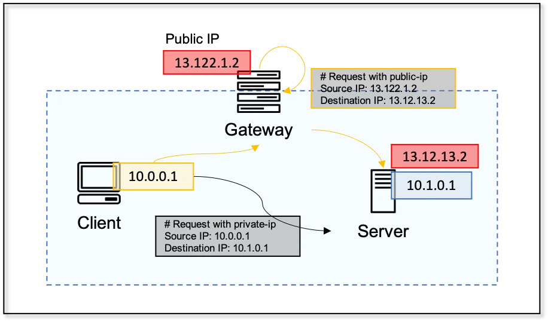

### 2024-08-14

## 사설 IP, 공인 IP
*참고: https://medium.com/bokunn91/192-168-172-16-31-10-%EC%82%AC%EC%84%A4-%EB%84%A4%ED%8A%B8%EC%9B%8C%ED%81%AC-ip-%EC%9D%98-%EB%AA%A8%EB%93%A0-%EA%B2%83-6409701e8e00*
- **정리**
  - `192.168.x.x`, `172.16-31.x.x`, `10.x.x.x` IP 대역은 사설 네트워크 대역
    - 해당 자원이 속한 사설 네트워크 내에서만 서로 요청이 가능
    - 사설 네트워크 IP 대역은 바깥으로 나가서 요청이 처리될 수 없음
  - Client가 요청하는 IP의 형태(공인/사설)에 따라 목적지에서 받아들이는 source ip의 정보는 다름

- **사설 네트워크**
  - 사설 네트워크 IP 대역
    - `10.0.0.0 ~ 10.255.255.255`
    - `172.16.0.0 ~ 172.31.255.255`
    - `192.168.0.0 ~ 192.168.255.255`
  - IPv4 형태의 IP가 고갈됨에 따라, 개인/조직의 내부 사설 네트워크에서는 위 IP 범위를 마음껏 활용가능
    - 사설 네트워크 내 유일한 자원을 가리키게 됨
  - 인터넷 네트워크에 존재하는 라우터에서는 사설 네트워크 관련 처리를 거부하도록 설정한다. 
    - 다른 조직의 사설 네트워크는 침범할 일도 X
    - 네트워크 바깥으로 나가서 요청이 처리될 일도 X
  - 

- **사설 IP에 접근하는 방법**
  - 회사 바깥의 특정 클라이언트에 어떤 요청을 해도 사설 IP에는 도달하지 못함
  - VPN 구성이 되어있다면 가능
    - Virtual Private Network
    - 회사 바깥의 특정 Client 또한 동일 네트워크 범주에 속하게 하는 것

- **Gateway**
  - Gateway에는 사설 네트워크 인입되는 공인 IP를 가짐
  - 같은 네트워크 자원끼리도 어떻게 요청 보내냐에 따라 달라짐
  - 사설 네트워크 내 인스턴스에 공인 IP로 요청을 보내면, 게이트웨이를 거쳐 요청됨으로 요청이 게이트웨이에서 인입된 것으로 보일 것
  - 
