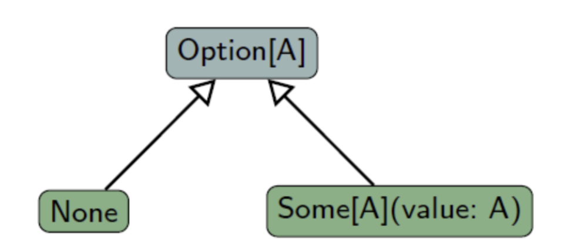
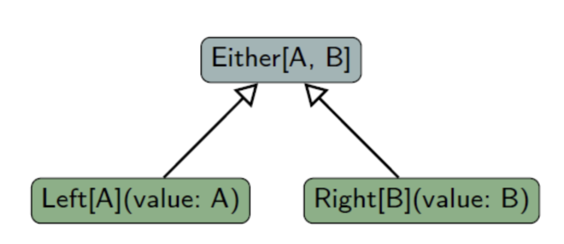

### 2024-10-10

## k8s Ingress : configuration-snippet vs server-snippet
*참고: https://skasha.tistory.com/103*
- **개요**
  - 쿠버네티스 어노테이션을 활용해 커스텀 행동 지정 가능

- **configuration-snippet**
  - Nginx location에 redirect/rewrite를 포함한 다양한 설정 추가적으로 지정 가능
  - location 블럭에 지정되는 설정

- **server-snippet**
  - server block에 지정되는 설정
  - 각 호스트마다 하나만 사용될 수 있다는 의미...

## Play 빌드 방식
*참고: https://www.playframework.com/documentation/3.0.x/BuildOverview*
1. `sbt clean compile stage` 명령을 통해 빌드하면...
2. `/target/universal/stage/` 안에 `bin`, `lib` 등등이 생성
3. `/target/universal/stage/bin/project`,`/target/universal/stage/bin/project.bat` 둘이 생성되는데 각각 unix shell script, window batch file
   - 이는 다음과 같은 행동 수행
     - 환경 변수 셋업
     - Java Runtime 환경 설정
     - Classpath 정의
     - Play Application 띄움
4. `/target/universal/stage/lib` 하위에 여러가지 jar 파일들이 존재해, 디펜던시 필요한 친구들 참조

## Scala Option & Either
*참고: https://hamait.tistory.com/649*
- **Option**
  - 값이 있거나/없거나 한 상태를 나타냄
  - Option의 하위 타입
    - 값이 있으면 Some[T]
    - 값이 없으면 None
  - Try/Future와 함꼐 Monadic Collection
  - 특징
    1. null을 대체하여 안전하게 사용
    2. 연속 체인에서 안정적인 사용

- **Option + Map**
  - map은 Option 타입을 스스로 변경하여 적용
  - None이 map안으로 들어가면 계산이 취소되어 아무것도 안 함. 

- **Either**
  - 둘 중 하나의 값을 가질 수 있는 타입
  ```scala
  // 제대로 된 값은 right, 뇌절은 left
  def eitherTest(num: Option[Int]): Either[String, Int] = {
    num match {
      case Some(n) => right(n)
      case None => Left("Error!")
    }
  }
  
  eitherTest(Some(7))
  ```

- **Either 활용하기**
  - isRight / isLeft
  ```scala
  val test = eitherTest(Some(7))
  if (test.isRight) 
    println(s"Number is ${test.right.get}")
  else if (test.isLeft)
    println(s"error ${test.left.get}")
  ```
  - pattern matching
  ```scala
  val result = eitherExample(Some(7)) match {
    case Right(num) => num
    case Left(err) => err
  }
  ```

## Scala Either
*참고: https://www.baeldung.com/scala/either-type*
- **Either를 쓰는 이유**
  - 스칼라에서는 Exception을 던지는게 실패를 리포트하는 좋은 방법이 아님. 
    - Scala에서 Exception은 function signature가 아니기 때문
    - compiler가 이를 트래킹 하는데 별다른 도움이 되지 않기 때문
  - 더 좋은 대안은 `Either[A, B]` 타입을 사용하는 것

- **Either Type에 대해서...**
  - `Either[A, B]`는 타입 A나 타입 B를 가질 수 있는 것
    - 정확히는 `Left[A]` 혹은 `Right[B]`가 될 수 있는 것
    - `Left[A]`를 에러로 지칭
      - 여기에 exception을 담고 있다면 `Try[T]`를 쓸 수도 있어
    - `Right[B]`를 성공적인 결과로 지칭

- **example code**
  ```scala
  val e: Either[String, Int] = Right(5)
  val test: Any = e.merge
  ```

## Scala의 예외처리
*참고: https://wonyong-jang.github.io/scala/2021/04/29/Scala-Option-Either-Try.html*
### 1. Option
- 
  - 값이 있으면 Some(value), 없으면 None

- **2가지 특징**
  1. Type Safety: Option으로 감싼 값이기에, 매개변수를 통해 전달 => 타입 안정성 보장 가능
  2. Functionally aware: Option은 버그를 적게 생성하는데 도움이 되는 함수형 프로그래밍 방법 제공. 
    - 연속적으로 계산되는 체이닝에서 문제 생기는 것 방어

- **Mapping Operations**
  - map, flatMap, filter, foreach 쓰세용
  ```scala
  final def map[B](f: (A) => B): Option[B] // 알맹이만 쏙~ 변환하는 Functor (https://papimon.tistory.com/124)
  ```

### 2. Either
- 
  - 정상 값이 없을 때, Either

- 제대로된 인자는 Right, 잘못된 친구는 Left
  ```scala
  def eitherTest(num: Option[Int]): Either[String, Int] = {
    num match {
      case Some(n) => Right(n)
      case None => Left("Error!")
    }
  }
  
  val result = eitherTest(Some(7)) match {
    case Right(num) => num
    case Left(err) => err
  }
  ```

### 3. Try
- 
  - 예외 발생 시, Try로 감싸서 예외를 **값**으로 다룰 수 있다는 장점!

- **예시**
  ```scala
  Try {
    upperString(str)
  }
  
  match {
    case Success(_) => // ...
    case Failure(_) => // ...
  }
  ```

- **Try를 쓰면 다음 문법도 가능**
  - Failure => None 반환
  - Success => Some 반환
  ```scala
  Try(upperString(str)).toOption
  ```

## Nginx 설정 톺아보기
```nginx
server {
  listen          		443 ssl http2;
  listen          		[::]:443 ssl http2;
  server_name    	 lounge.com;
  root            		/home/lounge/current/public;
  index           		index.html;

  location / {
        try_files $uri $uri/ /index.html;
  }

  access_log      /usr/local/nginx/logs/ssl-access-lounge.log main;
  error_log       /usr/local/nginx/logs/ssl-error-lounge.log error;

  location /api {
    proxy_pass                      http://lounge;
  }
}
```
1. `/api`로 시작하는 요청은 `http://lounge`로 proxy 됨
2. 다른 요청들에 대해서는 
  - 2-1. Nginx가 처음 URI를 보고 매칭되는 static file이 root(`/home/lounge/current/public`)에 있나 보고 있으면 주고
  - 2-2. 그게 아니라면, `/home/lounge/current/public/index.html`을 반환한다!

- 쿠버 옮길때, ingress에 nginx-server-snippet에 이런 설정 똑같이 하면 제대로 안될거야
  - 그 전에, nginx <-> was 분리해서 설정 먹여도 이거 설정 그대로하면 안될거야. 
- try_files: 같은 인스턴스 내의 static-resource를 반환하는거! 그러니까, 좀 고민을 해야해!
