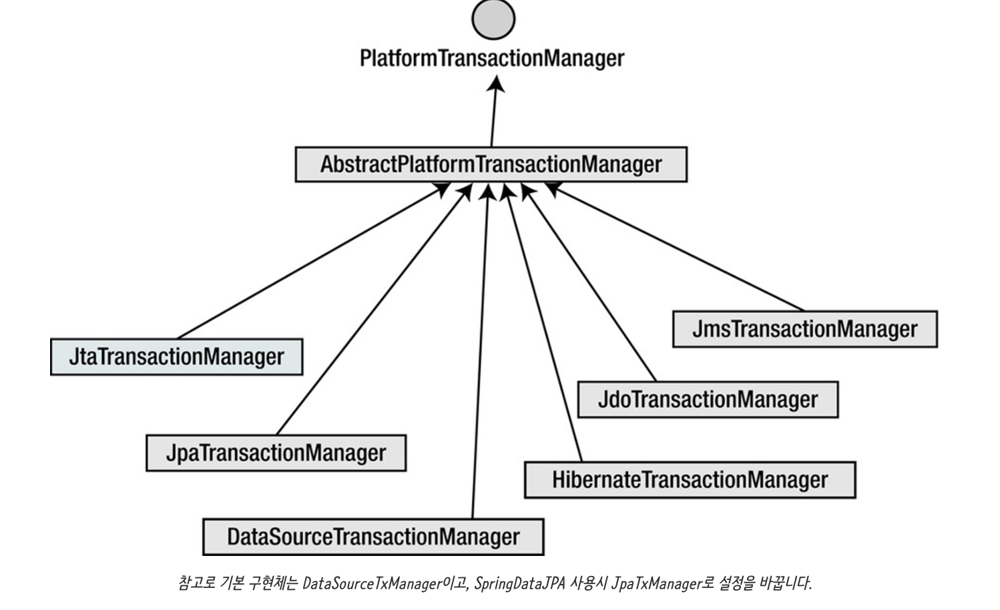

### 2024-10-23

## Batch 성능 끌어올리기
*참고: https://velog.io/@gongmeda/ifkakaodev2022-Batch-Performance-%EA%B7%B9%ED%95%9C%EC%9C%BC%EB%A1%9C-%EB%81%8C%EC%96%B4%EC%98%AC%EB%A6%AC%EA%B8%B0-1%EC%96%B5-%EA%B1%B4-%EB%8D%B0%EC%9D%B4%ED%84%B0-%EC%B2%98%EB%A6%AC%EB%A5%BC-%EC%9C%84%ED%95%9C-%EB%85%B8%EB%A0%A5-%EC%9A%94%EC%95%BD*  
*참고: https://velog.io/@ddongh1122/MySQL-%ED%8E%98%EC%9D%B4%EC%A7%95-%EC%84%B1%EB%8A%A5-%EA%B0%9C%EC%84%A0*
- **배치로 개발이 필요할 때**
  - 일괄 생성
  - 일괄 수정
  - 통계

- **배치 성능 개선 방법 - 대량 데이터 READ**
  - 배치 성능 개선은 Reader의 비중이 높다
  - Reader의 복잡한 조회 조건이 배치 전체의 성능을 크게 좌우
  - SELECT 를 제대로 튜닝만 해도 성능 개선 많아짐
  1. MySQL Limit/Offset
     - Offset이 커질수록 MySQL은 부담이 커짐
     - 앞에서 읽었던 행을 버리지만 다시 읽어야 하는 특성
     - 굳이 페이징이 필요없다면 (무한 스크롤 처럼) LIMIT 절만 걸로 id로 제어 하는 것도 좋은 방법

- **배치 성능 개선 방법 - 대량 데이터 WRITE**
  1. Batch Insert 사용하기 (일괄 쿼리 요청)
  2. 명시적 쿼리 (필요한 칼럼만 Update, 영속성 컨텍스트 X)

- **Batch와 JPA의 궁합?**
  - JPA를 쓰는게 그렇게 좋지 않을 수 있다!
  1. Dirty Checking + 영속성 관리 => 성능 손해
  2. UPDATE 시 불필요한 칼럼도 UPDATE
  3. JPA Batch Insert 지원 어려움. (ID 생성 전략이 IDENTITY면 더더욱 어려움)

## JdbcTemplate batchUpdate()
*참고: https://inkyu-yoon.github.io/docs/Language/Spring/JdbcBatchUpdate*
- **JPA에서의 batch Insert 한계**
  - Spring Data JPA에 정의된 saveAll()은 기본적으로 개별 insert
  - 대량의 엔티티 insert 경우, batch insert 사용해야 함
  - DB를 MySQL로 사용, 엔티티 기본키 전략이 `IDENTITY` 인 경우 Hibernate에서 Batch Insert 비활성화 하여 사용 못함
    - `IDENTITY`는 DB에 입력이 되면서 기본키 값이 부여되는 전략

- **Batch Insert**
  ```sql
  -- 개별
  INSERT INTO table (col1, col2) VALUES (val1, val11);
  INSERT INTO table (col1, col2) VALUES (val2, val22);
  INSERT INTO table (col1, col2) VALUES (val3, val33);
  
  -- batch
  INSERT INTO table (col1, col2) VALUES
       (val1, val11),
       (val2, val22),
       (val3, val33);
  ```

- **Chunk Size?**
  - 기본 100 ~ 10,000 레코드가 넣을 때 좋음
  - 배치 사이즈가 크면 데이터 베이스 round-trip과 성능 증대
  - 하지만, 너무 크면 메모리와 load가 많아지겠지
  - 주로 1000개 정도가 굿 밸런스

- **JdbcTemplate batchUpdate()**
  ```kotlin
  fun saveAll(templates: List<Template>) {
      jdbcTemplate.batchUpdate(
          """
          INSERT INTO template (template_id, flag, message)
          VALUES (?, ?, ?)
      """,
          templates,
          1000
      ) { ps, extend ->
          ps.setLong(1, extend.templateId)
          ps.setBoolean(2, extend.flag)
          ps.setString(3, extend.message)
      }
  }
  ```
  ```java
  public class JdbcTemplate extends JdbcAccessor implements JdbcOperations {
  
      @Override
      public <T> int[][] batchUpdate(String sql, final Collection<T> batchArgs, final int batchSize,
              final ParameterizedPreparedStatementSetter<T> pss) throws DataAccessException {
          // 각 컬렉션을 순회하며 각 컬렉션 원소마다 함수형 인터페이스 pss를 적용함
      }
  }
  ```
  
#### TOSS - Spring JDBC 성능 문제
*참고: https://toss.tech/article/engineering-note-7*
- JDBC에서 사용하는 데이터 타입을 정의 => `SqlType`
- 근데 `null` 값이 setValue로 넘어가면, `preparedStatement`에서 해당 값을 어떻게 세팅하는지 알 수 없어 직접 DB에서 타입 정보가져오느라 SELECT 발생

## MYSQL PK 조건 무시한 INSERT 
*참고: https://dev.mysql.com/doc/refman/8.4/en/insert-on-duplicate.html*  
*참고: https://bamdule.tistory.com/112*
- **INSERT INTO ... ON DUPLICATE UPDATE**
  - 데이터 삽입 시, PK/Unique Key 중복된 경우, 지정한 데이터만 UPDATE 하는 명령어 
  - 중복된 키가 없다면 INSERT
  - 중복 키 오류 발생 시, 사용자가 UPDATE 될 값을 지정할 수 있음

- **INSERT IGNORE**
  - 중복 키 에러가 발생했을 때, 신규로 입력되는 레코드 무시하는 방법
  - 중복이라면... `Query OK, 0 row affected`

- **REPLACE INTO**
  - 중복 발생 시, 기존 레코드 삭제 후 신규 레코드 INSERT
  - 해당 방식 수행 시, AUTO_INCREMENT는 새롭게 발급 됨. (DELETE -> INSERT 니까)

## Spring TransactionManager
*참고: https://jiwondev.tistory.com/154*
- **JDBC에서 사용하는 트랜잭션**
  ```
  Connection connection = dataSource.getConnection();
  
  try (connection) {
      connection.setAutoCommit(false); // 자동 커밋 off
      // ... DB 작업 ...
      connection.commit();  // 성공 시 트랜잭션 커밋
  } catch (SQLException e) {
      connection.rollback();
  }
  ```

- **Spring의 `@Transactional`**
  - 추상화해서 위의 JDBC 트랜잭션을 관리
  - isolation/propagation level을 어노테이션 값으로 지정하는 것은 결국 JDBC의 변수 set 하는 과정
  ```
  // isolation = TransactionDefinition.ISOLATION_READ_UNCOMMITED
  connection.setTransactionIsolation(Connection.TRANSACTION_READ_UNCOMMITTED);
  
  // propagation = TransactionDefinition.NESTED
  Savepoint savePoint = connection.setSavePoint();
  ...
  connection.rollback();
  ```

- **Transaction Management**
  - 스프링은 트랜잭션 처리 TransactionManager 객체를 통해 처리
  - 구현체는 갈아 끼울 수 있는 PlatformTransactionManager 주입되어 사용
  ```java
  public interface PlatformTransactionManager {
      TransactionStatus getTransaction(@Nullable TransactionDefinition var1) throws TransactionException;
  
      void commit(TransactionStatus var1) throws TransactionException;
    
      void rollback(TransactionStatus var1) throws TransactionException;
  }
  ```
  - 
  - 구현체마다 동일한 부분이 있을 수 있어 AbstractPlatformTxManager가 있기도 하다
    - 기본 구현체는 DataSourceTxManager, SpringDataJPA - JpaTxManager. 

- **`@Transactional`의 한계**
  - 선언적 트랜잭션은 클래스/메서드에서만 붙일 수 있음
  - TransactionTemplate을 주입받아 세부적으로 메서드 내 operation 별로 트랜잭션 관리 가능
    - 얘도 내부적으로는 `PlatformTransactionManager`로 실행

- **선언적 트랜잭션 `@Transactional`**
  - 스프링은 PlatformTxManager를 통해 DIP를 적용시켜둠
  - 스프링은 트랜잭션 코드를 프록시화 된 객체에 직접 추가하진 않음
    - 스프링 AOP는 프록시 객체에 다음과 같이 **[TransactionManager 객체]**에게 위임하는 코드를 추가
    - **[TransactionManager 객체]**의 `doBegin()`/`doCommit()` 메서드에 위임
  - 정리하면 스프링 트랜잭션은 결국 모두 JDBC로 동작한다!
    1. 스프링은 `@Transactional` 메서드 발견시, 다이나믹 프록시 생성
    2. 해당 프록시 객체는 [TransactionManager 객체]에게 트랜잭션 동작 위임하는 코드 가짐
    3. [TransactionManager 객체]는 JDBC 통해 트랜잭션 실행

- **JPA+Spring?**
  - JPA(하이버네이트)가 관리하도록 `@Transactional`을 달아버리면 (SessionFactory 주입)
  - 스프링에서 AOP 프록시 생성할 때, PlatformTxManager에게 위임 X => JpaTransactionManger O
    - `spring-boot-starter-data-jpa`를 쓰면 자동으로 Jpa 트랜잭션 매니저 쓰도록 설정 바꿔줌!
