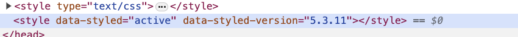
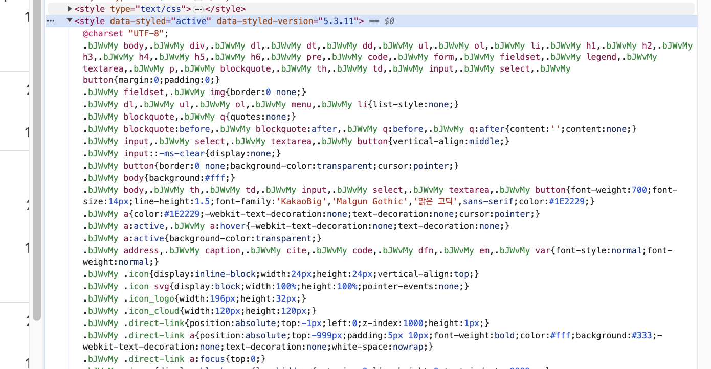

### 2024-12-04

## MySQL Multi-Column Join
*참고: https://www.statology.org/mysql-inner-join-multiple-columns/*

- MySQL에서는 `ON`절의 `AND`를 통해 여러개의 컬럼으로 테이블을 조인할 수 있음
- 이를 통해 더 상세하고 세부적인 조인이 가능하며, 하나의 칼럼으로는 unique한 관계를 수립할 수 없을 때 더 용이하다

- **Use Cases**
  - 조인하려는 놈이 복합키인 경우
  - Time-based Data에 대해서
  - 복잡한 관계인 경우

- **장점**
  - 데이터 무결성: 테이블간 더 정확한 일치 보장
  - 퍼포먼스: 더 타겟팅된 조인을 통해 퍼포먼스 개선도 가능

## ARIA (Access Rich Internet Applications)
- 접근성을 올려서 사용자에게 전달

## react-app-rewired
*참고: https://www.npmjs.com/package/react-app-rewired*
*참고: https://velog.io/@parksil0/React-app-rewired%EB%A5%BC-%EC%9D%B4%EC%9A%A9%ED%95%98%EC%97%AC-CRA%EC%97%90-css-prop-%EC%84%A4%EC%A0%95%ED%95%98%EA%B8%B0-with-customize-cra*
*참고: https://m.blog.naver.com/twilight_teatime/223452665585*
*참고: https://medium.com/@jsh901220/create-react-app%EC%97%90%EC%84%9C-eject%EC%82%AC%EC%9A%A9%EC%95%88%ED%95%98%EA%B8%B0-customize-cra-react-app-rewired-10a83522ace0*
*참고: https://velog.io/@shinoung2360/Webpack%EA%B3%BC-Babel%EC%9D%B4%EB%9E%80-%EA%B0%9C%EB%B0%9C%ED%99%98%EA%B2%BD-%EA%B5%AC%EC%B6%95%ED%95%98%EA%B8%B0*
- **개요**
  - CRA에서 제공하는 `eject`와 `react-script`의 포크를 생성하지 않고 웹팩 설정 변경 가능
  - `no config` 제한 두지 않고 CRA 이점 제공. 
  - 사용자가 원하면 플러그인/로더 추가 가능
  - `react-app-rewired`를 사용해 CRA 프로젝트의 Webpack 설정을 커스터마이징 할 수 있음
    - `react-script`의 기본 설정을 유지하면서 필요에 따라 Webpack 설정 재정의/확장 가능

- **CRA 쓰는 이유**
  - CRA : 리액트 프로젝트 처음 실행시, 필요한 여러가지 라이브러리/웹팩 설정 없이 간편하게 프로젝트 시작하게 해줌
  - 장점
    1. 단 하나의 one build dependency: 리액트 프로젝트 구성시 필요한 Webpack/Babel/EsLint 연결 알아서 해줌
    2. CRA가 필요한 필수적인 configuration 다 해줌
    3. Autoprefixer 지원. CSS 코드에 -webkit-, -ms- 자동 적용

- **Eject 쓰는 이유?**
  - one build dependency 가진 프로젝트를 커스텀 하기 위함
  - `yarn eject`를 통해 숨겨져 있던 모든 설정 (All Config, webpack/babel 설정 및 각 패키지 의존성 확인 가능)
  - 단! 한번 Eject 한 뒤, 이전 상태 못돌아감

- **Eject 쓰면 안되는 이유**
  1. CRA 모든 configuration 직접 유지보수 해야함. Webpack/Babel 전문가냐?
  2. One build dependency 장점 잃음. 작업 도중 패키지 필요 설치/삭제 시 의존성 신경써!

- **React-App-Rewired, Customize-CRA**
  - Eject 하지 않고, 기존 CRA 프로젝트에 약간의 커스텀 적용 가능!

- **Webpack & Babel?**
  - Babel: 트랜스파일러 (특정 언어로 작성된 코드를 비슷한 다른 언어로 변환)
    - 구형 브라우저도 알아먹는 ES5 사양으로 변환 작업
  - Webpack: 모듈 번들러 (여러개의 모듈을 하나의 파일로 묶어서 보냄)
    - JS/CSS/Image 모아서 하나의 파일로 번들링
    - 

- **사용 방법**
  1. 라이브러리 설치 : `npm install react-app-rewired`
  2. 최상단 경로에 `config-overrides.js` 생성
     - 웹팩 설정을 커스터마이징 할 수 있음
     - 추가 플러그인/로더 설정 가능
    ```js
    module.exports = function override(config, env) {
        return config;
    }
    ```
  3. `package.json` 안에 `script` 설정 변경
    ```
    "scripts": {
      "start": "react-app-rewired start",
      "build": "react-app-rewired build",
      "test": "react-app-rewired test",
      "eject": "react-scripts eject",
    }
    ```

- **장점**
  - `customize-cra` 라이브러리를 통해 많은 설정 간단히 가능 (웹팩 설정 쉽게 확장)
  - Babel 설정 : Babel 플러그인/프리셋 추가 변경 가능
    ```js
    const { addBabelPlugin, addBabelPreset } = require('customize-cra');
    
    module.exports = override(
        addBabelPlugin('@babel/plugin-proposal-optional-chaining'),
        addBabelPreset('@babel/preset-env')
    )
    ```
  - CSS 로더 : CSS 로더 설정 커스터마이징 가능
    ```js
    const { addLessLoader } = require('customize-cra');
    
    module.exports = override(
        addLessLoader({
            lessOptions: {
                javascriptEnabled: true
            }
        })
    )
    ```
  - Webpack 플러그인 추가 
    ```js
    const { addWebpackPlugin } = require('customize-cra');
    const WebpackBundleAnalyzer = require('webpack-bundle-analyzer').BundleAnalyzerPlugin;
    
    module.exports = override(
      addWebpackPlugin(new WebpackBundleAnalyzer())
    );
    ```
  - Webpack 설정 오버라이드
    ```js
    const { override, addWebpackModuleRule } = require('customize-cra');
    
    module.exports = override(
      addWebpackModuleRule({
        test: /\.txt$/,
        use: 'raw-loader'
      })
    );
    ```
  - ESLint 설정
    ```js
    const { addEslintConfig } = require('customize-cra');
    
    module.exports = override(
      addEslintConfig({
        extends: ['react-app', 'airbnb', 'prettier'],
      })
    );
    ```

## Styled-Components
*참고: https://www.zigae.com/styled-components-abstract/*  
*참고: https://medium.com/creatrip/styled-components%EA%B0%80-%EB%9F%B0%ED%83%80%EC%9E%84%EC%97%90-css%EB%A5%BC-%EC%A3%BC%EC%9E%85%ED%95%98%EB%8A%94-%EB%B0%A9%EB%B2%95-b0916c001e72*  
*참고: https://joong-sunny.github.io/javascript/styled-components/#google_vignette*  
*참고: https://stackoverflow.com/questions/70514323/in-production-mode-the-style-tag-that-generated-by-styled-component-has-no-cont*  
*참고: https://nocode-nobug.com/things-to-know-about-styled-components/*  
*참고: https://pawangujral.medium.com/styled-components-css-injection-a6a1b4c1f09b*  
*참고: https://shiwoo.dev/posts/next-13-and-css-in-js#server-side-rendering%EB%95%8C-style%EC%9D%B4-%EC%83%9D%EC%84%B1%EB%90%98%EC%A7%80-%EC%95%8A%EB%8A%94-%EC%9D%B4%EC%9C%A0%EB%8A%94-%EB%AD%98%EA%B9%8C*  
- **Styled-Components에서 상용 환경에서 왜 스타일 안 먹히지?**
  - Prod
    - 
  - Dev
    - 
  - Production Mode에서는...
    1. 비어있는 `<style>` 태그가 `<head>` 아래에 들어감
    2. 바로 스타일 태그에 스타일을 넣지 않고, styled-components는 JS에서 동적으로 런타임에 스타일 넣도록 했음
  - 그럼에도 동작하는 이유는
    - insertRule API를 통해 스타일이 주입된다. (CSS 규칙이 스타일시트에 주입됨)
    - HTML 크기를 줄이고, 구문 분석 속도를 높여주기에, 대규모 어플리케이션의 경우 성능 올라감
  
- **Styled-components는 CSS를 CSSOM으로 직빵으로 넣어줘!**
  - 이러면 CSS rendering 속도가 올라간다고 함
  - 이런 설정이 있다고 합니다. 
    ```
    SC_DISABLE_SPEEDY=true 
    
    // For React
    REACT_APP_SC_DISABLE_SPEEDY=true 
    ```
  - 프로덕션 환경에서는 CSSOM API로 스타일을 넣어줌. (런타임 성능위한 압축)
    ```js
    // Dev
    document.createElement("style").innerHTML = ".bXfiY{width:200px;}"
    
    // Prod
    const styleSheet = document.createElement("style").sheet
    styleSheet.insertRule(".bXfiY{width:200px;}")
    ```

- **Styled-Components**
  - CSS-in-JS는 모든 스타일이 js 파일로 구성되어 있고, 모든 자바스크립트 에코시스템을 기반으로 레버리지할 수 있음

- **Styled-Component -> HTML Element**
  - Development, production 모드에 따라서 달라짐
  - 두개의 클래스 네임이 생성됨

- **Dom에 스타일이 안착하는 법**
  - Development 모드
    - `<style>` 태그가 `<head>`안에 들어가고
    - `<style>` 태그안에 data가 들어갈 것
  - Production 모드
    - `<style>` 태그가 들어가지만, 안에 내용은 비어있음. 
    - css-in-js 솔루션인 것 기억나지?
      - JS script로써 런타임에 스타일이 인젝션 일어난다고 함. 
      - 번들러/configuration에 따라 달라질 수도 있긴함
