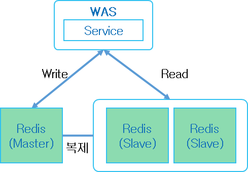

### 2025-01-03

## Redis
*참고: https://devocean.sk.com/search/techBoardDetail.do?ID=165057*  
- **개요**
  - 오픈소스, 인메모리 데이터 저장소
  - 용도 : DB, 캐시, 스트리밍엔진, 메세지 브로커

- **구성에 따른 구분**
  - 단일 모드(standalone)
    - 간단한 설치 및 개발
    - 어플리케이션이 하나의 Redis에 데이터 읽고 씀
    - 
  - Master-Slave 복제모드
    - 읽기 성능 확장 필요 시
    - 데이터 쓸 때엔 Master, 읽을 땐 Slave
      - 읽기 성능 늘리기 위해서 Slave 노드 추가하기도 함
    - 
  - Cluster 모드
    - 대규모 데이터 운용하기 위함
    - 기본 6개의 노드 (클러스터 구성 위한 최소 단위는 6개)
    - 3개의 Master, 3개의 Slave로 구성

- **Multi Key Operation**
  - 한번의 명령에 여러 키 동시 전달 처리
  ```
  MGET key1 key2 key3
  MSET key1 val1 key2 val2
  SINTER setKey1 setKey2
  SUNION setKey1 setKey2
  ```
  - 단일 노드 문제 없음
  - 클러스터에서는 키들이 서로 다른 노드에 있으면 한번에 처리 어려움
  - Redis Cluster는 키들을 슬롯 단위로 나눠 각 노드에 분산 저장

## Redis Cluster
*참고: https://co-de.tistory.com/24*  
*참고: https://jaehoney.tistory.com/328*  
- **샤딩의 문제점**
  - key % 3 이런식으로 연산 때려버리면... 샤드 늘어날 때 마다 데이터 전혀 다른곳으로 이동해야 함
  - Redis는 16384개의 해시 슬롯으로 키 공간 나눠서 관리
    - CRC16 해싱 % 16384 -> 해시 슬롯 매핑

- **개요**
  - Redis Cluster 특징 : master 여러개 두어 분산 저장 가능하며, Sharding/Scale out 가능
  - Master 하나 이상의 Slave 둘 수 있음
  - Slave가 죽어서 복제 노드가 없는 마스터가 생긴다면, 다른 마스터 노드에 여유분이 있다면 해당 노드로 빈자리 채울 수 있음
    - Master가 죽으면 Slave가 Master로 자동 failover
  - 여러 노드에 자동적인 데이터 분산
  - 일부 노드의 실패나 통신 단절에도 계속 작동하는 가용성
  - 고성능 보장, 선형 확장성 제공
  - 

- **특징**
  - full-mesh 구조 통신
  - cluster bus 추가 채널 사용
  - gossip protocol : 근처 노드 통신
  - Multi key 명령어가 제한됨
  - 클라이언트는 모든 노드에 접속?

- **데이터 분산**
  - hash slot (각 키 해싱 후 모듈러 연산해 매핑)
    - CRC16 해싱 후 모듈러 연산으로 16384개의 해시 슬롯 중 하나로 매핑
  - 클라이언트 데이터 접근

- **클러스터 제약 사항**
  - 클러스터는 DB 0 만 사용 가능
    - Redis는 한 인스턴스에 여러 데이터베이스를 가질 수 있으며 디폴트는 16
    - 이는 용도별로 분리하여 관리를 용이하게 하기 위한 목적
    - 하지만, 클러스터에서는 해당 기능 사용 못하고 DB 0으로 고정
  - Multi key operation 사용 제약
    - key들이 각각 다른 노드에 저장 -> MSET 등 multi-key operation 사용 X

## redisclient.debasishg.net > RedisClient
*참고: https://github.com/debasishg/scala-redis*  
- 레디스 클러스터 환경에 연결/명령 실행하자
  ```scala
  class RedisCluster(protected val hosts: List[ClusterNode],
                     override protected val keyTag: Option[KeyTag]) extends RedisClusterOps
  ```
- 특징
  1. 클러스터 노드 정보 관리 : Redis 클러스터에 여러 노드(호스트/포트)를 등록
  2. 키 태그 설정 : 키-슬롯 매핑 효율적으로 제어하기 위함
  3. 클러스터 명령 라우팅 

## Redis Pub/Sub

## Scala 2.11 라이브러리를 Scala 2.13에서 쓰면 안 되는 이유

