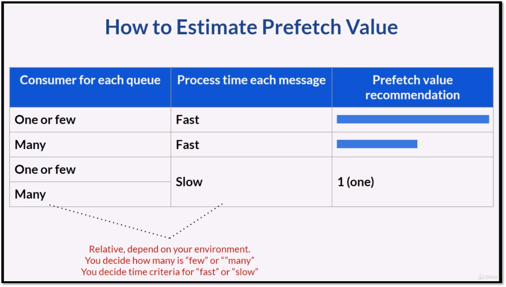
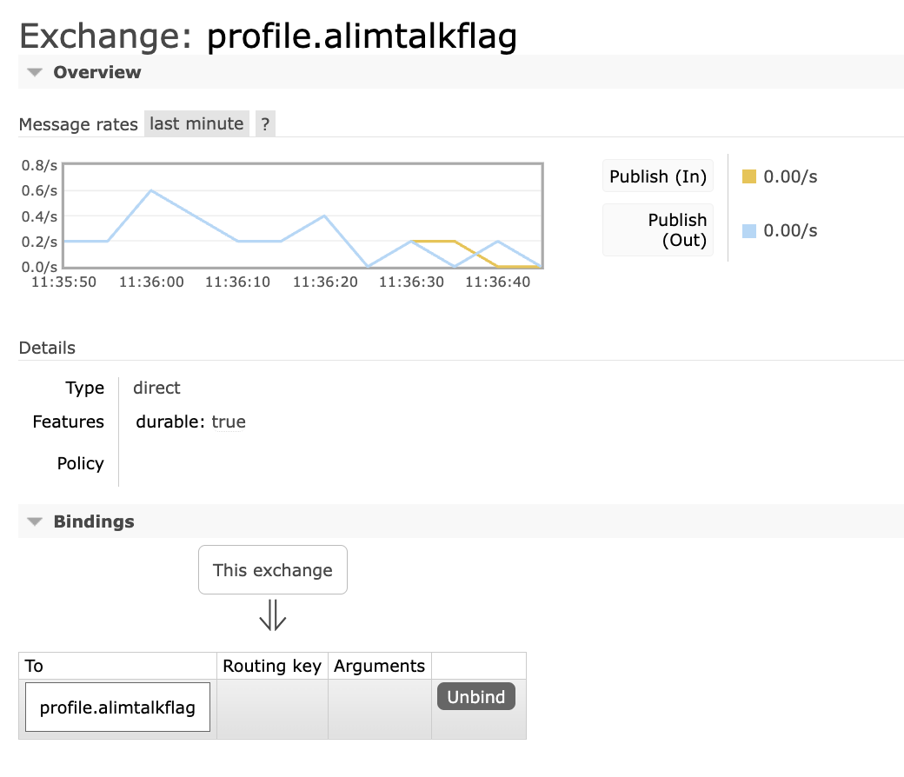
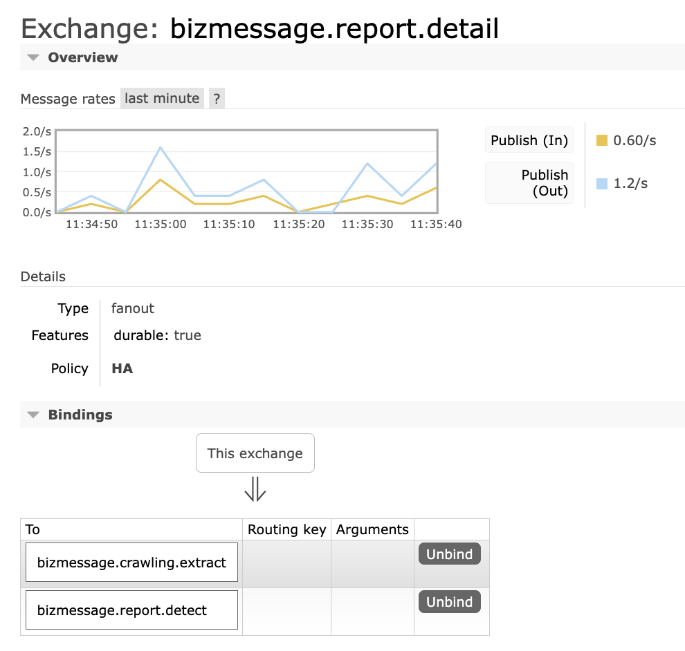
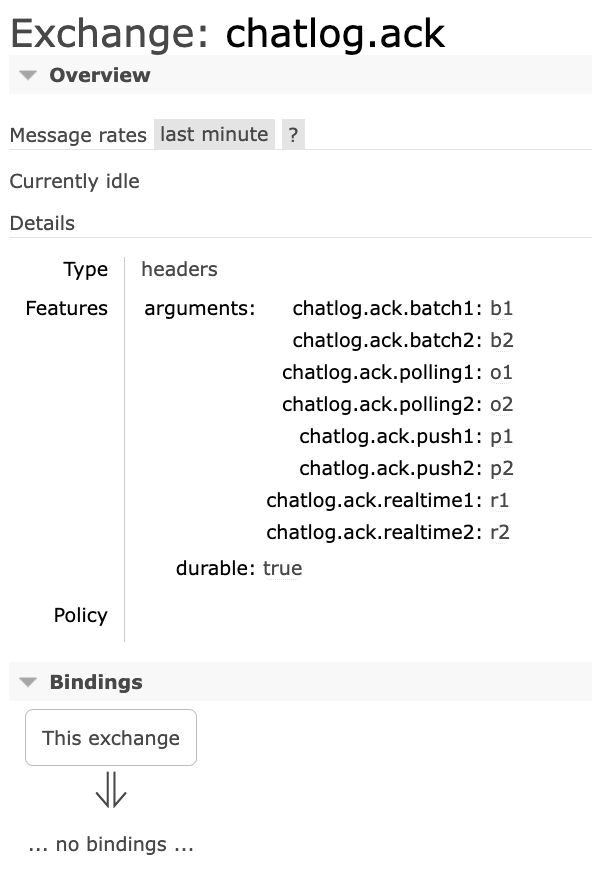

### 2025-05-16

## 반정규화
*참고: https://velog.io/@dddooo9/%EB%8D%B0%EC%9D%B4%ED%84%B0%EB%B2%A0%EC%9D%B4%EC%8A%A4-%EB%B0%98%EC%A0%95%EA%B7%9C%ED%99%94*  
*참고: https://sophia-su.tistory.com/135*  
- **개요**
  - 정규화된 엔티티/속성/관계에 대해 시스템 성능 향상과 개발/운영의 단순화를 위해 중복/통합/분리 등을 수행하는 데이터 모델링 기법
  - 데이터 조회시, 조인으로 인한 성능 저하가 예상되는 경우 수행
  - 데이터 중복을 허용하고 조인을 줄이는 데이터 성능 향상 기법
  - 조회 속도 UP! 데이터 모델 유연성 LOW!

- **왜 반정규화?**
  - 디스크 I/O량이 많아서 성능이 저하되거나, 경로가 너무 멀어 조인으로 인한 성능저하 예상되거나
  - 칼럼을 계산하여 읽을 때 성능이 저하될 것이 예상되는 경우
  - 업무적으로 조회에 대한 처리성능이 중요하다고 판단시 부분적으로 반정규화 고려

- **언제 반정규화?**
  - 자주 사용되는 테이블에 항상 일정한 범위만 조회하는 경우
  - 대량의 데이터 범위를 자주 처리하는 경우, 처리범위 일정하게 줄이지 않으면 성능을 보장할 수 없는 경우
  - 통계성 프로세스에 의해 통계정보가 필요한 경우, 별도의 통계테이블 생성
  - 지나치게 많은 조인이 걸려 데이터를 조회하는 작업 기술적으로 어려울 경우

- **반정규화의 대안?**
  - 성능을 고려한 VIEW 를 생성하여 이를 개발자가 접근하게 함
  - 인덱스를 조정하여 반정규화를 회피할 수 있도록 클러스터링
    - PK 기반 파티셔닝 등

## 정규화
*참고: https://seaforest76.tistory.com/28*  
- **개요**
  - 중복을 최소화하도록 설계된 데이터베이스
  - 데이터의 일관성 / 최소한의 데이터 중복 / 최대한의 데이터 유연성
  - RDB에서 중복을 최소화하기 위해 데이터를 구조화하는 작업
  - 하나의 종속성이 하나의 릴레이션에 포현될 수 있도록 분해

- **정규화 종류**
  - [제1정규화]: 테이블의 칼럼이 하나의 값을 가지도록 분해하자
  - [제2정규화]: 제1정규화 진행한 테이블에 대해 완전함수 종속을 만족하도록 테이블을 분해
    - 완전함수 종속: 기본키의 부분집합이 결정자가 되어선 안 됨
    - 찢은 테이블은 각각 조인해서 정보를 가져올 수 있어야 함
  - [제3정규화]: 제2정규화를 진행한 테이블에 대해 이행적 종속을 없애도록 테이블을 분리
    - 이행적 종속: A->B, B->C 성립할 때, A->C가 성립되는 것을 의미

## RabbitMQ prefetch_count
*참고: https://velog.io/@sdb016/RabbitMQ-Prefetch%EC%99%80-%EC%84%B1%EB%8A%A5*  
*참고: https://minholee93.tistory.com/entry/RabbitMQ-Prefetch*  
*참고: https://1995-dev.tistory.com/150*  
- **Prefetch?**
  - Queue의 메시지를 Consumer의 메모리에 쌓아둘 수 있는 최대 메시지의 양
  - prefetch=250 이라면 RabbitMQ는 consumer 메모리에 메시지 250개 한번에 푸시
    - 그 후 Consumer는 메모리에서 메시지 하나씩 꺼내서 처리

- **성능 고려사항**
  - prefetch 갯수 만큼 consumer가 가져갈 메시지 분량이 산정됨
  - MQ에 500개 메시지 있고, consumer 3개, prefetch_count = 250이면 다음과 같은 상황 발생 -> 컨슈머 하나 더 추가했는데도 성능 개선 X
    - consumer1: 250
    - consumer2: 250
    - consumer3: 0
  - prefetch 설정값은 전체 앱 성능에 많은 영향을 끼침. prefetch criteria 하기 설정 볼 것

- **Prefetch Criteria**
  - 
  - 메시지 처리 속도 빠름
    - consumer 많음 : prefetch_count = middle
    - consumer 적음 : prefetch_count = high
  - 메시지 처리 속도 느림 : prefetch_count = 1
    - `메시지 처리속도가 느릴경우, 메시지를 먼저 메모리에 올려두는게 비효율적임`

- **트러블 슈팅**
  - 메시지 처리속도에 따라 최적화된 prefetch_count 설정이 중요
  - 포스팅 상황
    - MQ <-> Consumer 연결이 모종의 이유로 끊기고
    - Consumer가 다시 생성되어 재연결되면, 
    - 수신 처리 되지 않은 Unacked 메시지가 Ready 상태로 이동되어 처리됨
    - 위 프로세스가 계속 반복되며 데이터 쌓이고 커넥션 끊기고 다시 쌓이고 지연 발생
  - `prefetch=0 이라면 무제한으로 처리됨
    - 
    - QoS(주로 prefetch_count) 설정이 없다면, RabbitMQ는 네트워크/클라이언트가 허용하는 속도로 모든 대기열의 메시지를 클라에 푸시
    - Consumer는 RAM에 모든 메시지를 버퍼링하여 메모리가 팽창

- **RabbitMQ 기본 구성요소**
  1. Channel
     - App <-> RabbitMQ 가상의 통신 경로
     - 메시지 publish/consume 시, 별도의 채널을 통해 수행하는 것이 일반적
  2. Queue
     - 메시지를 저장하는 버퍼 역할 하는 곳
     - Producer의 메시지는 Exchange를 거처 Queue에 적재
     - Consumer는 Queue로 부터 메시지 가져가 처리
  3. Exchange
     - Producer가 보낸 메시지를 받아 적절한 큐에 라우팅하는 역할
     - 정확하게 어느 Queue로 보낼지 결정하는 로직
       - Direct Exchange: 메시지의 라우팅 키와 큐의 바인딩 키가 정확히 일치하는 경우 메시지 전달
         - 
       - Fanout Exchange: 라우팅 키와 무관하게 익스체인지에 바인딩된 모든 큐로 메시지 전달
         - 
       - Topic Exchange: 와일드카드 포함한 라우팅 키 패턴 매칭을 통해 메시지 라우팅
       - Headers Exchange: 메시지 헤더 속성 기반으로 라우팅
         - 

- **코드로 확인하기**
  - `libraryDepedencies += "com.rabbitmq" % "amqp-client" % "5.15.0"`
  - [메시지 publish]
  ```scala
  def publish(message: String) = {
    try {
      val factory = new ConnectionFactory()
      factory.setHost("rabbitmq.host")
      factory.setPort("rabbitmq.port")
      factory.setUsername("rabbitmq.username")
      factory.setPassword("rabbitmq.password")
      
      val connection = factory.newConnection()
      val channel = connection.createChannel()
      
      // 큐 선언 (없으면 생성)
      channel.queueDeclare("queueName")
      // 메시지 발행 (exchange routing_key queue 지정)
      channel.basicPublish("", "queueName")
  
      channel.close()
      connection.close()
    } catch {
      case e: Exception => logger.error("ERROR: ", e)
    }
  }
  ```
  - [메시지 consume]
  ```scala
  def consume() = {
    // RabbitMQ 연결 설정
    val factory = new ConnectionFactory()
    factory.setHost(config.get[String]("rabbitmq.host"))
    factory.setPort(config.get[Int]("rabbitmq.port"))
    factory.setUsername(config.get[String]("rabbitmq.username"))
    factory.setPassword(config.get[String]("rabbitmq.password"))
  
    val connection = factory.newConnection()
    val channel = connection.createChannel()
  
    // 큐 설정
    val queueName = config.get[String]("rabbitmq.queue")
    channel.queueDeclare(queueName, true, false, false, null)
  
    // QoS 설정 - 한 번에 하나의 메시지만 처리 (prefetchCount)
    channel.basicQos(1)
  
    // Consumer 정의
    val consumer: Consumer = new DefaultConsumer(channel) {
      override def handleDelivery(consumerTag: String, envelope: Envelope, properties: AMQP.BasicProperties, body: Array[Byte]): Unit = {
        val message = new String(body, "UTF-8")
        println(s" [x] Received '$message'")
        try {
          processMessage()
        } catch {
          case e: Exception => e.printStackTrace()
        } finally {
          // 메시지 처리 완료 후 ack 전송 (false: 단일 메시지 ack)
          channel.basicAck(envelope.getDeliveryTag, false)
        }
      }
    }
  
    channel.basicConsume(queueName, false, consumer)
  }
  ```

## RabbitMQ consistent-hash-exchange

## RedisLock
