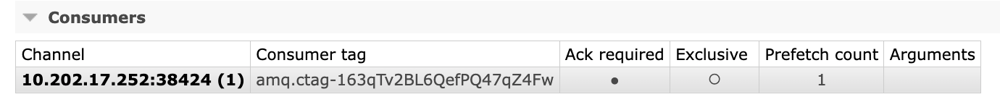

### 2025-05-23

## RabbitMQ 설정
- **prefetch_count**
  - *참고: https://minholee93.tistory.com/entry/RabbitMQ-Prefetch* 
  - 컨슈머 채널의 설정값. Queue의 메시지를 Consumer의 메모리에 최대 몇 개 쌓아놓을지 결정
  - 확인 방법
    - 웹에서 Consumers 하위에 보임
    - 
  - prefetch_count=1, Consumer=4대 -> 최대 4개의 메시지가 처리될 수 있는 구조임
  - 어플리케이션 내에서 다음과 같이 선언하여 사용 가능
    ```scala
    private def declareQueue(queueName: String, durable: Boolean = true, prefetchCount: Int = 1, arguments: util.HashMap[String, Object] = null): Channel = {
        val channel = getChannel
        channel.queueDeclarePassive(queueName)
        channel.basicQos(prefetchCount)
        channel
    }
    ```

- **Connection**
  - 실제로 클라이언트(앱)과 RabbitMQ 브로커 사이에 맺어지는 물리적인 <TCP> 연결
  - 연결 맺을 때 인증, 핸드쉐이크 등 복잡한 과정 다수. 시스템 자원 소모
  - 하나의 프로세스에서 보통 한 개의 Connection 장기간 유지 권장
  - Connection이 닫히면 그 안의 Channel도 모두 닫힘

- **Channel**
  - Connection 내부에서 생성되는 가상의 논리 연결
  - AMQP 프로토콜의 세션 단위. Connection을 멀티플렉싱 하여 여러 Channel을 동시에 사용할 수 있음
  - publish/consume, queue/exchange 선언 등 모든 AMQP 작업은 <CHANNEL>을 통해 이루어짐
  - Channel은 가볍고 빠르게 생성/종료 되며 리소스 소모 적음.
  - 멀티 스레드 환경에서는 각 스레드마다 별도 Channel 사용이 일반적
  - Channel은 Connection의 컨텍스트를 공유하며, Channel의 통신은 서로 완전히 분리되어 독립적으로 동작

- **consumer의 ack 전략**
  1. Auto-ACK
     - consumer가 `auto_ack=true`로 구독 -> 메시지 브로커는 메시지 보내자 마자 처리라고 간주
  2. ManualACK-single
     - `void basicAck(long deliveryTag, boolean multiple) throws IOException;`
     - `consumer.getChannel.basicAck(envelope.getDeliveryTag, false)`
     - Consumer에서 한건씩 확인했다고 응답
  3. ManualACK-multiple
     - `multiple: true` 로 호출
     - deliveryTag - RabbitMQ가 해당 채널로 몇번째로 보낸 메시지인지를 가르키는 64bit 일련번호
       - 범위: Channel 단위로 1,2,3 순차 증가, 다른 채널과 중복될 수 있음.
       - 용도: consumer가 `basicAck`, `basicNack`, `basicReject` 호출 시, RabbitMQ에게 어떤 메시지를 확인/거절할지 알려줌
     - ex)
         - `basicAck(tag=3, multiple=false)`: tag 3 만 처리되었다고 ACK
         - `basicAck(tag=3, multiple=true)`: tag 3 이하 1/2/3 모두 처리되었다고 ACK
  4. NACK/Reject
     - 처리 실패시 `basicNack`, `basicReject` 로 거절
     - requeue 정책으로 다시 큐에 넣을지, DLX로 보낼지 결정.
     - `void basicReject(long deliveryTag, boolean requeue) throws IOException;`
     - `consumer.getChannel.basicReject(envelope.getDeliveryTag, false)`

- **consumer가 ACK를 보내지 못했다면?**
  1. Channel 살아있지만, ACK 호출 못한 경우
     - 메시지가 `unacked` 상태로 남음. MQ가 해당 Consumer로 메시지 안 보냄
  2. Consumer가 예외로 종료되어 Channel이 닫힘
     - RabbitMQ는 해당 채널의 모든 Unacked 메시지를 자동으로 requeue하여 타 Consumer에게 보냄
  3. 명시적으로 Consumer가 `basicNack/reject(requeue=false)` 호출
     - requeue=false -> 메시지 큐에서 제거. DLX 있다면 이동/폐기

- **Queue에 들어간 메시지 유통기한**
  - 큐/메시지에 TTL 제한 둘 수 있음.
  - TTL(`x-message-ttl`, `x-expires`), 길이제한(`x-max-length`) 등 설정시 삭제/DLX 이동 가능
