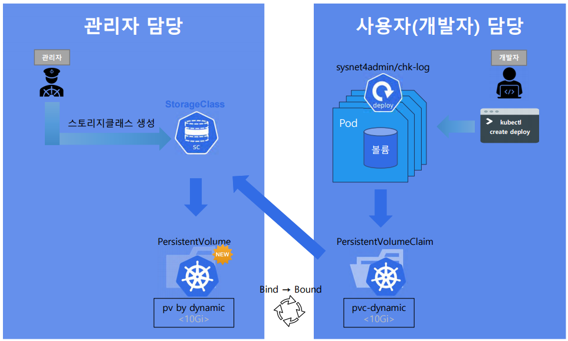

### 2025-06-17

## k8s storageClass
*참고: https://velog.io/@rockwellvinca/kubernetes-%EC%8A%A4%ED%86%A0%EB%A6%AC%EC%A7%80%ED%81%B4%EB%9E%98%EC%8A%A4StorageClass%EC%99%80-PV%EC%99%80-PVC%EC%9D%98-%EC%83%9D%EB%AA%85%EC%A3%BC%EA%B8%B0*  
- **개요**
  - PV, PVC 할당의 문제는 PVC로 PV 요청하여 바인딩하기에, 사용자가 PV를 미리 만들어야 한다는 것
  - 이를 해결하고자 StorageClass가 있음
    1. StorageClass를 관리자가 생성
    2. PVC를 통해 사용자가 요청을 보냄
    3. StorageClass로 요청이 들어가 PV를 생성함
  - 
  - PVC가 어떤 `storageClass`를 참조하면, 그에 맞는 PV가 동적으로 생성
    - 동적으로 생성: storage provisioner

- **필요한 이유**
  - 클라우드에서는 다양한 종류의 스토리지가 제공됨 (SSD, HDD, NFS)
  - 사용자가 PVC에서 상세 설정하지 않아도, storageClass 이름만 쓰면 원하는 PV 붙여줌
  - 클라우드 별로 제공되는게 다름
    - ex) GKE: `standard`, `premium-rwo`

- **예시**
  - StorageClass
    ```yaml
    apiVersion: storage.k8s.io/v1
    kind: StorageClass
    metadata:
      name: fast-ssd
    provisioner: kubernetes.io/gce-pd
    parameters:
      type: pd-ssd
      replication-type: none
    ```
  - PersistentVolumeClaim
    ```yaml
    apiVersion: v1
    kind: PersistentVolumeClaim
    metadata:
      name: my-pvc
    spec:
      accessModes:
        - ReadWrtieOnce
      resources:
        requests:
          storage: 10Gi
      storageClassName: fast-ssd
    ```
    
- **수동 프로비저닝**
  - `provisioner: kubernetes.io/no-provisioner`
  - 자동 생성하지 않고, 수동으로 PV 만들어놔야한다!
  - 절차
    1. StorageClass `storageClass: local-sc` 정의
    2. PVC `storageClassName: local-sc` 명시
    3. 이미 클러스터 내 PV 중, `storageClassName: local-sc` PV 중 하나를 찾아
    4. 용량, accessMode 조건 맞으면 바인딩
  ```yaml
  apiVersion: storage.k8s.io/v1
  kind: StorageClass
  metadata:
    name: local-sc    # PVC가 storageClassName: local-sc로 참조
    annotations:
      storageclass.kubernetes.io/is-default-class: "true"   # 클러스터의 기본 StorageClass로 지정. PVC에서 storageClassName 없으면 기본으로 쓰도록 지정
  provisioner: kubernetes.io/no-provisioner   # 자동으로 PV를 만들어주는 프로비저너 없음! 수동으로 만든 PV만 매칭 가능!
  volumeBindingMode: WaitForFirstConsumer     # 볼륨 바인딩 시점은 PVC를 사용하는 Pod가 어느 노드에 배치될지 결정한 후에 바인딩
  allowVolumeExpansion: true                  # 해당 storageClass를 사용하는 PVC는 추후에 용량 늘릴 수 있음
  ```