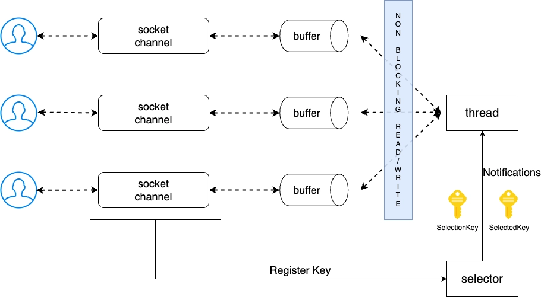
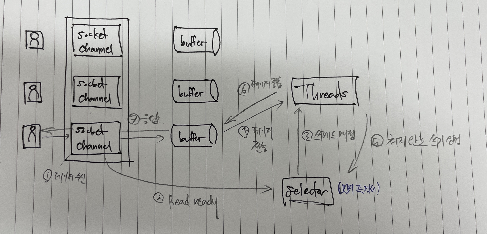
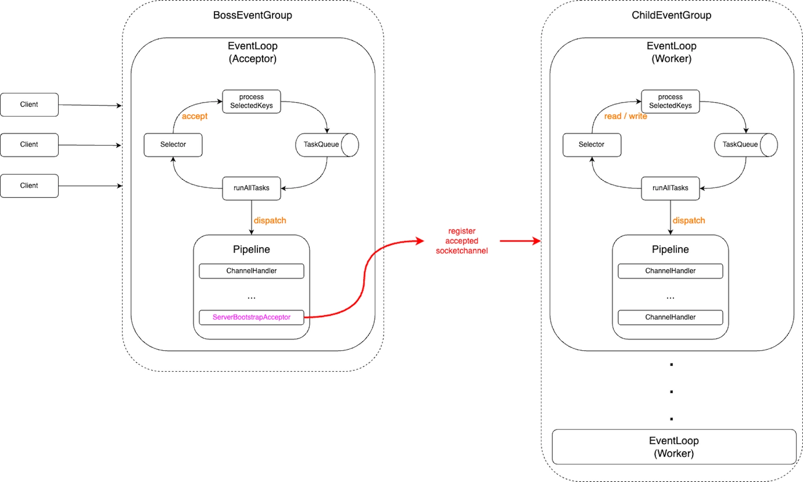
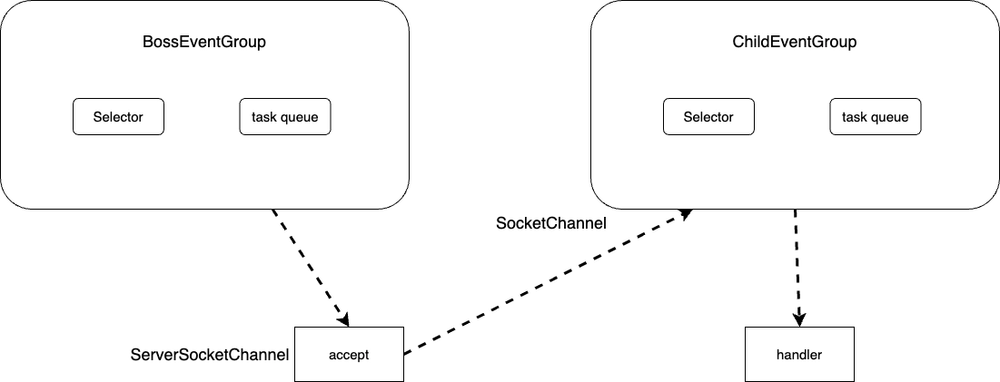

### 2025-01-05

## Play에 요청이 들어와서 응답이 나가기까지...
- **개요**
  - 플레이: 논블로킹/비동기 프레임워크
  - Netty(2.5 이하)/Akka HTTP 서버를 구동 중
    - Play 2.6 부터는 Akka HTTP를 기본 엔진
    - 논블로킹 모델, Akka Streams 기반
    - 큰 흐름으로 돌려주는 구조 유사

- **흐름 요약**
  1. Netty Event Loop가 새 TCP 연결을 받아들여, HTTP 요청을 파싱
  2. 파싱된 요청을 Play로 전달
  3. Routing 과정 - 특정 컨트롤러 Action으로 결정
  4. 컨트롤러(Action) 호출: 내부적으로 비동기/넌블러킹 방식의 요청 수행
  5. Future로 반환되는 결과가 완료되면, Play가 HTTP 응답을 Netty에게 전달
  6. Netty가 응답을 TCP 소켓으로 비동기 write 하여 클라이언트에게 전송

## NIO Non-Blocking 서버
*참고: https://mark-kim.blog/understanding-non-blocking-io-and-nio/*  
*참고: https://mark-kim.blog/understanding-event-loop/*
- **이벤트 기반 프로그래밍**
  - 이벤트 기반의 Multiplexing I/O
  - Polling 말고, 작업 완료시 Push 방식
  - `Selector`: Socket이 변경되었으면 변경되었다고 이벤트를 만들어 알림을 주도록 함 -> 컴퓨팅 자원 효율적
    - linux에서 데이터 수신, 새 커넥션 등 소켓에 새 이벤트 확인을 위한 select, poll, epoll 등을 제공하는데 이를 활용
  - 이벤트 루프 : 특정 이벤트/메시지가 발생할 때 까지 대기하다가 이벤트 발생시 디스패치하는 디자인 패턴

- **Selector, Channel**
  - 
  - Selector는 이벤트 리스터 역할
  - Non-Blocking Channnel에 Selector 등록
  - 클라이언트 커넥션 요청, 데이터 읽기/쓰기 필요시 -> Channel이 Selector에 이벤트 통보
  - Selector는 미리 등록해둔 Key의 상태를 변경해 특정 Channel에 대한 작업 수행하도록 미리 등록된 콜백 메서드 실행
    - 이때 쓰레드들이 등록된 비즈니스 로직 처리

- **역할**
  - Selector
    - 등록된 채널에 변경 사항 발생했는지 검사 -> 변경 사항이 발생한 채널에 대한 접근 가능하게 해줌
    - SelectorProvider를 통해 OS 버전에 따른 멀티플렉싱 기술 활용
  - SocketChannel, ByteBuffer
    - 소켓의 open/connect, 데이터 read/write 모두 ByteBuffer 통해 이뤄짐
    - SocketChannel은 양방향 채널 지원. 
  - Thread
    - 구현에 따라 Thread는 다양히 존재
    - NIO 관장 쓰레드, 비즈니스 처리 쓰레드
  - 

## Netty 이해하기
*참고: https://mark-kim.blog/netty_deepdive_1/*  
- **Netty의 EventLoop**
  - NioEventLoop: `1 Selector + 1 Thread + 1 TaskQueue`
  - NIO Selector에 등록된 Channel에서 발생하는 이벤트들을 Channel에 매핑된 핸들러가 처리하는 구조

- **Boss/Child EventLoopGroup**
  - 
  - 
  - Boss EventLoopGroup: 새로운 커넥션 처리
  - Child EventLoopGroup: 연결된 커넥션에 대한 read/write 처리
    - 이게 더 많기 때문에, `2 * 사용가능한 프로세서 수`

## Play SBT Plugin
- **개요**
  - Play 프로젝트를 SBT로 다룰 수 있게 해주는 메인 플러그인 
  - Play 어플리케이션을 SBT로 빌드/실행하기 위한 모든 기초 작업 포함

- **사용처**
  ```
  // plugins.sbt
  addSbtPlugin("com.typesafe.play" % "sbt-plugin" % "2.8.19")
  
  // build.sbt
  lazy val root = (project in file(".")).enablePlugins(PlayScala, JavaAgent)
  ```

- **역할**
  1. Play 전반을 위한 SBT 설정
     - Play 어플리케이션 빌드, 실행(run), 패키팅(dist), 배포(stage)
     - route, 템플릿 엔진 자동 컴파일
     - dev 모드에서 auto-reload
  2. Play 관련 디펜던시 구성
     - Play 웹서버 (Netty/Akka HTTP) 관련 라이브러리와 Play API 종속성 포함
     - 필요한 컴파일러 플러그인, 라이브러리 추가
  3. 개발 편의 제공
     - sbt run, sbt test
