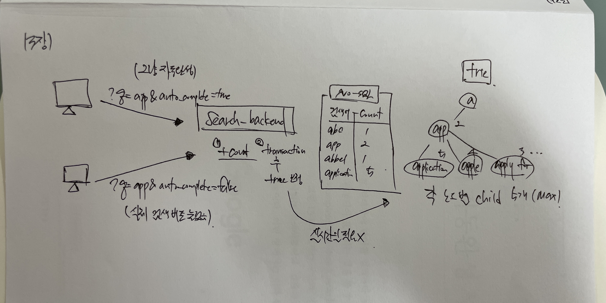

## 대규모 시스템 설계 기초 ch13. 검색어 자동완성 시스템

### 1단계. 문제 이해 및 설계 범위 확정
- 빠른 응답 속도 (100ms 이내)
- 연관성
- 정렬
- 규모 확장성 (DAU 천만명)
- 고가용성

### 2단계. 개략적 설계안 제시 및 동의 구하기
- **시스템 나누기**
  1. 데이터 수집 서비스
  2. 질의 서비스
     - DB의 like 절 + LIMIT 쓸 수 있지만, 대규모 시스템이면 터지기 딱 좋음

### 3단계. 상세 설계
- **트라이 자료구조**
  - 문자열을 간략하게 저장할 수 있는 자료구조
  - 트리 형태의 자료구조, 루트는 빈 문자열
  - 노드에 빈도 정보까지 함께 저장할 것
  - 노드에 질의어를 top5 검색어를 캐시해두면 시간 복잡도 O(1)으로 커버 가능

- **데이터 수집 서비스**
  - 수천만건의 질의가 입력될 때, 트라이를 매번 갱신하면 서비스 부하 너무 큼
  - 인기 검색어 만들어지면 트라이 자주 변할 것은 아님. 갱신은 자주할 필요가 없음
  - 로그 취합 -> 분류 작업 서버 -> 트라이 갱신도 가능

- **트라이 데이터베이스**
  1. 문서 저장소
     - MongoDB와 같은 도큐먼트 디비를 통해 데이터 편하게 저장 가능
  2. key-value 저장소
     - 모든 트라이 데이터를 해시테이블 처럼 대응하여 저장 가능.

- **질의 서비스**
  - API 서버는 트라이 캐시에서 데이터를 가져와 해당 요청에 대한 자동완성 검색어 제안 응답 구성
  - 브라우저 캐싱을 통해 한동안 자동완성 똑같은 쿼리 안날리도록 조치

- **트라이 연산**
  - 트라이는 DB, 로그 등에서 취합한 데이터 사용
  - 검색어 삭제: 필터 계층을 두고 부적절한 질의어가 반환되지 않도록 하기
    - 어뷰징 제어하듯

- **저장소 규모 확장**
  - 샤딩을 통해서 특정 노드들을 분산시킬 수 있음.
  - 여기에서도 유명인사 문제가 발생할 수 있어, 과거의 데이터를 통해 노드를 쪽수별로 잘 분산할 수 있도록 샤딩 필요

### 4단계. 마무리
- 다국어 지원은 무조건 유니코드
- 국가별로 다른 검색어라면, 국가별 트라이
- 실시간 검색어를 자동완성에 구축하려면 어떻게?

### 설계)
- 