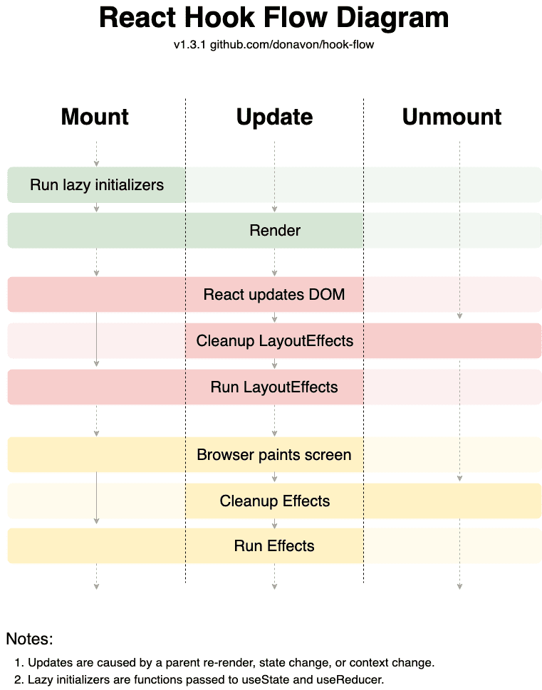

### 2026-03-23

## useEffect, useLayoutEffect
*참고: https://f-lab.kr/insight/understanding-useeffect-and-uselayouteffect-in-react-20240618?gad_source=1*  
*참고: https://medium.com/@jnso5072/react-useeffect-%EC%99%80-uselayouteffect-%EC%9D%98-%EC%B0%A8%EC%9D%B4%EB%8A%94-%EB%AC%B4%EC%97%87%EC%9D%BC%EA%B9%8C-e1a13adf1cd5*  
- **개념**
  - Render: `DOM Tree`를 구성하기 위해 각 엘리먼트 스타일의 속성을 계산
  - Paint: 실제 스크린에 Layout 표시하고 업데이트
  - 

- **useEffect**
  - Render와 Paint된 후에 실행
  - 비동기적으로 실행. DOM이 업데이트 된 후에 실행이 된다
  - 이벤트 루프의 태스크 큐에 콜백이 쌓이는 방식으로 동작 > DOM 업데이트 후 실행!
  - useEffect 내부에 dom에 영향을 주는 코드가 있다면, 사용자 입장에서 **화면의 깜빡임이 보임**

- **useLayoutEffect**
  - 컴포넌트들이 render된 후에 실행. 그 이후에 paint가 됨
  - 동기적으로 실행. DOM이 업데이트되기 전에 실행
  - DOM이 업데이트되기 전에 실행
  - Paint 되기전에 실행되기 때문에, dom을 조작하는 코드가 있더라도, 사용자는 **깜빡임을 경험하지 않음**
  - 다만!
    - 로직이 복잡할 경우 내부 코드가 모두 실행된 다음 painting을 하기 때문에, 성능에 영향이 있다면 X 쓰지말어!

## React Rendering
*참고: https://ko.react.dev/learn/render-and-commit*  
1. 렌더링 트리거
   - 컴포넌트의 초기 렌더링인 경우 / 컴포넌트의 state가 업데이트 된 경우 => 컴포넌트 렌더링이 일어남
     - 초기 렌더링)
       - `createRoot`를 호출한 다음, 해당 첨포넌트로 `render` 메서드를 호출하면 이 작업 완료
     - state 업데이트시 리렌더링)
       - `set` 함수를 통해 상태 업데이트하여 추가적인 렌더링 트리거
       - 컴포넌트의 상태 업데이트 하면 자동으로 렌더링 대기열에 추가

2. React 컴포넌트 렌더링
   - React는 컴포넌트를 호출하여 화면에 표시할 내용 파악
   - "렌더링" = React에서 컴포넌트를 호출하는 것
     - 초기 렌더링) 
       - React는 루트 컴포넌트 호출
     - 이후 렌더링)
       - React는 state 업데이트가 일어나 렌더링을 트리거한 컴포넌트 호출

3. React가 DOM에 변경 사항 커밋
   - 컴포넌트가 렌더링한 후 React는 DOM을 수정
   - 초기 렌더링)
     - React는 `appendChild()` DOM API를 사용해 생성한 모든 DOM 노드를 화면에 표시
   - 리렌더링)
     - React는 필요한 최소한의 작업을 적용하여 DOM이 최신 렌더링 출력과 일치하도록 함
     - 렌더링 간 차이가 있는 경우에만 DOM을 변경
     - 딱 변경될 부분만 딱 변경!

4. 브라우저 페인트
   - 렌더링이 완료 된 후, React가 DOM을 업데이트한 후 브라우저는 화면 다시 그림
   - 브라우저 렌더링 이라고 부르는데, 리액트에서는 페인팅이라고 부름
