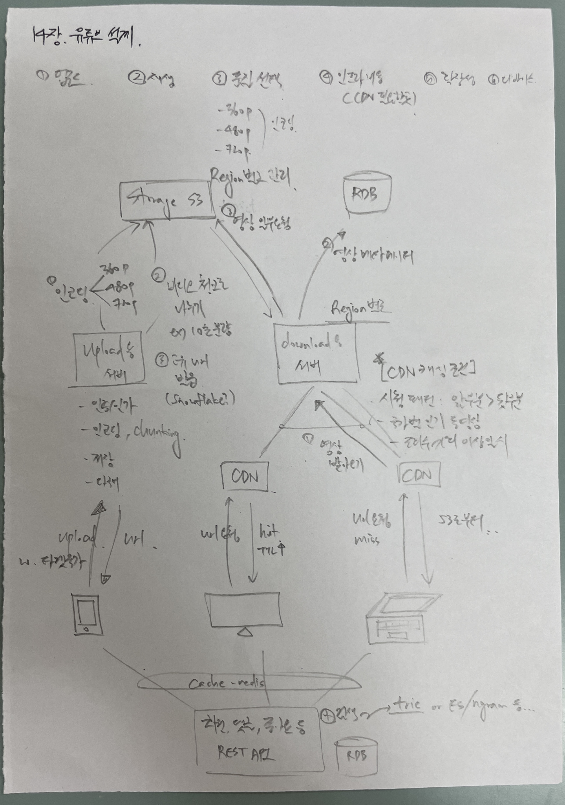
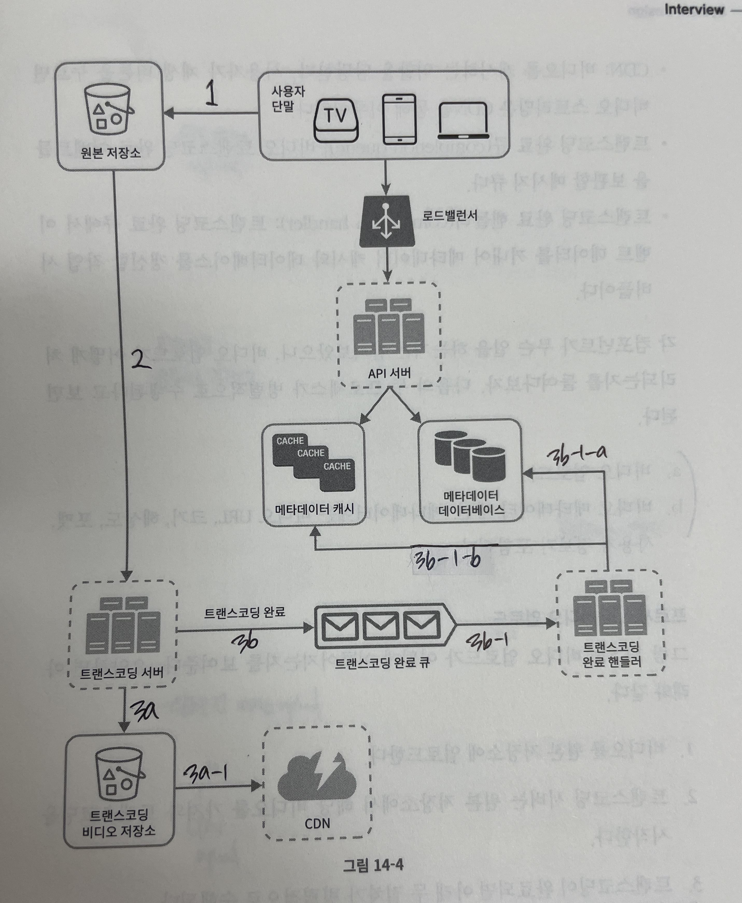
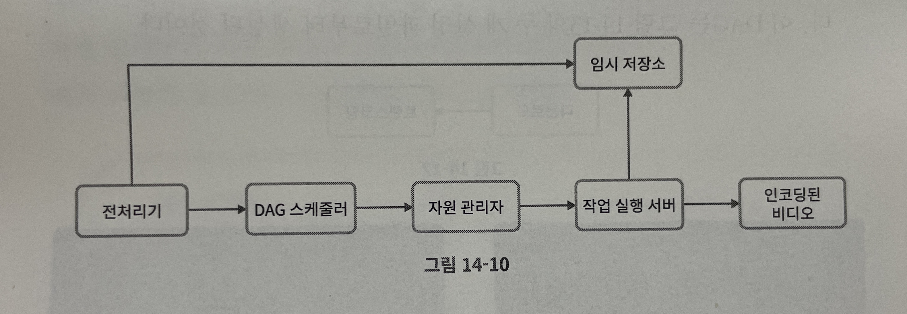
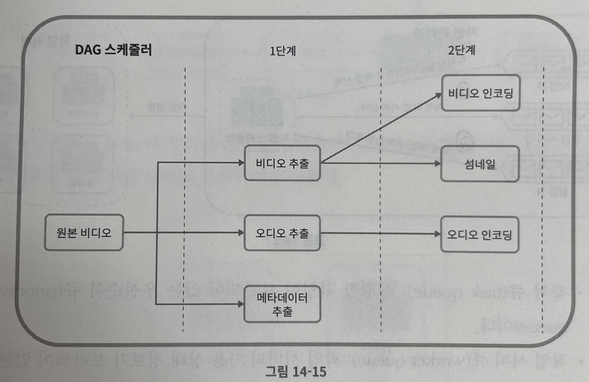
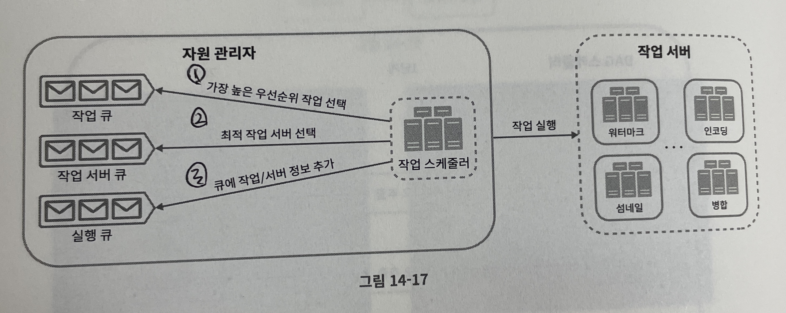
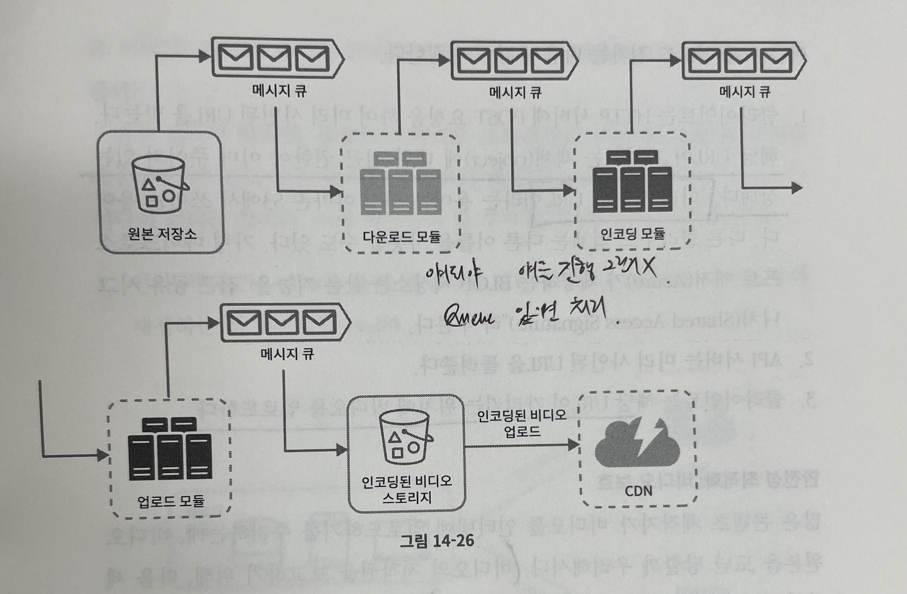

## 대규모 시스템 설계 기초 ch14. 유튜브 설계

### 0단계. 가벼운 설계


### 1단계. 문제 이해 및 설계 범위 확정
- **요구사항**
  - 빠른 비디오 업로드
  - 원활한 비디오 재생
  - 재생 품질 선택 기능
  - 낮은 인프라 비용
  - 높은 가용성과 규모 확장성, 그리고 안정성
  - 지원 클라이언트: 모바일 앱, 웹 브라우저, 스마트 TV

- **개략적 규모 측정**
  - DAU 5백만명
  - 사용자 한명에 하루 평균 5개의 비디오 시청
  - 10%의 사용자가 하루에 비디오 1개 업로드
  - 비디오 평균 크기는 300MB
  - 비디오 저장을 위해 매일 새로 요구되는 저장 용량
    - 5백만 * 10% * 300MB = 150TB
  - CDN 비용
    - 클라우드 CDN을 통해 비디오를 서비스할 경우, 사용량에 따라 과금
    - 아마존 CDN 솔루션으로 사용할 경우, 100% 트래픽이 미국에서 발생한다고 하면 1GB $0.02 요금
    - 발생 요금: 5백만 * 5비디오 * 0.3GB * $0.02 = $150,000 (한화 약 2억이라고 합니다...)

### 2단계. 개략적 설계안 제시 및 동의 구하기
- **개요**
  - CDN과 BLOB 스토리지의 경우, 기존 클라우드 서비스 활용 (넷플릭스, 페이스북도 클라우드 서비스 활용)
  - CDN: 비디오는 CDN에 저장. CDN으로부터 스트리밍
  - API 서버: 비디오 스트리밍 제외한 모든 요청 API 서버 처리. 피드 추천, 비디오 업로드 URL 생성, 메타데이터 DB/Cache 갱신, 사용자 가입 등

- **비디오 업로드 절차**
  - 
  - 비디오 업로드)
    - 1.비디오를 원본 저장소에 업로드
    - 2.트랜스코딩 서버는 원본 저장소에서 해당 비디오를 가져와 트랜스코딩 시작
    - 3.트랜스코딩 완료되면 아래 두 절차가 병렬적으로 수행
       - 3a. 완료된 비디오를 트랜스코딩 비디오 저장소로 업로드
         - 3a-1. 트랜스코딩이 끝난 비디오 CDN에 업로드
       - 3b. 트랜스코딩 완료 이벤트를 트랜스코딩 완료 큐에 넣는다
         - 3b-1. 완료 핸들러가 이벤트 데이터를 큐에서 꺼냄
           - 3b-1-a/3b-1-b. 완료 핸들러가 메타데이터 데이터베이스와 캐시를 갱신
    - 4.API 서버가 단말에게 비디오 업로드가 끝나서 스트리밍 준비가 되었음을 알림
  - 메타데이터 갱신)
    - 원본 저장소에 파일 업로드 되는 동안, 단말은 병렬적으로 비디오 메타데이터 갱신 요청을 API에 보냄

- **비디오 스트리밍 절차**
  - 스트리밍 프로토콜마다 지원하는 비디오 인코딩이 다르고 플레이어도 다ㅏ름
    - 서비스의 용례에 맞는 프로토콜을 잘 고를 것
    - ex)
      - MPEG-DASH
      - HLS (Apple)
      - Microsoft Smooth Streaming
      - Adobe HTTP Dynamic Streaming

### 3단계. 상세 설계
- **비디오 트랜스코딩**
  - 비디오 녹화 시, 특정 포맷으로 저장됨. 순조롭게 여러 단말에서 재생되려면 타 단말과 호환되는 비트레이트/포맷으로 저장할 것
    - 비트레이트: 비트가 얼마나 빨리 처리되어야 하는지를 나타내는 단위. 높을수록 고화질 비디오
  - 비디오 트랜스코딩이 필요한 이유
    - 가공되지 않은 비디오는 용량을 엄청 차지함
    - 상당수 단말/브라우저는 특정 종류의 비디오 포맷만 지원. 여러 포맷으로 인코딩하는 것이 바람직
    - 끊임 없는 비디오를 사용자에게 제공하기 위해서는 네트워크 환경에 따라 화질을 조절할 수 있어야 함
  - 인코딩 포맷
    - 컨테이너: 비디오/오디오/메타데이터 담는 바구니
    - 코덱: 압축/압축해제 알고리즘. 비디오 화질 보존 + 파일 크기 줄이기에 사용

- **Directed Acyclic Graph (DAG) 모델 소개**
  - DAG: Acyclic(방향성, 특정 방향을 가짐) + Acyclic(비순환성, 자기 자신으로 못 돌아옴)
    - 데이터 처리 파이프라인에 많이 사용
  - 비디오 프로세싱 파이프라인 처리 과정의 병렬성을 높이기 위해, 각 작업을 단계별로 배열하여 순차/병렬 실행될 수 있도록 DAG를 사용하자.

- **비디오 트랜스코딩 아키텍쳐**
  - 
  1. 전처리기
     - 비디오 분할: 비디오 스트림을 GOP(Group Of Pictures) 단위로 쪼갬. 
     - DAG 생성: 개발자가 작성한 파일에 따라 DAG 생성. 
     - 데이터 캐시: GOP와 메타데이터를 임시 저장소에 보관. 인코딩 실패시, 보관된 데이터를 기반으로 인코딩 재개
  2. DAG 스케줄러
     - 
     - DAG 그래프를 세부 스테이지로 분할, 해당 작업을 작업 큐에 publish
     - ex)
       - stage1. 비디오, 오디오, 메타데이터 분리
       - stage2. 비디오 인코딩, 썸네일 추출, 오디오 인코딩
  3. 자원 관리자
     - 
     - 자원 배분을 효과적으로 수행하는 역할 담당
  4. 작업 서버: 실제 작업 수행
  5. 임시 저장소: 작업 서버가 빈번히 참조하는 작은 정보들. 프로세싱 후 삭제 요망
  6. 인코딩된 비디오: 최종 결과물

- **시스템 최적화**
  - 속도 최적화
    - 비디오 병렬 업로드: GOP를 병렬적으로 업로드
    - 업로드 센터 사용자 근거리에 지정: CDN을 업로드 센터로 활용
    - 모든 절차 병렬화
      - 앞선 단계가 완료되어야 뒤의 절차를 진행할 수 있는 현재 구조를, MQ를 도입하여 시스템 결합도를 낮추자
      - 
  - 안정성 최적화
    - pre-signed 업로드 URL: URL이 가리키는 객체에 대해 접근 권한 선 부여, 해당 URL이 가르키는 위치에 업로드
    - 비디오 보호: AES 암호화. 허락된 사용자만 암호화된 비디오 시청. 재생시에만 복호화
    - 워커마크
  - 비용 최적화
    - 비디오 서비스는 롱테일 분포를 따름
    - 인기 없는 비디오 인코딩하지마
    - 특정 지역에서 인기있는 비디오는 지역에서만 캐싱
    - ISP와 제휴

- **쿠팡플레이 예시 w. GEMINI**
  ```
  [Request]
  Request URL       https://vod02-cosmos.coupangstreaming.com/output/drm/2025/08/1a00cde8-5b71-4455-a294-39462a2fa9a3/avc/dash/1755266791/1b8a3f23415886d5c88918a77554201c08ff57aa-video-384_000000441.mp4
  Request Method    GET
  Status Code       200 OK
  Remote Address    162.128.170.47:443
  Referrer Policy   strict-origin-when-cross-origin
  
  [Response]
  accept-ranges                   bytes
  access-control-allow-methods    *
  access-control-allow-origin     *
  access-control-expose-headers   cdn-tracking, via
  access-control-max-age          3600
  cdn-tracking                    tencent
  content-length                  237833
  content-type                    video/mp4
  date                            Sat, 16 Aug 2025 14:29:22 GMT
  eo-cache-status                 HIT
  eo-log-uuid                     7940344221724878289
  etag                            "a68623ecd91977e76fdf94bb3c0a3f4e"
  last-modified                   Fri, 15 Aug 2025 14:28:11 GMT
  server                          AmazonS3
  vary                            Origin
  x-amz-cf-id                     A-NV0F0ubZZHe-VXcv9-__68tDP4OrCXJCxwJPtVKzufl6aBER7nwg==
  x-amz-cf-pop                    ICN57-P4
  x-amz-meta-mediaconvert-jobid   1755266791252-2x5jis
  x-amz-server-side-encryption    AES256
  x-cache                         Miss from cloudfront
  ```
  1. DRM (Digital Rights Management): 핵심적인 이유 🔒
     - 영상 암호화: 쿠팡플레이의 원본 영상은 암호화된 상태로 서버(Amazon S3)에 저장됩니다. 요청 예시에서 받은 .mp4 파일은 단순한 영상 조각이 아니라, 암호가 걸려있는 영상 조각입니다.
     - 재생 허가 및 복호화 키: 쿠팡플레이 앱이나 웹 플레이어에서 영상을 재생하면, 플레이어는 쿠팡플레이의 DRM 라이선스 서버에 "나 정식 사용자인데, 이 영상 재생하게 해줘"라고 요청을 보냅니다.
     - 암호 해독: 라이선스 서버는 사용자의 로그인 정보와 기기 정보 등을 확인하고, 유효한 사용자일 경우에만 영상의 암호를 풀 수 있는 **'복호화 키(Decryption Key)'**를 보내줍니다. 이 키는 운영체제나 브라우저의 안전한 영역에서 처리되므로 사용자가 직접 가로챌 수 없습니다.
     - 결론: 외부 다운로더로 영상 조각(.mp4)을 다운로드하더라도, 암호를 풀 수 있는 '키'가 없기 때문에 그냥 암호화된 데이터 덩어리일 뿐, 재생할 수 없습니다.
  2. DASH (Dynamic Adaptive Streaming): 조각난 파일 🧩
     - 스트리밍 방식: URL에 포함된 /dash/는 이 비디오가 DASH 방식으로 스트리밍되고 있음을 나타냅니다. 이는 전체 비디오를 하나의 큰 파일로 보내는 것이 아니라, 수백, 수천 개의 아주 작은 .mp4 조각으로 쪼개서 전송하는 기술입니다.
     - 다운로드의 어려움: 설령 모든 조각의 URL을 알아내서 다운로드하더라도, 이것들을 순서에 맞게 합치는 것은 매우 번거롭습니다. 더 중요한 것은 위에서 설명한 것처럼 이 조각들 하나하나가 모두 DRM으로 암호화되어 있다는 점입니다.
  3. 서명된 URL (Signed URL): 시간제한이 있는 주소 ⏱️
     - 일회성 주소: URL의 1b8a3f23415886d5c88918a77554201c08ff57aa 와 같은 긴 문자열은 인증 토큰일 가능성이 높습니다. 이 토큰은 현재 로그인한 사용자에게만 특정 시간(예: 몇 분 또는 몇 시간) 동안만 유효하도록 생성됩니다.
     - 재사용 불가: 따라서 시간이 지나거나 로그아웃하면 이 URL은 만료되어 더 이상 접근할 수 없게 됩니다. 다른 사람에게 이 URL을 공유해도 소용이 없습니다.

- **오류 처리**
  - 회복 가능 오류: 재시도
  - 회복 불가능 오류: 클라이언트에게 적절한 오류 반환

### 4단계. 마무리
- 더 논의해보면 좋을 내용들
  - API 무상태 서버 수평적 확장 가능
  - 데이터베이스 계층 규모 확장성 확보 방안 (샤딩, 다중화)
  - 라이브 스트리밍은 어떻게?
  - 비디오 삭제: 저작권, 선정성, 불법적 어떻게?
