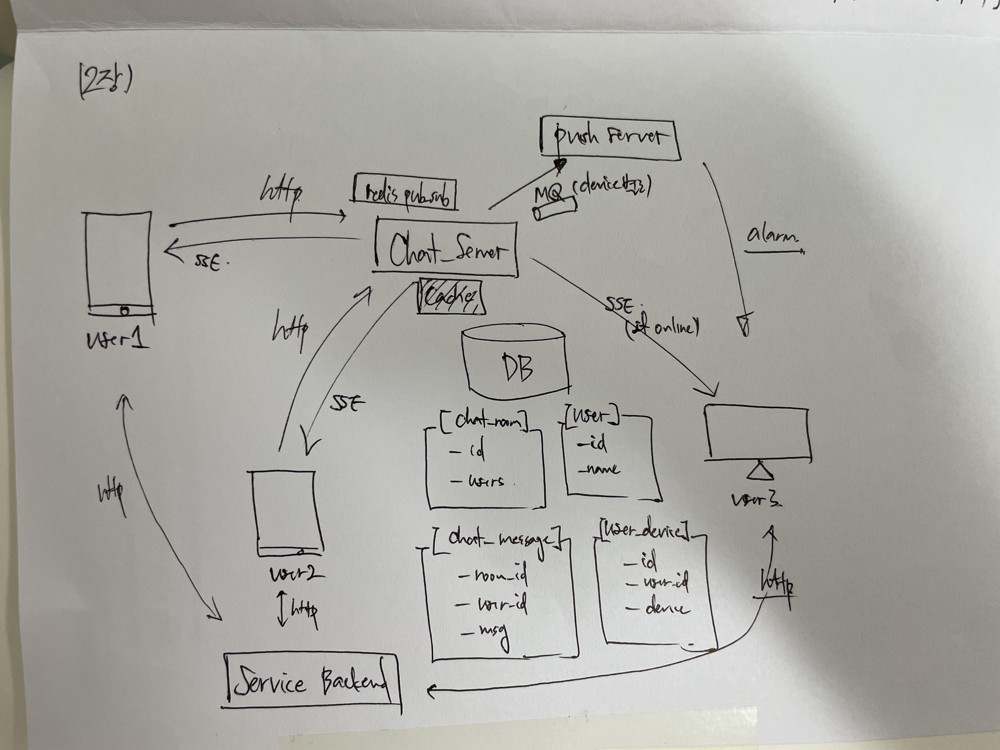

## 대규모 시스템 설계 기초 ch12. 채팅 시스템 설계

### 1단계. 문제 이해 및 설계 범위 확정
- 응답 지연이 낮은 일대일 채팅 기능
- 최대 100명까지 참여할 수 있는 그룹 채팅 기능
- 사용자의 접속상태 표시 기능
- 다양한 단말 지원, 하나의 계정으로 여러 단말 동시 접속 지원
- 푸시알림

### 2단계. 개략적 설계안 제시 및 동의 구하기
- **채팅 서비스 프로토콜**
  - HTTP를 쓸 땐 keep-alive를 쓰자.
  1. polling
     - 서버 자원이 불필요하게 낭비
  2. long-polling
     - 새 메시지 반환되거나 타임아웃 될 때 까지 연결 유지
     - 여전히 주기적으로 반복적으로 서버 요청 > 낭비
  3. websocket
     - 처음에는 HTTP 연결, 특정 핸드셰이크 절차 거쳐 웹소켓 연결 업그레이드
     - 이후에는 비동기적으로 메시지 전송 가능. 
     - HTTPS/HTTP 기본 포트번호 그대로 사용
     - 서버 측에서 리소스 관리를 하기에 효율적인 관리 기법이 필수

- **서버 나누기**
  - 무상태 서비스: HTTP 로 프로필, 그룹 등등 기본 웹 요청
  - 상태 유지 서비스: 웹 소켓 등
  - 제 3자 서비스 연동 : 푸시 알림 등
  - 규모 확장성이 중요! 서버 한대로 얼마나 많은 접속 동시에 허용 가능한지!?

- **채팅 서버**
  - 채팅 이력을 보관하기 위해서는 읽기/쓰기 연산 패턴 이해할 것
  - key-value 저장소로 HBase/Cassandra 등을 많이 사용
    - Column-Oriented Database
      - 행이 아닌 열 단위로 데이터를 저장하는 DB
      - 테이블에 같은 column에 속한 모든 값을 연속적으로 저장
      - 장점)
        - 특정 column 조회 매우 빠름
        - 압축 효울 올라감
        - 분석/집계 쿼리에 유리함
  - 메시지 순서를 보장할 수 있는 message_id 기법이 필요
    - RDB면 auto_increment,
    - snowflake같은 전역 순서 생성기도 가능

### 3단계. 상세 설계
- **서비스 탐색**
  - 사용자 로그인 하면, 주키퍼와 같은 서비스 탐색기로 채팅 서버 중에 해당 사용자의 웹소켓 연결을 관리할 서버를 지정
  - 주키퍼)
    - 분산 어플리케이션을 위한 분산 코디네이션 서비스 제공 오픈소스
    - 각각의 서버는 다른 서버의 정보 공유
    - 하트비트 전송 등을 수행
    - 서버 연결 끊어지면 타 서버와 통신

- **메시지 흐름**
  - 여러 단말간 메시지 동기화를 위해 각 단말별로 어디까지 채팅 읽었는지 `chatLogId`와 같은 것을 저장해두자.
  - 메시지가 새로 왔을 때, 단체 채팅방에서는 각 수신자별 메시지 큐에 복사해서 넣는것도 가능
    - Qs) 오픈채팅방은 어떻게 구현되어 있을까? 
  - 한 수신자는 여러 사용자로부터 오는 메시지를 수신할 수 있어야 함

- **접속 상태 표시**
  - 서버는 클라와 웹 소켓으로 통신하며 실시간 서비스. 
  - 접속 장애 (ex. 터널에 들어감)로 싸그리 상태를 off 하는것은 비효율. 
  - 하트비트 이벤트 등을 통해서 접속 상태 offline으로 변경하는 방법 고려
  - 접속했는지 상태는 pub-sub 을 지원하는 데이터베이스를 써서 관리하는 것도 좋은 방법. 
    
### 4단계. 마무리
- 미디어 지원하려면?
- 종단간 암호화?
- 캐시?
- 로딩 속도 개선?
- 오류 처리?
- 메시지 재전송?

### 설계)
- 