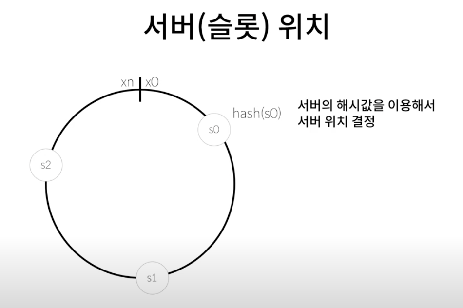
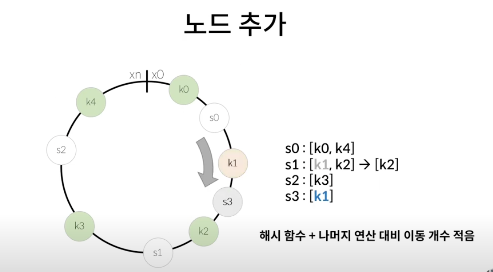
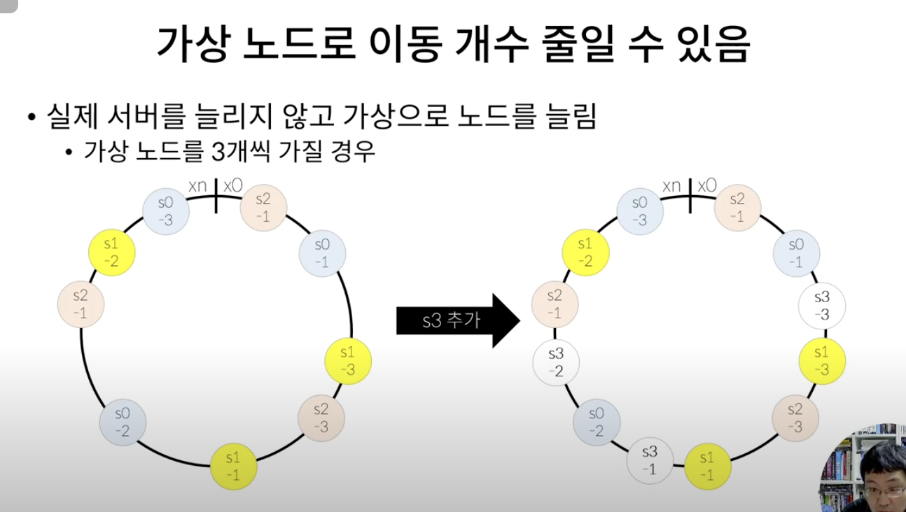

## 대규모 시스템 설계 기초 ch5. 안정 해시 설계
*참고: https://www.youtube.com/watch?v=UQfNytDFpgk*  
*참고: https://gallery.selfboot.cn/en/algorithms/hashring*  
- **개요**
  - 수평적 규모 확장성을 달성하기 위해서는 요청 또는 데이터를 서버에 균등하게 나누는 것이 중요

- **해시 키 재배치 문제**
  - 모듈로 연산으로 해싱을 해둔다면, 서버가 추가 되거나 기존 서버가 삭제되었을 때 해시 키 재배치가 문제가 됨
    - 특정 서버가 죽으면, 대부분 캐시 클라이언트가 데이터 키가 없는 엉뚱한 서버를 바라보게 됨
    - 서버 갯수가 변동되면, 많은 데이터의 저장 서버 위치가 재배치되어야 함

- **안정 해시**
  - 안정 해시: 해시 테이블 크기가 조정될 때 평균적으로 오직 k/n개의 키만 재배치하는 해시 기술
    - k = 키의 갯수
    - n = 슬롯의 갯수
  - 서버 슬롯 위치: 서버의 해시값을 이용해서 서버 위치 결정
    - 
  - 노드 추가: 해시 함수 + 나머지 연산 대비 이동 갯수가 적음
    - 

- **가상 노드**
  - 가상 노드의 갯수를 늘리면 키의 분포는 점점 더 균등해짐
    - 다만, 가상 노드 데이터를 저장할 공간은 더 많이 필요해질 것
    - 따라서, 적절한 trade-off를 고려하여 적당한 갯수를 조절하자
    - 

- **요약 - 안정 해시의 이점**
  - 서버가 추가되거나 삭제될 때 재배치되는 키의 수가 최소화
  - 데이터가 보다 균등하게 분포, 수평적 규모 확장성 달성하기 쉬움
  - hotspot 키 문제가 줄어듦. 특정한 샤드에 대한 접근이 지나치게 발생하는 과부하 문제 low
