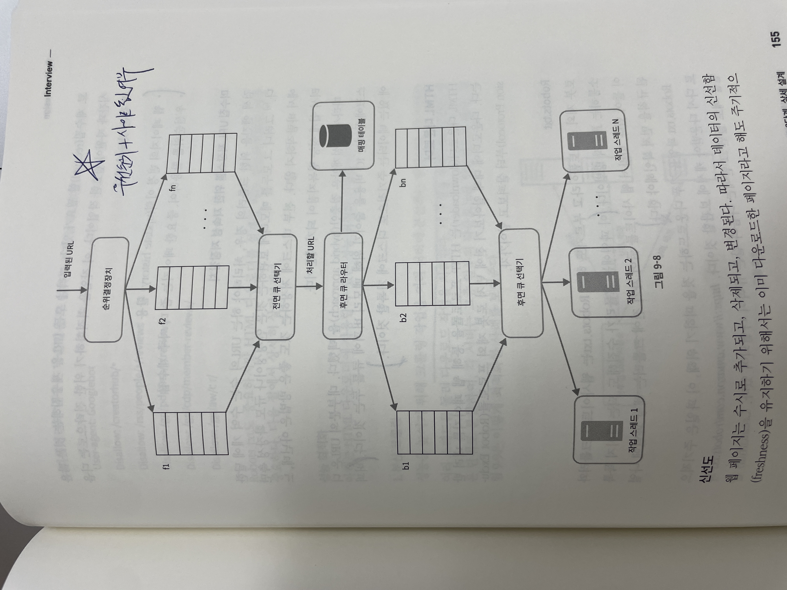

## 대규모 시스템 설계 기초 ch9. 웹 크롤러 설계

#### 크롤러의 용도
- 검색 엔진 인덱싱: 웹 페이지를 모아 검색 엔진을 위한 로컬 인덱스 생성
- 웹 아카이빙: 나중에 사용할 목적으로 장기 보관. 국회 도서관 등
- 웹 마이닝: 인터넷에서 유용한 지식을 도출해내기
- 웹 모니터링: 해적판 저작물 찾아서 보고

### 1단계. 문제 이해 및 설계 범위 확정
- **기본 알고리즘**
  1. URL 집합이 입력으로 이루어지면, 해당 URL들이 가리키는 모든 웹페이지 다운로드
  2. 다운받은 웹 페이지에서 URL 추출
  3. 추출된 URL들을 다운로드할 URL 목록에 추가, 위의 단계 반복
- **웹 크롤러가 만족시킬 속성**
  1. 규모 확장성: 효과적인 웹 크롤링
  2. 안정성: 비정상적 입력이나 환경에 잘 대응할 것
  3. 예절: 수집대상 웹사이트에 많은 요청 한번에 X
  4. 확장성: 새로운 형태의 콘텐츠 지원할 수 있을 것

### 2단계. 개략적 설계안 제시 및 동의 구하기
- **STEP BY STEP**
  1. 시작 URL 집합
  2. 미수집 URL 저장소 탐색
  3. HTML 다운로더 w. DNS 변환기
  4. 컨텐츠 파서
  5. 중복 컨텐츠 검사 w. 컨텐츠 저장소
  6. URL 추출기
  7. URL 필터
  8. 이미 방문한 URL 인지? 아니라면 2번 부터 반복
  ```
                                 도메인 이름 변환기
                                       ^
                                       |
  시작 URL 집합 -> 미수집 URL 저장소 -> HTML 다운로더 -> 컨텐츠 파서 -> 중복 컨텐츠?
                       ^                                          ↓
                       |                                      URL 추출기
                       |                                          ↓
                       |                                       URL 필터
                       |                                          ↓
                       -----------------------------------  이미 방문한 URL?
                                                                  ↓
                                                               URL 저장소
  ```

- **시작 URL 집합**
  - 크롤러가 가능한 많은 링크를 탐색할 수 있도록 URL 고르기
  - 나라별로 인기있는 웹사이트가 다르다는 점에서 착안
  - 쇼핑, 스포츠, 건강 등 주제별 세분화 URL 사용

- **미수집 URL 저장소**
  - 다운로드할 URL / 다운로드된 URL 로 관리

- **중복 컨텐츠인가?**
  - 웹 페이지의 해시값을 비교

- **이미 방문한 URL?**
  - 블룸필터, 해시테이블을 사용하여 중복 제

### 3단계. 상세 설계
- **DFS vs BFS**
  - BFS를 사용. DFS 사용했다가 그래프 못나올수도
  - 위키피디아 하나 들어갔다가, 페이지 너무많아서 탐색하다보니 디도스공격 마냥 될 수 있음
    - 따라서 페이지 랭크, 트래픽양, 업데이트 빈도 등으로 중요도를 달리하여 탐색해야 함

- **미수집 URL 저장소**
  - 예의를 갖춘 크롤러를 만들자
  - 초당 수천건의 페이지 요청 웹사이트에 보내 마비하면 안돼. 따라서 순위 결정 장치 + 큐 라우터를 사용하여 탐색 순서를 조정하자
    - 우선 순위 + 동일한 사이트 인지 여부
  - 

- **신선도**
  - 웹 페이지의 변경 이력 활용
  - 우선순위 활용하여 중요한 페이지 자주 수집

- **성능 최적화**
  - 크롤링 작업을 여러 서버에 분산하는 방법. 여러 스레드를 돌려 다운로드 작업을 처리
  - DNS 응답은 동기적. 캐시 둬서 빠릿빠릿하게 응답받게 하자
  - 지역적으로 가까운 페이지는 근처로 크롤러 서버 배치
  - 짧은 타임아웃줘서 안오면 다음거

- **안정성**
  - 안정 해시: 다운로더 서버들에 부하 분산하기 위해 적용. 다운로드 서버 쉽게 추가 가능
  - 크롤링 상태 및 수집 데이터 저장: 크롤링 상태, 수집된 데이터 SSD에 기록

- **확장성**
  - 새로운 형태의 콘텐츠 쉽게 지원할 것

- **문제 있는 컨텐츠 감지 및 회피**
  1. 중복 컨텐츠: 해시나 체크섬 사용하여 중복 컨텐츠 쉽게 탐지
  2. 거미 덫: URL 최대길이 제한, 무한 크롤링 알림오면 크롤러에서 수동 제거 등
  3. 데이터 노이즈

### 4단계. 마무리
- 서버 측 렌더링 대응은?
- 스팸 방지 어떻게?
- DB 다중화/샤딩?
- 수평적 규모 확장성?

### 스터디
- 중복 컨텐츠 해시값 비교
  - 단순 해시값 비교로 중복 컨텐츠라고 보진 않음
  - 광고, 타임스탬프, 카운터 등으로 인한 일부 차이로 인해 거의 중복된 페이지(near-duplicates)를 제거할 수 없기 때문에 SimHash, MinHash, LSH 등 확률적 방식을 활용하는 것으로 보임.
