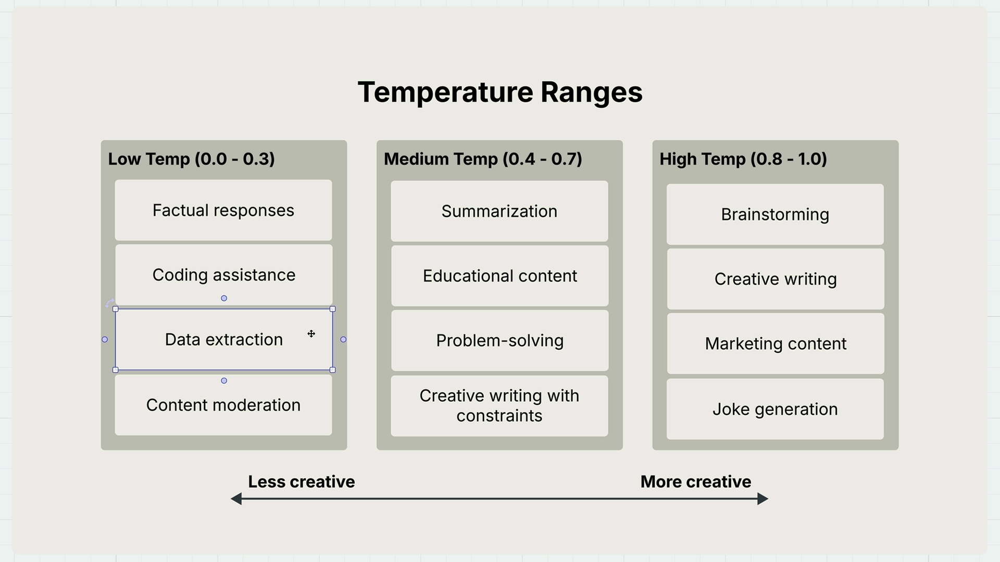
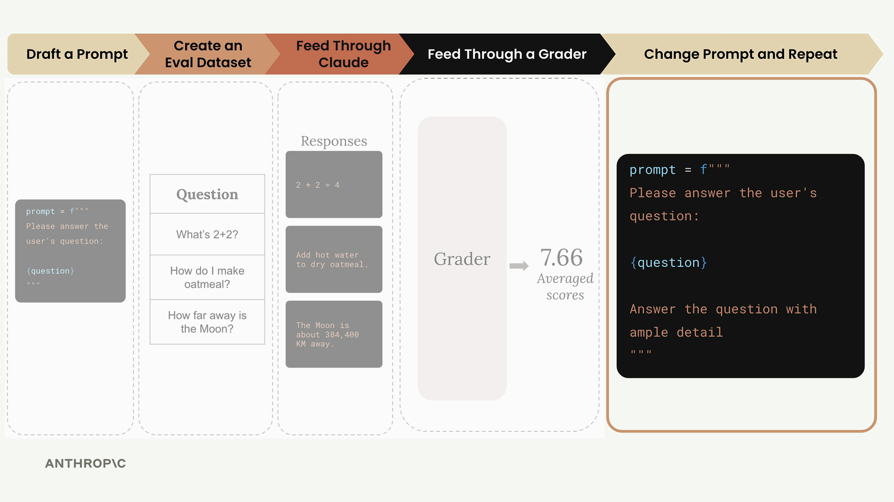

# AI

## Claude with the Anthropic API
*참고: https://anthropic.skilljar.com/claude-with-the-anthropic-api/*
### Accessing Claude with the API
- **Accessing the API**
  1. Request to Server
     - Client에서 직접 API 호출하지 말고, 서버 통해서 호출하세요
  2. Request to Anthropic API
     - 앤트로픽 SDK 등을 활용해서 요청하세요
       - API Key, Model, Message, Max Token 파라미터로 전달
  3. Model Processing
     - Text Generation Process
       - Tokenization
       - Embedding: list of numbers
       - Contextualization: Embedding 기반으로 확률 계산
       - Generation: 높은 확률로 그 다음 단어 뭐가 나올지 Output Layer
  4. Response to Server
     - Message, Usage, Stop Reason을 반환

- **API context**
  - context를 유지하기 위해서는 코드에서 수동으로 메시지를 저장해야한다. follow-up question 하기 위해서는 준 메시지 다 필요해

- **System Prompt**
  - Style/Tone을 조정하여 클로드의 답변 조정
  - ex) 수학 튜터 역할을 맡기고 싶다면
    - you are a patient math tutor. Do not directly answer a student's questions. Guide them to a solution step by step.

- **Temperature**
  - Each token being selected -> 그 다음 단어 선택될 확률
  - temperature (0~1 사이 값) 으로 어떤 토큰을 선택할지 조절할 수 있음
    - 확률의 분포를 조정한다
    - `0`: 가장 높은 확률의 token이 선택될 확률이 100%로 올라감 (deterministic)
    - `1`: 확률의 분포가 고만고만해짐
  - 

- **Model Output 조정**
  - assistant 메시지에 특정한 문장을 넣어, 마치 모델이 이미 해당 답변을 제공한것 처럼 조작해 모델의 답변 선호도를 조절할 수 있음
  - `stop_sequence`를 통해서 특정 문자열이 나오면 멈추도록 제어 가능

- **Structured data**
  - 딱 구조화된 응답을 받고 싶다면, 위의 assistant + stop_sequence를 응용할 수 있음
  - `add_assistant_message(messages, "```json")`
    - 클로드가 생각하기에 어머! 나 벌써 json 마크다운 응답 시작했구나? 그냥 json부터 뱉어야지
  - `chat(stop_sequences=["```"])`
    - 마크다운 끝낼때 나오는 사인 나오면 응답 중지!
  - 이렇게 많은 형식을 구조화하여 출력 가능

### Prompt Evaluation
- **개요**
  - Prompt Engineering: improve prompt
  - Prompt Evaluation: Getting objective metric that prompt is effective
  - 측정 가능한 것이 뭔지 먼저 알고 (Evaluation), 최적화 (Engineering) 로 나아가자
    - Evaluation Pipeline을 태워서 해당 프롬프트를 점수화하고, 반복하자

- **Evaluation Workflow**
  - 다양한 방식이 있음. 많은 오픈소스 워크 플로우가 있음
  - workflow가 어떻게 동작하는지 알고, 대단한 규모가 필요한 일은 아님
  - 방식
    1. Draft a Prompt
    2. Create an Eval Dataset
    3. Feed Through Claude
    4. Feed Through a Grader
    5. Change Prompt and Repeat
  - 

- **Evaluation Criteria**
  - Format: 어떤 형식만을 반환해야할지 검증
  - Valid Syntax: Python/JSON/Regex가 문법이 맞는지?
    - Code로 직접 검증 가능
  - Task Following: 정확한 요구사항을 맞춘 결과물인지?
    - Model API 호출하여 자체 검증을 하는것이 빠름

### Prompt Engineering
- **Being clear and direct**
  - prompt의 첫번째 줄이 가장 중요. 굉장히 clear/direct 해야해. 
    - clear: 명확히 원하는 것을 얘기할 것. 모델이 해야할일을 명확히 줄 것
      - ex) Write 3 paragraphs about how solar panel works
    - direct: 질문하지 말고 명령할 것. 확실한 액션 동사를 사용할 것. (ex. Write, create, generate)
      - ex) Identify 3 countries that use geothermal energy. Include generation stats for each

- **Be specific**
  - 모델에게 무엇을 원하는지 명확한 가이드라인을 주세요. 
  - 명확한 절차를 모델에게 제공하여 방황을 줄여주세요. 
  - 가이드라인 타입 : 혼합해서도 쓰임. 상용에서 많이 쓰이는 프롬프트
    1. 결과물이 갖춰야할 퀄리티를 제공하기
       - 대다수의 경우 이렇게 만족해야할 퀄리티를 제공하는 것이 유용
       ```
       Write a short story about a character who discovers a hidden talent. 
       
       Guidelines: 
       1. Keep the story under 1,000 words
       2. Include a clear action that reveals the character's talent
       3. Include at least one supporting character
       ```
    2. 모델이 지켜야할 절차를 제공하기
       - complex problem, force claude to get wider view. 
       - 즉각적으로 고려하기 어려운 것이 있다면 알려주세요. 
       ```
       Write a short story about a character who discovers a hidden talent. 
       
       Guidelines: 
       1. Brainstorm 3 talents that would create dramatic tension
       2. Pick the most interesting talent
       3. Outline a pivotal scene that reveals the talent
       4. Brainstorm 3 supporting characters types that could increase the impact of this discovery
       ```
       
- **Structure with XML tags**
  - claude에게 지시사항과 분석하려는 데이터를 구분하여 넣어줄 수 있도록, 가라 태그라도 괜찮으니 구분해주세요.
  - asis)
    ```
    Debug my code
    println("Hello World")
    ```
  - tobe)
    ```
    Debug my code

    <my_code>
    println("Hello World")
    </my_code>
    ```
    
- **Providing Examples**
  - One-shot/Few-shot 기법
  - Make SUPER CLEAR for claude to get what I really mean. 
    ```
    Categorize the sentiment of the below tweet:
    <input_tweet>
    Yeah, sure. that was the best movie I've ever seen since 'Plan 9 from Outer space'
    </input_tweet>
  
    If the tweet has a positive sentiment, respond with "Positive". If it is negative, repsond with "Negative"
  
    Here is a example input with an ideal response:
    <sample_input>
    Great game tonight!
    </sample_input>
    <ideal_output>
    Positive
    </ideal_output>
  
    Be especially careful with tweets that contain sarcasm:
    For example:
    <sample_input>
    Oh yeah, I really needed a flight delay tonight. Excellent!
    </sample_input>
    <ideal_output>
    Negative
    </ideal_output>
    ```
  - 프롬프트 채점기를 통해서 10점을 받은 친구가 있을거야. 그러면 그걸 one-shot/few-shot으로 활용하여 이거랑 비슷하게 출력하도록 하면 좋겠지?!
  - 추가로 왜 이게 좋은 점수를 받았는지까지 곁들여주세요. 그러면 클로드가 더 감을 잡기 좋아요. 

### Tool use with Claude
- **Tool functions & Tool schemas**
  - 약간 function calling과 비슷한 느낌.
  - Json Schema로 클로드에게 function을 쓰는 법을 알려줌
    - 필드: `name`, `description`, `input_schema`
    - 3-4줄 정도로 description을 알려줌.
  - 특정 사용하고자 하는 함수를 클로드에게 Tool use with Claude를 넣고 가장 좋은 JSON 스펙 작성해달라고 요청

- **Handling message blocks**
  - `TextBlock`과 `ToolUseBlock`을 assistant가 답해준다. 이를 기록해둬야함. 
  ```python
  messages = []
  messages.append({
    "role": "user",
    "content": "What is the exact time, formatted as HH:MM:SS?"
  })
  
  response = client.messages.create(
    model=model,
    max_tokens=1000,
    messages=messages,
    tools=[get_current_datetime_schema],
  )
  ```

- **Sending tool results**
  - Tool function을 실행하고 나면, `ToolResultBlock`을 반환
    - 해당 블록은 user message 클로드에게 무슨일이 해당 툴 시작할 때 있었는지 알려줌
    - `tool_use_id` : ToolResult와 ToolUseBlock과의 묶음
    - `content`
    - `is_error`

- **Multi-turn conversations with tools**
  - 여러개의 함수를 넘겨, 멀티 턴제 프롬프트 구축 가. 
  - While 문 같은거 사용해서 계속해서 추가하도록 가능.

- **Implementing multiple turns**
  - 클로드가 언제 tool을 그만 쓸지 어떻게 알 수 있지? 
  - assistant_message의 `stop_reason`이 tool_use가 아니라면, 고만!

- **The web search tool**
  - Claude에 내장되어 있는 툴!
  - Claude에서 알아서 web_search를 할 수 있도록 지원해줌. 
  ```python
  web_search_schema = {
      "type": "web_search_20250305",
      "name": "web_search",
      "max_uses": 5,
  }  
  
  messages = []
  add_user_message(
      messages,
      """
      대한민국에서 사용했던 기본소득 제도 슬로건을 찾아줘. 
      """,
  )
  response = chat(messages, tools=[web_search_schema])
  response
  ```