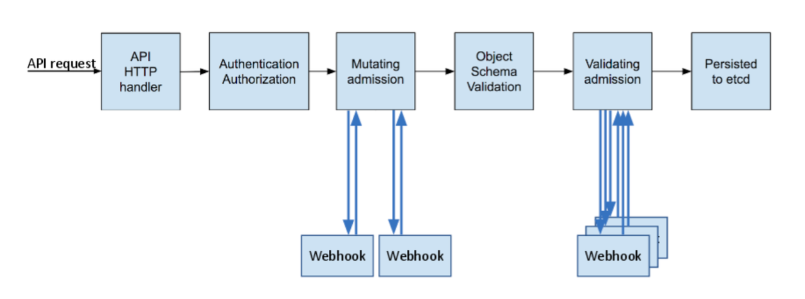

# Kubernetes (CKA)
*참고: https://kubernetes.io/docs/home/*  
*참고: https://www.udemy.com/course/certified-kubernetes-administrator-with-practice-tests/*

## 쿠버네티스 아키텍쳐

#### 공통
- **Container Runtime Engine**
  - 모든 노드에서는 docker, rkt 등 컨테이너 엔진이 필요

#### Master Node
- 역할 - Manage / Plan / Schedule / Monitor

- **ETCD cluster**
  - key-value 형식의 DB
  - 2379 포트에서 listening
    - 클라이언트 요청용 (API 서버 등 컨트롤 플레인 구성 요소 여기에 연결)
  - 2380 포트
    - etcd간 p2p 통신용 (etcd 클러스터 구성시 사용)
    - 클러스터가 혼자만으로 구성되어도 2380 포트에서 구동 가능
    ```
    controlplane /etc/cni/net.d ✖ netstat -anp | grep etcd | grep 2380
    tcp        0      0 192.168.117.46:2380     0.0.0.0:*               LISTEN      3654/etcd
    ```

- **kube-scheduler**
  - 어떤 Pod가 어떤 Node에 들어갈지 결정 (실제 배치는 Kubelet에서 진행)
    - 적재할만큼 용량이 되는지, 올바른 dest 인지
    - Scheduling
      1. Filter Nodes: Cpu/memory 하한 검증
      2. Rank Nodes: 0~10 점수 메겨서 어디가 적합할지 검증

- **kube-controller-manager**
  - node controller: 노드 상태 및 장애 감지
  - replication controller: 파드 갯수 유지 및 복제 관리
  - endpoint controller: 서비스-파드 간 연결 관리
  - service account & token controller: API 접근 위한 계정/토큰 관리
  - 기타 역할 많음: deployment, namespace, endpoint, job, pv-protection, service-account, pv-binder, cronjob, stateful set, replicaset

- **kube-apiserver**
  - 클러스터 구성요소 통신하는 중심 허브
  - `kubectl` 명령어 및 다른 클라이언트 요청 처리
  - 인증/인가
  - etcd 통신하여 클러스터 상태 저장/조회

#### Worker Node
- **kubelet**
  - `kube-apiserver`에게 현재 워커 노드 상태 보고
  - 각 Container의 선장으로, 컨테이너 런타임을 통해 컨테이너 실행/모니터링
    1. Node Register
    2. Pod 생성
    3. Node/Pod 모니터

- **kube-proxy**
  - 네트워크 통신 관리 역할
  - iptable/IPVS 통한 네트워크 트래픽 라우팅
    - iptable을 통해서 서비스 forwarding
  - 클러스터 내/외부 서비스 접근을 위한 네트워크 규칙 설정

## Kubernetes Workload Resource
- **ReplicaSet**
  - 특정 갯수의 Pod 갯수를 유지하는 역할
  - 파드 죽으면 새로운 파드 생성
  - 직접 사용하기보단 Deployment에서 주로 관리

- **Deployment**
  - 내부적으로 `ReplicaSet` 생성/관리
  - 어플리케이션 배포 및 업데이트 기능 제공
  - 롤링 업데이트 및 롤백 가능
    ```yaml
    apiVersion: apps/v1
    kind: Deployment
    metadata:
      name: my-deployment
    spec:
      replicas: 3
      selector:
        matchLabels:
          app: my-app
      template:
        metadata:
          labels:
            app: my-app # 위의 deployment에서 관리대상으로 지정한 label과 동일해야함. 그래야 pod를 관리함
        spec:
          containers:
          - name: nginx-container
            image: nginx
    ```

- **DaemonSet**
  - 클러스터의 모든(혹은 특정) 노드에 하나의 파드를 실행하도록 보장하는 리소스
  - 각 노드 별 하나의 파드로 배포하는 방식
  - 특징
    1. 모든 노드에 자동 배포
    2. 노드마다 하나의 파드만 실행됨
    3. 일반적인 사용 사례
       - 로그수집 에이전트 (Fluentd, Logstash)
       - 모니터링 에이전트 (Prometheus Node Exporter, Datadog)
       - 네트워크 관리 도구 (CNI 플러그인, kube-proxy)
       - 보안/시스템 관리 도구 (Falco, Sysdig)
    ```yaml
    apiVersion: apps/v1
    kind: DaemonSet
    metadata:
      name: monitoring-daemon
    spec:
      selector:
        matchLabels:
          app: monitoring-agent
      template:
        metadata:
          labels:
            app: monitoring-agent
        spec:
          containers:
          - name: monitoring-agent
            image: monitoring-agent
    ```

## Kubernetes Pods
- **Args**
  - Dockerfile에 있는 `ENTRYPOINT`, `CMD`는 쿠버 Pod의 `command`, `args` 필드로 오버라이딩 가능

- **Pod Priority, Preemption**
  - *참고: https://malwareanalysis.tistory.com/653* 
  - `kube-scheduler`가 더 이상 pod를 스케줄링하지 못할 경우, 우선 순위가 낮은 pod를 제거하고 새로운 pod를 스케줄링
  - ex) Node에 용량이 꽉 찼는데, 우선순위 높은 pod가 생성 요청 -> 우선 순위 낮은 pod 종료/빈 자리에 pod 스케줄링
    ```yaml
    apiVersion: scheduling.k8s.io/v1
    kind: PriorityClass
    metadata:
      name: test
    value: -1
    globalDefault: false
    ```
    ```yaml
    apiVersion: apps/v1
    kind: Deployment
    metadata:
      name: dummy-pod
      namespace: default
    spec:
      # ...
      template:
        spec:
          priorityClassName: test
          containers:
          - name: busybox
            image: busybox
    ```
  - 언제 사용하지?
    - 대기 시간을 최소화하기 위해 우선순위가 낮은 pod 미리 생성하여 노드 추가하는 AWS 카펜터의 오버프로비저닝

- **Multi-container pod**
  - *참고: https://seongjin.me/kubernetes-multi-container-pod-design-patterns/*
  - 하나의 Pod 안에 여러개의 Container가 있는 경우
  - 필요에 따라 메인 프로세스에 도움을 줄 수 있는 보조적인 역할의 컨테이너를 더해서 운영
  - 메인 프로세스를 네트워크/스토리지의 밀접한 공유가 필요한 다른 컨테이너와 함께 운영하고자 할 때
  1. `Sidecar Pattern`
     - 하나의 컨테이너는 하나의 책임만 가져야 한다
     - 두 컨테이너는 하나의 파드에 떠있어 file system 공유
     - ex) Log container(Sidecar), Webapp container(Main)
  2. `Adapter Pattern`
     - 특정 어플리케이션의 출력물 규격을 필요에 맞게 다듬는 용도
     - 이질적인 어플리케이션으로부터 출력물의 상호 호환성을 만들어주는 용도
     - ex) 오픈소스 어플리케이션 어떤건 포맷 `YYYY-MM-DD`, 어떤건 `DD/MM/YYYY`
  3. `Ambassador Pattern`
     - 파드 외부의 서비스에 대한 엑세스를 간소화하는 특수한 유형의 컨테이너
     - ex) 메인 컨테이너의 네트워크를 전담하는 프록시 역할을 수행하는 컨테이너
  - 예시) sidecar 컨테이너에서 동일한 웹앱의 log-volume 볼륨을 마운팅하여 filebeat로 전송하는 구조
    ```yaml
    apiVersion: v1
    kind: Pod
    metadata:
      name: app
      namespace: elastic-stack
      labels:
        name: app
    spec:
      containers:
      - name: app
        image: kodekloud/event-simulator
        volumeMounts:
        - mountPath: /log
          name: log-volume
    
      - name: sidecar
        image: kodekloud/filebeat-configured
        volumeMounts:
        - mountPath: /var/log/event-simulator/
          name: log-volume
    
      volumes:
      - name: log-volume
        hostPath:
          path: /var/log/webapp
          type: DirectoryOrCreate
    ```

- **Init Container**
  - 파드의 메인 컨테이너 실행 전 초기화 역할을 담당하는 컨테이너
  - 파드에 메인 프로세스 구동하는데 필요한 사전작업/조건 걸어두고, 완료된 뒤에 메인 프로세스 시작토록
  - 일반 컨테이너와의 차이점
    1. 모든 초기화 컨테이너는 의도된 작업 끝나면 반드시 종료될 것
    2. 초기화 컨테이너는 생명주기 관련 옵션(lifecycle), probe 옵션 사용 X
    3. 정상 종료되면 다음 컨테이너 순서 넘어감. 순차적 시작
    4. 초기화 컨테이너 구동 실패시, 성공할때까지 컨테이너 계속 재시작.

## Kubernetes Service & Ingress
- **개요**
  - 여러개의 파드를 하나의 네트워크 엔드포인트 (고정 IP)로 묶어주는 역할
  - 파드가 동적으로 변해도 안정적인 네트워크 접근 제공
  - 로드밸런싱 가능
  - 내부/외부 트래픽 파드로 전달
  - 관리할 파드를 지정하기 위해서는, Service selector에 정의한 라벨들을 Pod에서 **모두** 가지고 있어야 한다.
    ```yaml
    apiVersion: v1
    kind: Service
    metadata:
      name: my-service
    spec:
      selector:
        app: nginx
        tier: frontend
      ports:
        - protocol: TCP
          port: 80
          targetPort: 80
    ```
    ```yaml
    apiVersion: v1
    kind: Pod
    metadata:
      name: nginx-pod
      labels:
        app: nginx
        tier: frontend
        env: prod
    spec:
      containers:
        - name: nginx
          image: nginx:latest
          ports:
            - containerPort: 80
    ```

- **ClusterIP**
  - 클러스터 내부에서만 접근 가능한 가상 IP 부여
  - 외부 접근 X
  - `my-service.default.svc.cluster.local` 같은 내부 DNS 접근 가능
  - ex. 클러스터 내부에서만 사용되는 마이크로서비스간 통신
    ```yaml
    apiVersion: v1
    kind: Service
    metadata:
      name: backend-service
    spec:
      selector:
        app: backend
      ports: 
        - protocol: TCP
          port: 80          # 서비스에서 노출할 포트
          targetPort: 8080  # 파드 내부에서 실행되는 포트
      type: ClusterIP
    ```

- **NodePort**
  - 각 노드의 특정 포트를 통해 외부에서 접근 가능
  - `<노드IP>:<노드Port>` 통해 외부에서 접근 가능
  - 포트 범위: 30000~32767
  - 작은 규모 테스트/내부 네트워크 운영시 사용
    ```yaml
    apiVersion: v1
    kind: Service
    metadat:
      name: nodeport-service
    spec:
      selector:
        app: web-app
      ports:
        - protocol: TCP
          port: 80
          targetPort: 8080
          nodePort: 30080
      type: NodePort
    ```

- **LoadBalancer**
  - AWS/GCP/Azure에서 외부 로드 밸런서 자동 생성
    - 클라우드 벤더가 제공하는 외부 로드 밸런서를 사용하여 트래픽을 파드로 전달 가능
  - `EXTERNAL-IP` 통해 클러스터 외부에서 직접 접근 가능 (클라우드 서비스에서만)
    ```yaml
    apiVersion: v1
    kind: Service
    metadata:
      name: lb-service
    spec:
      selector:
        app: frontend
      ports:
        - protocol: TCP
          port: 80
          targetPort: 8080
      type: LoadBalancer
    ```
 
- **ExternalName**  
*참고: https://velog.io/@rockwellvinca/kubernetes-%EC%95%A0%ED%94%8C%EB%A6%AC%EC%BC%80%EC%9D%B4%EC%85%98-%EB%85%B8%EC%B6%9C%EB%B2%95-Externalname*  
  - 클러스터 내부의 파드가 외부 서비스에 접속할 때, 네트워크 트래픽 제어, 보안 정책 등으로 어려움이 있을 수 있음
  - `ExternalName`을 활용함으로써, 클러스터 내부의 서비스에 접속하듯 외부 도메인에 접속할 수 있음
  - 클러스터 내부 서비스에서 외부 서비스에 도메인 이름을 통해 접근할 때 사용 (DNS 기반 라우팅)
  - 내부 파드가 외부의 특정 FQDN에 쉽게 접근하기 위한 서비스
    - FQDN: Fully Qualified Domain Name - 도메인 전체 이름 표기하는 방식
  - 실제 트래픽은 쿠버 네트워크 벗어나 외부 서비스로 전송
    - 쿠버네티스 내부에서 외부 DB에 접근
    - 클러스터 내부에서 외부 API 서버 호출
    - 내부 DNS를 통해 외부 서비스로 트래픽 라우팅
  - ex)
  ```yaml
  apiVersion: v1
  kind: Service
  metadata:
    name: ex-url-1
    namespace: default
  spec:
    type: ExternalName
    externalName: sysnet4admin.github.io
  
  # k exec net -it -- /bin/bash
  # nslookup ex-url-1
  # -> Name: sysnet4admin.github.io | Address: 185.199.108.153
  ```

- **Ingress**
  - 쿠버네티스 내부 서비스에 대한 HTTP/HTTPS 요청 관리하는 API Gateway
  - 쿠버 클러스터 외부에서 들어오는 HTTP/HTTPS 요청을 내부 서비스로 라우팅하는 역할 수행
  - 특징
    - 여러 서비스를 하나의 진입점 (도메인) 관리 가능
    - 경로/호스트 기반 라우팅 가능
    - SSL/TLS 가능
    ```yaml
    apiVersion: networking.k8s.io/v1
    kind: Ingress
    metadata:
      name: my-ingress
    spec:
      rules:
      - host: myapp.example.com
        http:
          paths:
          - path: /api
            pathType: Prefix
            backend:
              service:
                name: backend-service
                port: 
                  number: 80
    ```

## Scheduling
- **Taints & Tolerations**
  - *참고: https://gngsn.tistory.com/282*
  - 특정 노드에서 특정 파드를 제한하거나 허용하는 메커니즘
  - Pod가 적절치 않은 노드에 스케줄링 되지 않는 것을 보장
  - [Taints]: 노드에 적용하는 제한 규칙 (퇴치제)
    - 특정 Node에 아무 Pod나 배치되지 않게 Taint 상태를 만들어줌
    - 등록 = `kubectl taint nodes {node-name} {key}={value}:{taint-effect}`
    - 제거 = `kubectl taint nodes {node-name} {key}={value}:{taint-effect}-`
    - ex) `kubectl taint nodes node1 env=production:NoSchedule`
      - NoSchedule: 일치하는 toleration이 없으면 node1에 스케줄하지 않는다
    - Taint Effect)
      - NoSchedule: Pod가 Node에 스케줄되지 않음. 기존 실행되던 Pod는 유지.
      - PreferNoSchedule: Pod가 Node에 스케줄되지 않도록 최대한 노력. but 보장은 아님
      - NoExecute: 새로운 Pod는 해당 Node에 위치되지 않으며, 만약 Node에 존재했던 Pod가 있다면 아래 조건에 따라 처리
        - Tolerate 되지 않은 Pod => 바로 퇴출
        - Tolerate 된 Pod, toleration spec에 tolerationSeconds가 지정 X => 영구적 바인딩
        - Tolerate 된 Pod, toleration spec에 tolerationSeconds가 지정 O => 해당 시간 이후 퇴
  - [Toleration]: 파드가 특정 노드의 제한을 무시하고 실행될 수 있도록 허용하는 설정 (내성)
    - 지정하고자 하는 Pod에 Toleration 규칙을 달아 특정 Node에 접근할 수 있도록 만듦 
    - Toleration 조건 (Taint Node에 할당될 수 있는 조건)
      - 1. Key 동일할 것
      - 2. Effect 동일할 것
      - 3-1. Operator: "Equal" - value가 동일
      - 3-2. Operator: "Exist" - value는 안 봄
    ```yaml
    apiVersion: v1
    kind: Pod
    metadata:
      name: production-pod
    spec:
      tolerations:
      - key: "env"
        operator: "Equal"
        value: "production"
        effect: "NoSchedule"
      containers:
      - name: app
        image: my-app:latest
    ```
    ```yaml
    apiVersion: v1
    kind: Pod
    metadata:
    name: production-pod
    spec:
    tolerations:
    - key: "env"
      operator: "Exists"
      effect: "NoSchedule"
      containers:
    - name: app
      image: my-app:latest
    ```
  - Master Node에는 초기 설정부터 자동 taint 설정되어 있음
    - `> k describe node kind-control-plane -n kube-system | grep Taint`
    - `Taints: node-role.kubernetes.io/master:NoSchedule`

- **nodeName**
  - Pod의 `spec.nodeName` 필드를 활용하면 해당 Pod가 직접 특정 노드에 할당되도록 지정 가능
  - nodeSelector/nodeAffinity 보다 더 직접적. 
  - 스케줄러가 개입 X => 지정한 노드에 바로 Pod 배치
  - 해당 이름에 노드가 없으면 pending 상태로 유지
  - `nodeName` >> `nodeSelector` || `nodeAffinity`

- **nodeSelector**
  - node Selector 조건 중 가장 간단. 
  - pod에서 타겟으로 삼고 싶은 노드가 가진 node labels 지정
  - 하지만, not ssd, ssd or hdd 이런 논리 연산자 등의 사용은 어려움
    - 딱 맞게 딱 지정해서 쓸 것!
  - 노드 라벨 확인: `kubectl get node node01 --show-labels`
  - 예시)
    1. add label to node
       - `kubectl label nodes node01 disktype=ssd`
    2. node label 보기
      - `kubectl get nodes --show-labels`
    3. 해당 node로 pod 스케쥴링하기
       ```yaml
       apiVersion: v1
       kind: Pod
       metadata:
         name: nginx
         labels:
           env: test
       spec:
         containers:
         - name: nginx
           image: nginx
           imagePullPolicy: IfNotPresent
         nodeSelector:
           disktype: ssd
       ```

- **nodeAffinity**
  - 특정 조건을 만족하는 노드에만 파드 배치하도록 강제 (nodeSelector의 확장)
  - Pod에 직접 해당 조건을 쓰거나, Deployment의 Template에 해당 조건을 포함하자.
  - 강제 배치: `requiredDuringSchedulingIngnoredDuringExecution`
    ```yaml
    apiVersion: v1
    kind: Pod
    metadata:
      name: nginx
      labels:
        env: test
    spec:
      containers:
      - name: nginx
        image: nginx
      affinity:
        nodeAffinity:
          requiredDuringSchedulingIgnoredDuringExecution:
            nodeSelectorTerms:
            - matchExpressions:
                - key: gpu
                  operator: In
                  values:
                  - "true"
    ```
    ```yaml
    apiVersion: apps/v1
    kind: Deployment
    metadata:
      name: blue
    spec:
      replicas: 3
      selector:
        matchLabels:
          app: blue
      template:
        metadata:
          labels:
            app: blue   # spec.selector.matchLabels의 값과 일치할 것
        spec:
          containers:
          - image: nginx
            name: nginx
          affinity:
            nodeAffinity:
              requiredDuringSchedulingIgnoredDuringExecution:
                nodeSelectorTerms:
                - matchExpressions:
                  - key: color
                    operator: In
                    values:
                    - blue
    ```
  - 선호 배치: `preferredDuringSchedulingIgnoredDuringExecution`
    ```yaml
    apiVersion: v1
    kind: Pod
    metadata:
      name: gpu-pod-preferred
    spec:
      affinity:
        nodeAffinity:
          preferredDuringSchedulingIgnoredDuringExecution:
            - weight: 10
              preference:
                matchExpressions:
                  - key: gpu
                    operator: In
                    values:
                      - "true"
      containers:
        - name: my-app
          image: my-app:latest
    ```
  
- **Additional Scheduler**
  - 커스텀 스케줄러가 생성 가능하다. 
  - yaml에 `schedulerName: ~` 으로 지정할 수 있음
  
## Kubernetes Configuration
- **Static Pods**
  - kubelet이 스스로 만든 Pod (타 쿠버 클러스터 컴포넌트와 무관)
  - 특정 노드에서 직접 실행되는 파드
  - kubelet에 의해 직접 관리되며, API 서버 등록되지 않아도 실행 가능
  - 쿠버네티스 스케줄러가 관여 X
  - 셋업 경로: `/etc/kubernetes/manifest`
  - Control Plane(MasterNode)에 의존적이지 않기에, Control Plane 자체를 구성하는데 쓸 수 있음

- **Multi-Container Pods**
  - 사이드카로 같이 하나의 pod에 올릴 container 등록 가능
  ```yaml
  apiVersion: v1
  kind: Pod
  metadata:
    name: simple-webapp
    labels:
      name: simple-webapp
  spec:
    containers:
    - name: simple-webapp
      image: simple-webapp
      ports:
      - containerPort: 8080
    - name: log-agent
      image: log-agent
  ```

- **ConfigMap**
  1. 환경변수, 명령줄인자, 설정파일 등 저장 가능
  2. Pod와 독립적으로 관리됨
  3. k-v 페어로, data 관리
     - configMap)
       ```yaml
       apiVersion: v1
       kind: ConfigMap
       metadata:
         name: app-config
       data:
         APP_COLOR: blue
         APP_MODE: prod
       ```
     - pods)
       ```yaml
       apiVersion: v1
       kind: Pod
       metadata:
         name: simple-webapp
         labels:
           name: simple-webapp
       spec:
         containers:
         - name: simple-webapp
           image: simple-webapp
           ports:
           - containerPort: 8080
         envFrom:
           - configMapRef:
               name: app-config
       ```

- **Secrets**
  - *참고: https://binux.tistory.com/176*
  - yaml `kind: Secret` 으로 생성하면, k-v BASE64 인코딩해서 저장 (깃헙에 푸시하지마...)
    - helm secret, vault 등을 추천
  - 시크릿 역시 타 쿠버 리소스와 마찬가지로 etcd에 저장됨
    - Secret 저장해도 etcd에는 그냥 plaintext로 보임 => "etcd 암호화 가능하도록 만들자!"
      - `--encryption-provider-config` 활성화 여부 체크
      1. 정적 키 암호화
        - Api Server에서 이를 바라보고 재시작되어야 함
        ```
        kind: EncryptionConfiguration
        apiVersion: apiserver.config.k8s.io/v1
        resources:
        - resources:
          - secrets
          providers:
          - aescbc:
              keys:
                - name: key1
                  secret: ${ENCRYPTION_KEY_1}
        ```
      2. 봉투 암호화
        - KMS(Key Management Service)와의 통합을 통해 Envelope encryption 가능
        ```
        kind: EncryptionConfiguration
        apiVersion: apiserver.config.k8s.io/v1
        resources:
        - resources:
          - secrets
          providers:
          - kms:
              name: mykey
              endpoint: http://127.0.0.1:8080
              cacheSize: 100
              timeout: 30
        ```
  - 유저에게 ClusterRoleBinding, ClusterRole을 함부로 주지 않을 것
  - Secret은 Namespace 범위이기에, Secret이 존재하는 Namespace의 Pod에서만 사용 가능
  - 사용 방법
    1. 환경 변수 - 직접 yaml에 작성해 활용
    2. 시크릿 볼륨 주입 - 직접 yaml에 작성해 활용
    3. 쿠버네티스 API - 어플리케이션 실행 중 시크릿에 접근하는 방법
       - kube-api-server와 통신하며 시크릿 검색, 이를 주입/사용에 대한 책임을 어플리케이션에게 위임
  - Vault
    - 쿠버와 통합 지원
    - Mutating webhook 통해 Init Container, sidecar container 붙어 동작
    - 파드의 파일시스템에 주입되어, 파드에서 실행하는 모든 컨테이너에서 사용 가능
  - 시크릿 봉인 (Sealed Secret)
    - 비대칭 암호화를 통해, gitops (yaml github으로 관리) 방식에서도 살아남도록
    - 시크릿을 공개키로 암호화해 커밋해, 데이터 노출 우려 X

- **logging/monitoring**
  - metrics server
    - 클러스터 당 하나 설치 권장
    - Node/Pod 정보 받아 인메모리에 저장: 히스토리 X
    - minikube: `minikube addons enable metrics-server`
    - others: `git clone https://github.com/kubernetes-incubator/metrics-server.git && k create -f deploy/1.8+/`
  - view
    - `k top node`, `k top pod`
  - log
    - 도커라면: `docker logs -f image`
    - 쿠버라면: `kubectl logs -f event-pod`

## Security
- **Certificate Signing Requests**
  - *참고: https://mr-zero.tistory.com/579*
  - 클러스터의 오브젝트/서비스에 접근하기 위해 유저에 대한 인증/인가를 위한 인증서 사용
  - 인증서 생성하기 위한 작업의 일환으로 유저의 개인키에 대한 signing을 k8s의 CA에 요청시 CertificateSigningRequest API 사용
  - 프로세스
    - [create KEY] -> [create CSR] -> [API] -> [download CRT from api] -> [use CRT+KEY]
    - CRT: CA가 csr을 보고 서명해서 발급해준 인증서
  - 실습
    1. key 생성: `openssl genrsa -out [name].key 2048`
    2. csr 생성: `openssl req -new -key [name].key -out [name].csr`
    3. csr base64 인코딩: `cat [name].csr | base64 -w 0`
    4. CertificateSigningRequest 생성 및 요청 (apply)
      ```yaml
      apiVersion: certificates.k8s.io/v1
      kind: CertificateSigningRequest
      metadata:
        name: [name]@internal.users
      spec:
        groups:
          - system:authenticated
        request: sdfjisdfjsdof3299j # base64 인코딩된 csr 값
        signerName: kubernetes.io/kube-apiserver-client
        usage:
          - client auth
      ```
    5. CSR 승인: `k certificate approve [csr_name]`
       - 거부는: `k certificate deny [csr_name]`
    6. CSR로부터 CRT 생성: `k get csr [csr_name] -o yaml`
  - `user`가 생성이 되었다는 것
    - 쿠버네티스에서 `user`는 쿠버 클러스터 내부의 오브젝트로 생성되지 않음
      - `kubeconfig` 파일에 정의된 인증 정보에 따라 존재하는 개념
      - `kubectl`에서 `--as dev-user` 옵션을 사용하면, kubeconfig에 정의된 `dev-user`라는 사용자로 요청 보냄

- **kubeconfig**
  - *참고: https://nayoungs.tistory.com/entry/Kubernetes-Kubeconfig*
  - k8s의 설정파일로, 클러스터에 대한 접근을 구성하는데 사용하는 파일
  - `kubectl` 명령어로 apiserver에 접근할 때 사용할 인증 정보를 담음
  - 구조
    - `clusters`: 쿠버네티스 API 서버 정보(IP, 도메인)로, 여러 클러스터 명시 가능
    - `users`: 쿠버네티스 API에 접속하기 위한 사용자 목록, 인증 방식에 따라 형태 다름
    - `context`: user와 cluster 사이의 관계를 매핑한 것으로, 어떤 context 사용하느냐에 따라 cluster와 user가 결정
      - context 기반으로 어떤 Cluster에 어떤 User가 인증을 통해 쿠버를 사용한다
      - context에는 여러 종류 있을 수 있으며, 현재 사용하는 context를 current-context라고 함
  - 위치: `~/.kube/config`
    - `/etc/kubernetes/pki`에 인증서와 키가 존재
    - `kubectl`은 항상 `~/.kube/config` 을 먼저 찾음
    - 해당 디렉토리가 아니라면, `KUBECONFIG` 환경변수를 설정할 수 있음
    - `--kubeconfig` 옵션을 사용하여 타 kubeconfig 파일 사용할 수 있음
  - context 확인
    - `k config use-context myadmin@mycluster`
    - `k config current-context`

- **쿠버네티스의 사용자들**
  - *참고: https://jonnung.dev/kubernetes/2020/06/18/kubernetes-user-authorizations/*
  - 쿠버네티스 설정 (kubeconfig)는 3가지 부분으로 구성됨
    - clusters: 클러스터 명시. 쿠버네티스 API 서버 정보
    - users: 쿠버API에 접속하기 위한 사용자 목록. 인증 방식에 따라 형태가 달라질 수 있음
    - context: cluster 항목 - user 항목 중 하나씩 조합하여 만들어짐
  - 쿠버의 Context에 명시된 User는 인증을 거쳐야 접근이 허용됨
    - 인증 절차를 위해 활용하는 대표적인 방법은 `X.509 인증서`, `ServiceAccount 토큰`
  - `X.509 인증서`
    - 쿠버네티스 설치할 때 자동 생성
    - 마스터 노드 서버에서 직접 kubectl 실행 시, kubectl 참조하는 kubeconfig 파일에 인증서 내용 들어있음
    - `/etc/kubernetes/pki/ca.crt`를 루트 인증서로 하여 만들어진 하위 인증서임 
  - `Service Account`
    - 쿠버네티스 상에 존재하는 오브젝트, 네임스페이스마다 각각 정의 가능
    - 각 네임스페이스에는 기본적으로 `default` 서비스 어카운트가 자동으로 생성됨
      - 서비스 어카운트 만들면 JWT 토큰이 자동으로 함께 생성되어 쿠버 시크릿에 저장
  - `User`
    - 쿠버에는 User 개념은 있으나, 추상적인 의미
    - 내부에 저장되는 데이터가 아닌 단순히 문자열로 식별할 수 있는 값으로 사용
    - ex) `X.509 인증서` 활용 시...
      - 인증서 만들 때 CN='joel' 이라면, 이 인증서를 통해 인증된 사용자는 쿠버 상에 User=joel로 지징가능
  - `Group`
    - User와 마찬가지로 추상적인 개념
    - User와 마찬가지로 문자열 형태로 표현
    - 쿠버에서 미리 정의해둔 그룹 `system:`으로 시작
      - `system:unauthenticated`
      - `system:authenticated`
      - `system:serviceaccounts`
      - `system:serviceaccounts:<네임스페이스이름>`
  - RBAC
    - 위의 쿠버 사용자 식별 개념 3가지 (SA, User, Group)은 인증으로써의 기능
    - 쿠버 오브젝트 사용권한 검사, 인가는 RBAC을 통해 지정

- **Service Accounts**
  - pod 안에서 serviceAccount, serviceAccountName 정의할 수 있음
  - 이를 통해 pod 안에서 쿠버 API를 접근하게 할 수 있음
  - 기본으로 정의 안하면 default가 SA로 매핑되는데, 이는 타 리소스 접근에 한계가 있음
    ```yaml
    apiVersion: v1
    kind: Pod
    metadata:
      name: my-app
    spec:
      serviceAccountName: my-app-sa
      containers:
        - name: app
          image: my-image
    ```

- **Security Context**
  - *참고: https://velog.io/@_zero_/%EC%BF%A0%EB%B2%84%EB%84%A4%ED%8B%B0%EC%8A%A4-SecurityContext-%EA%B0%9C%EB%85%90-%EB%B0%8F-%EC%84%A4%EC%A0%95*
  - *참고: https://doitnow-man.tistory.com/entry/CKA-42-k8s-%EA%B0%81%EC%A2%85-%EB%B3%B4%EC%95%88-image*
  - 개념
    - 쿠버네티스는 컨테이너 실행 시, 기본 root 권한으로 실행
    - root 권한에서의 컨테이너 실행 방지하기 위해 파드/컨테이너 단위로 실행시킬 PID를 지정
  - 옵션
    - `runAsUser`: 파드/컨테이너 실행시킬 PID 지정
    - `runAsGroup`: 파드/컨테이서 실행시킬 GID 지정
    - `fsGroup`: 볼륨 마운트 시 활용할 PID 지정
    - `runAsNonRoot`: 컨테이너를 루트가 아닌 사용자로 실행할지 지정
  - container security context
    - container 수준에서 설정하면, 특정 컨테이너에 대한 보안 설정을 개별적으로 정의 가능
    - container 우선 순위가 pod 보다 더 높음
    - [capabilities 설정 가능](https://man7.org/linux/man-pages/man7/capabilities.7.html)
      - ex) CAP_SYS_TIME, CAP_LAST_CAP 등...
  - 적용
    - 
    ```yaml
    apiVersion: v1
    kind: Pod
    metadata:
      name: test
    spec:
      securityContext: # 파드 단위 적용
        runAsUser: 1000
      containers:
        - name: demo
          image: busybox:1.28
          command: ["sh", "-c", "sleep 1h"]
          securityContext:
            runAsUser: 3000 # 컨테이너 단위 적용
            capabilities:
              add: ["NET_ADMIN", "SYS_TIME"]
    ```
    
- **Custom Resource, Custom Resource Definition**
  - *참고: https://frozenpond.tistory.com/111*
  - [Custom Resource Definition]
    - Custom Resource를 etcd에 등록하기 위해서는 CRD 혹은 AA 이용이 필요
    ```yaml
    apiVersion: apiextensions.k8s.io/v1
    kind: CustomResourceDefinition
    metadata:
      name: hello.extension.example.com
    spec:
      group: extension.example.com
      version: v1
      scope: Namespaced
      names:
        plural: hellos  # 진짜 복수형이여야 함
        singular: hello
        kind: Hello
    ```
  - [Custom Resource]
    - 오브젝트를 직접 정의하여 사용. 소스코드 수정 없이 API를 확장해 사용할 수 있음
    ```yaml
    apiVersion: extension.example.com/v1
    kind: Hello
    metadata:
      name: hello-sample
    size: 3
    ```    
  - 리소스가 등록/변경 되었을 때 쿠버 클러스터에게 특정한 operation을 주고 싶다면 custom controller 사용해야 함

## Application Lifecycle & Management
- **Deployment Strategy**
  1. Rolling Update
     - 기본값 (명시 안하면 기본 이거)
     - 기존 파드 점진적으로 교체하여 어플리케이션 업데이트
     - 서비스 중단없이 고가용성 유지하며 배포
     - 설정할 수 있는 주요 옵션
       - `maxSurge`: 한번에 최대 몇개의 파드를 새롭게 생성할 수 있는지?
       - `maxUnavailable`: 업데이트 중 최소한으로 유지되어야 하는 파드 수 설정
  2. Recreate
     - 기존의 파드 종료한 뒤 새로운 버전의 파드 전부 시작
     - 서비스 중단 발생함
      ```yaml
      apiVersion: apps/v1
      kind: Deployment
      metadata:
        name: my-deployment
      spec:
        replicas: 3
        selector: # 관리할 파드 선택 기준. 주로 template과 일치
          matchLabels:
            app: my-app
        template:
          metadata:
            labels:
              app: my-app
          spec:
            containers:
            - name: my-container
              image: my-image:v2
        strategy:
          type: Recreate
      ```

- **Lifecycle Management**
  - 라이프사이클 훅과 조정방법으로 수명주기 관리 가능
  1. Pod Lifecycle
     - `Pending` -> `Running` -> `Success` | `Failed`
     - InitContainer
       - Pod의 메인 컨테이너 실행 전 반드시 실행되어야 하는 준비 작업
       - initContainer가 완료되어야 다음 InitConainer/MainContainer 실행
     - Hooks
       - `postStart`: 컨테이너가 생성된 직후 실행. ENTRYPOINT와 병렬 실행될 수 있음
       - `preStart`: 컨테이너 종료되기 직전 실행되는 Hook. graceful shutdown을 위함
       ```yaml
       apiVersion: v1
       kind: Pod
       metadata:
          name: joel
       spec:
          containers:
          - name: joel-container
            image: nginx
            lifecycle:
              postStart:
                exec:
                  command: ["/bin/sh", "-c", "echo Hello postStart"]   
              preStop:
                exec:
                  command: ["/bin/sh", "-c", "nginx -s quit"]
       ```
  2. Horizontal Pod Autoscaler (HPA): 파드 수 부하에 맞게 리소스 할당
  3. Rolling Back
     - 배포 중 문제가 발생하면 기존 버전 롤백 가능. 
     - Deployment 리소스에 대해 버전 관리 제공
       - `kubectl rollout undo deployment/my-app`
       - `kubectl rollout undo deployment/my-app --to-revision=2`

- **Horizontal Pod Autoscaling (HPA)**
  - *참고: https://velog.io/@rockwellvinca/EKS-HPAHorizontal-Pod-Autoscaler%EC%99%80-VPAVertical-Pod-Autoscaler*
  - Vertical: CPU/Memory 더 많이 쓰자! 재구동이 필수
  - Horizontal: 서버 댓수 더 끌어와서 Load Balance
    - Scale out/Scale in
    - 동일한 파드가 복제되는 것, 수량 자체가 늘어나게
  - HPA: 쿠버에서 리소스 사용량 기반으로 자동으로 Pod 갯수를 조절
    - 주기적으로 메트릭 확인 -> 설정 기준 초과/미만 시 ReplicaSet의 Pod 갯수 조절
    - CPU 사용율, 메모리 사용율 기반 조정
    - Custom Metrics 사용 가능 (ex. HTTP 요청, Kafka MQ 길이)
      - 다만 Custom Metrics 사용을 위해선 Prometheus Adapter 등 추가 설정 필요할 수 있음
  - HorizontalPodAutoscaler로 Deployment/ReplicaSet의 scale을 조절
    - `desiredReplicas = ceil{currentReplicas * currentMetricValue / desiredMeetricValue}`
  - 구성 
  ```yaml
  apiVersion: autoscaling/v2
  king: HorizontalPodAutoscaler
  metadata:
    name: my-app-hpa
  spec:
    scaleTargetRef:
      apiVersion: apps/v1
      kind: Deployment
      name: my-app
    minReplicas: 1
    maxReplicas: 10
    metrics:
    - type: Resource
      resource:
        name: cpu
        target:
          type: Utilization
          averageUtilization: 50
  ```
  - `kubectl get hpa`
  - 동작 과정
    1. `HPA Controller`가 메트릭 쿼리를 통해 메트릭 서버로부터 정보 수집
    2. API 서버의 HPA는 `HPA Controller`에 수집된 정보 바탕 적절한 Replica 갯수 계산
    3. `HPA Controller`가 적절한 Replicas 갯수 되도록 Deployment 업데이트
    4. `Deployment Controller`가 ReplicaSet에게 적절한 갯수 되도록 업데이트
    5. `Scheduler`와 `kubelet` 통해 실제 파드 수량 조절

- **Vertical Pod Autoscaler**
  - 파드의 리소스를 감시하여 파드의 리소스 부족한 경우, 파드 Restart하여 리소스 증가
  - CPU/Memory 등의 스펙을 증가시키는 것 (Scale up/down)
  - 동작 과정
    1. `VPA Recommender`가 VPA 정보 읽어오고, 메트릭 서버로부터 파드 자원 사용량 수집
    2. 해당 정보 기반으로 파드 권장 사용량(Pod Recommender) 정의 -> VPA에게 전달
    3. `VPA Updater`가 VPA로 부터 파드 권장 사용량(Pod Recommender) 정보 가져옴
    4. 파드와 정보 비교하여 업데이트할지 말지 결정
    5. 파드의 수직 스케일링 필요하다고 판단되면, 파드 종료
    6. Deployment를 통해 파드 재생성 프로세스
    7. `VPA Admission Controller`가 파드 권장 사용량(Pod Recommender) 정보 가져와 파드에게 전달
  - 예시)
    ```yaml
    apiVersion: autoscaling.k8s.io/v1
    kind: VerticalPodAutoscaler
    metadata:
      name: flask-app
    spec:
      resourcePolicy:
        containerPolicies:
        - containerName: '*'
          controlledResources:
          - cpu
          maxAllowed:
            cpu: 1000m
          minAllowed:
            cpu: 100m
      targetRef:
        apiVersion: apps/v1
        kind: Deployment
        name: flask-app-4
      updatePolicy:
        updateMode: "Off"
    status: ### VPA Recommender가 Metrics Server를 통해 리소스 사용량 분석, 바탕으로 추천 채워넣는 정보 ###
      conditions:
      - type: RecommendationProvided
        status: "True"
      recommendation:
        containerRecommendations:
        - containerName: flask-app-4
          lowerBound:
            cpu: 100m
          target:
            cpu: 627m
          uncappedTarget: 
            cpu: 627m
          upperBound:
            cpu: "1"
    ```

## API Access Control
- **Admission Controller**
  - 리소스 요청이 승인될 때, 실제로 API 서버가 요청될 때 추가적인 검사 및 수정 작업 수행하는 컴포넌트
  - 리소스 생성/업데이트 전 마지막 검증 단계 + 클러스터 보안/정책/규칙 enforce
    - 요청 수락/거부/수정
  - 역할
    1. 리소스 생성 전 검증
    2. 리소스 수정 전 적용
    3. 보안 정책
    4. 감사 및 로깅
  - kubectl 요청 flow
    - `kubectl` > `Authentication` > `Authorization` > `Admission Controller` > `Create Pod`
  - 종류
    1. NamespaceLifecycle: Namespace 존재여부 확인
    2. LimitRanger: pod/container 리소스 제한 강제
    3. ServiceAccount: pod에 SA 자동 추가
    4. NodeRestriction: 노드에 관련 리소스 제한
    5. PodSecurityPolicy: 파드 보안 정책 적용하여 파드 실행환경 정의
    6. MutatingAdmissionWebhook: 리소스 생성/업데이트 -> 리소스 수정
    7. ValidatingAdmissionWebhook: 리소스 요청 검증/유효한지 확인
    8. AlwaysPullImages: 파드 생성시, 이미지 항상 최신 상태로 풀하도록 강제
    9. PodTolerationRestriction: 특정 taint에 대해 toleration 명시해야만 생성 가능 제한
    10. ResourceQuota: 네임스페이스 단위 리소스 제한
  - `kube-apiserver --enable-admission-plugins=MutatingAdmissionWebhook,ValidatingAdmissionWebhook,PodSecurityPolicy`

## Cluster Maintenance
- **OS upgrade**
  - 기본 명령어
    ```
    > k drain node-1      # 특정 노드 내 작업들을 타 노드로 이관. 노드 끔
    > k drain node-1 --ignore-daemonset
    > k uncordon node-1   # 해당 노드 다시 스케줄링 대상으로 ON
    > k cordon node-2     # 새로운 pod가 스케줄링 되지 않도록 마킹
    ```
  - drain 하는 시점에 Pod는 다음으로 관리되어야 함
    - ReplicationController
    - ReplicaSet
    - Job
    - DaemonSet
    - StatefulSet
  - `kubectl drain`은 컨트롤러(ReplicaSet, Deployment, StatefulSet 등)에 의해 관리되지 않는 Pod, 즉 Standalone Pod를 기본적으로 삭제하지 않음
    - 컨트롤러가 없어, 다시 생성할 수 없기 때문임. 
    - 컨트롤러: 클러스터 상태 지속적으로 감시하여, Desired state를 유지해주는 자동화 도구
      - Deployment, ReplicaSet, StatefulSet, DaemonSet, Job/CronJob
    - Pod를 standalone으로 쓰지말고, 컨트롤러와 함께 쓰자!

- **Cluster upgrade process**
  - *참고: https://v1-32.docs.kubernetes.io/ko/docs/tasks/administer-cluster/kubeadm/kubeadm-upgrade/*
  - 클러스터 최근 마이너 3버전 (ex. 1.11 ~ 1.13) 지원
  - 업그레이드 추천은 마이너 하나씩 올리기
  - GCP는 클릭 몇번으로 업그레이드 가능
  - 직접: `> kubeadm upgrade plan`, `> kubeadm upgrade apply`
  - 마스터 부터 업그레이드 추천. 워커 노드에서 구동 중인 것들은 마스터 없이 그대로 유지됨
    - kubectl, scheduling, self-healing 등 마스터 관장 기능은 못쓰지만, 돌아가고 있는건 돌아감
  - 패키지 매니저의 경로를 잘 변경해야 함. 
    - `vim /etc/apt/sources.list.d/kubernetes.list`
  - Kubeadm을 통해 업그레이드를 모두 진행하고, systemctl 명령어 구동
    - `sudo systemctl daemon-reload`: 업그레이드로 변경된 systemd 설정을 다시 반영
      - `systemd`: 리눅스에서 서비스와 프로세스를 관리하는 시스템
      - `systemd`는 모든 서비스에 대해 `.service` 설정 파일을 메모리에 로딩해놓고 관리
      - kubelet 실행은 systemd가 `.service` 파일로 관리됨 (ex. `/etc/systemd/system/kubelet.service.d/10-kubeadm.conf`)
        - kubelet 실행 명령어 예시 (/usr/bin/kubelet)
          ```
          Environment="KUBELET_KUBECONFIG_ARGS=--kubeconfig=/etc/kubernetes/kubelet.conf"
          ExecStart=/usr/bin/kubelet $KUBELET_KUBECONFIG_ARGS ...
          ```
        - kubelet 업그레이드 했으나, systemd는 기존 바이너리 보고 있을꺼라, 업데이트된 바이너리로 구동하도록 daemon-reload 과정 필요
    - `sudo systemctl restart kubelet`: 새 바이너리 설정 적용하여 다시 실행
      - 버전 업그레이드 이후 새 바이너리나 설정 반영되도록 재시작 필요
      - kubelet은 쿠버 노드 중에서 가장 핵심

- **Backup and Restore Methods**
  - Backup 대상은 다음과 같음
  - [Resource Config]
    - 리소스가 선언형으로 yaml 파일로 되어 있다면, redeploy 쉬움 `> k apply -f ~.yaml`
    - 아니라면, kube-apiserver에서 모든 구성 가져올 수 있음
      - `> k get all --all-namespace -o yaml > all-deploy.yaml`
  - [ETCD Cluster]
    - 클러스터 상태 저장 / 마스터 노드에 저장
    - etcd service에 (`--data-dir=/var/lib/etcd` 에 디렉토리 저장)
    - `> etcdctl snapshot save snap.db` => 해당 이름으로 저장
    - `> etcdctl snapshot restore snap.db --data-dir=/var/lib/etcd-for-backup` => 복원
    - 이후...
    ```
    > systemctl damon-reload
    > systemctl etcd restart
    > service kube-apiserver start
    ```

## Kubernetes Security
- **Authentication(인증)**
  - Files - Username/Password
  - Files - Username/Tokens
    - csv와 같은 파일로 kube-apiserver에 사용자 설정 가능
    - volume-mount + 안정성 이슈로 비추
  - Certificates
  - External Authentication Providers - LDAP
  - Service Accounts: 유저 직관리

- **TLS in k8s**
  - Server Certificates for Servers
    - kube-api server (apiserver.crt / apiserver.key)
    - etcd server (etcdserver.crt / etcdserver.key)
    - kubelet server (kubelet.crt / kubelet.key)

- **kubeconfig**
  - kubeconfig을 통해 클러스터/사용자/네임스페이스/인증 메커니즘 정보 관리 가능
    - kubeconfig: 클러스터에 대한 접근을 구성하는데 사용되는 파일
    - 어떤 클러스터에, 어떤 인증 정보로, 어떤 네임스페이스에서 명령 실행할지 결정
    - `kubectl`은 `$HOME/.kube/config` 디렉토리에서 kubeconfig 파일 찾음
    - 우리가 kubeapi 서버(`kubectl`)에 tls 요청 없이 기본빵으로 요청할 수 있게 하는 요소
      - 클러스터가 RBAC을 사용하면, `kubeconfig`에 서비스 계정 토큰 포함되어 있으면 TLS 없이 인증서 접속 가능
  - 구성요소
    - clusters: 쿠버네티스 API 서버 정보를 포함 (서버 주소/인증서)
    - contexts: `cluster`+`user`+`namespace` 조합으로 환경 정의
    - users(credentials): 인증 정보를 포함 (TLS, 토큰, 기본 인증 등)
    ```yaml
    apiVersion: v1
    kind: Config
    clusters:
    - name: my-cluster
      cluster: 
        server: https://my-cluster.example.com  # API 서버 주소
        certificate-authority: /path/to/ca.crt  # 클러스터의 CA 인증서
    contexts:
    - name: my-context
      context:
        cluster: my-cluster
        user: my-user
        namespace: default                      # 기본 네임스페이스
    users:
    - name: my-user
      user:
        client-certificate: /path/to/client.crt # 사용자 인증서
        client-key: /path/to/client.key         # 사용자 개인 키
    current-context: my-context                 # 활성화된 컨텍스트
    ```
  - 주요 명령어
    - `> k config view`
    - `> k config current-context`
    - `> k config use-context my-context`

- **Authorization(인가)**
  - [Node Auth]
    - 노드의 요청을 제한하는 특별한 권한 부여 모드
    - 자신이 호스팅하는 Pod와 관련된 리소스에 대해서만 접근 가능
    - 노드는 특정 API 경로에만 접근 가능: `/api/v1/nodes/<node-name>`
  - [RBAC Auth]
    - 사용자의 역할 기반으로 리소스 접근 제어
    - 구성요소
      - Role: 특정 네임스페이스에서 권한 설정
      - RoleBinding: 특정 사용자/그룹에게 롤 부여
      - ClusterRole: 클러스터 전체에서 권한 설정
      - ClusterRoleBinding: 클러스터 전체에서 ClusterRole 부여
      ```yaml
      kind: Role
      apiVersion: rbac.authorization.k8s.io/v1
      metadata:
        namespace: default
        name: pod-reader
      rules:
      - apiGroups: [""]
        resources: ["pods"]
        verbs: ["get", "list"]
      ```
  - [ABAC Auth]
    - RBAC 보다 유연한, 정책 JSON 기반 파일로 권한 부여
    - 쿠버 API 서버 실행시 `--authorization-policy-file=policy.json` 옵션 필요
    - RBAC 보다 어려워 잘 사용 X
    ```json
    {
      "apiVersion": "abac.authorization.kubernetes.io/v1beta",
      "kind": "Policy",
      "spec": {
        "user": "alice",
        "namespace": "default",
        "resource": "pods",
        "readonly": true
      }
    }
    ```
  - [Webhook Mode]
    - 외부 서비스에서 관리할 때 유용
    - 방식: 요청 API 서버로 인입 > API 서버가 Webhook 서버에 요청 전달 > Webhook 서버가 allow/deny
    ```yaml
    apiVersion: v1
    kind: Config
    clusters:
    - name: example
      cluster:
        server: https://webhook-auth-server.example.com/authz
    ```
    
- **Role-Based Access Control**
  - *참고: https://kubernetes.io/docs/reference/access-authn-authz/rbac/*
  - `rbac.authorization.k8s.io` 사용하여 API group 인가 결정할 수 있도록 보조
  - RBAC은 인가 프로세스만 판단함 -> 이 사람이 권한이 있는가? 
    - 이 사람이 정상 사용자인가 인증은 딴 곳에서 진행
  - 비유 (회사 건물에 들어간다고 생각)
    - User: 사람
    - Resource: 어디 들어가고 싶은가? (ex. pod, node, cm)
    - Verbs: 무슨 권한이 필요한가? (ex. get, list, create, delete)
    - RoleBinding/ClusterRoleBinding: 사람에게 출입증 발급한 현황
    - Role/ClusterRole: 출입증에 적힌 권한의 목록
  - 흐름 순서
    1. User (혹은 ServiceAccount, Group) 이 존재
    2. 어떤 Role / ClusterRole 에 권한 목록이 정의되어 있음
    3. RoleBinding / ClusterRoleBinding 을 통해 누가 어떤 출입증을 (Role) 갖는지 봄
    4. 쿠버는 위의 사항을 보고 판단
  - 쿠버네티스에서 사용자-리소스간 권한을 제어하는 핵심 메커니즘
    - Role : 특정 네임스페이스 내에서 리소스에 대한 권한 정의
    - RoleBinding : 특정 네임스페이스에서 Role을 사용자/그룹에 부여
    - ClusterRole : 클러스터 전체에서 리소스에 대한 권한 정의
    - ClusterRoleBinding : 클러스터 전체에서 ClusterRole을 사용자/그룹에 부여
  - `kubectl auth can-i`: 인증이 아닌 RBAC 권한 검사 진행
  - [Role]
    - **특정 namespace**에서만 적용. 네임스페이스 내 리소스 접근 권한 정의
    - `pods`, `services`, `deployments` 같은 리소스 접근 설정 가능
    ```yaml
    apiVersion: rbac.authorization.k8s.io/v1
    kind: Role
    metadata:
      namespace: default
      name: pod-reader
    rules:
    - apiGroups: [""]
      resources: ["pods"]
      verbs: ["get", "list", "watch"]
    ```
  - [RoleBinding]
    - **특정 namespace**에서 Role을 사용자/그룹/서비스 계정에 부여
    ```yaml
    apiVersion: rbac.authorization.k8s.io/v1
    kind: RoleBinding
    metadata:
      name: pod-reader-binding
      namespace: default
    subjects:
    - kind: User
      name: alice
      apiGroup: rbac.authorization.k8s.io
    roleRef:
      kind: Role
      name: pod-reader
      apiGroup: rbac.authorization.k8s.io
    ``` 
  - [ClusterRole]
    - **클러스터 전체**에서 사용되는 Role
    - ClusterRole을 통해서
      1. namespace 리소스의 특정 namespace에서의 grant
      2. namespace 리소스의 전체 namespace에서의 grant
      3. cluster-scope 리소스에 grant
    ```yaml
    apiVersion: rbac.authorization.k8s.io/v1
    kind: ClusterRole
    metadata:
      name: pod-reader
    rules:
    - apiGroups: [""]
      resources: ["pods"]
      verbs: ["get", "list", "watch"]
    ```
  - [ClusterRoleBinding]
    - 클러스터 전체에서 ClusterRole을 사용자, 그룹, 서비스 계정에 부여
    ```yaml
    apiVersion: rbac.authorization.k8s.io/v1
    kind: ClusterRoleBinding
    metadata:
      name: pod-reader-binding
    subjects:
    - kind: User
      name: alice
      apiGroup: rbac.authorization.k8s.io
    roleRef:
      kind: ClusterRole
      name: pod-reader
      apiGroup: rbac.authorization.k8s.io
    ```

- **ServiceAccount**
  - ServiceAccount는 파드가 쿠버네티스 API에 접근할 때 사용됨.
    - kube-system 네임스페이스 외의 서비스 계정에는 최소 권한만 부여
    - 각 Pod에 필요한 권한만 별도 Role/RoleBinding, ClusterRole/ClusterRoleBinding으로 부여하는 것이 안전
  - 쿠버네티스 Pod와 API 서버가 안전하게 상호작용할 수 있도록 인증 제공하는 계정
    - 기본 Pod에 Secret Mount 해서 kube-api 서버에 접근 가능하도록 할 수 있음
  - `User`와 다르게 `ServiceAccount`는 Pod 내부에서 실행되는 어플리케이션이 쿠버 API 호출할 수 있도록 도와줌
  - 예시) Deployment -> ServiceAccount <- ClusterRoleBinding -> ClusterRole
    ```yaml
    apiVersion: v1
    kind: ServiceAccount
    metadata:
      name: prometheus
      namespace: monitoring
    ```
    ```yaml
    apiVersion: rbac.authorization.k8s.io/v1
    kind: ClusterRole
    metadata:
      name: prometheus-role
    rules:
      - apiGroups: [""]
        resources:
          - nodes
          - nodes/metrics
          - nodes/stats
          - pods
          - services
          - endpoints
        verbs: ["get", "list", "watch"]
    ```
    ```yaml
    apiVersion: rbac.authorization.k8s.io/v1
    kind: ClusterRoleBinding
    metadata:
      name: prometheus-binding
    subjects:
      - kind: ServiceAccount
        name: prometheus
        namespace: monitoring
    roleRef:
      kind: ClusterRole
      name: prometheus-role
      apiGroup: rbac.authorization.k8s.io
    ```
    ```yaml
    apiVersion: apps/v1
    kind: Deployment
    metadata:
      name: prometheus
      namespace: monitoring
    spec:
      replicas: 1
      selector:
        matchLabels:
          app: prometheus
      template:
        metadata:
          labels:
            app: prometheus
        spec:
          serviceAccountName: prometheus
          containers:
          - name: prometheus
            image: prom/prometheus
            ports:
            - containerPort: 9090
    ```

- **Admission Controller**
  - *참고: https://guide-to-devops.github.io/blog/Admission-Controller-%EC%86%8C%EA%B0%9C*
  - *참고: https://coffeewhale.com/kubernetes/admission-control/2021/04/28/opa1/*
  - 
  - 쿠버의 접근 제어 3단계
    - Authentication: 접속한 사람의 신분을 시스템이 인증
    - Authorization: 누가 어떤 권한을 가지고 어떤 행동할 수 있는지 확인
    - Admission Control: 인증과 권환확인 이후 추가 요청 내용 검증/변경
  - k8s 클러스터에서 관리자가 정의한 정책(Policy)를 수행(Admission Control)하는 플러그인
  - 보안성/제어성 측면에 보강이 됨
  - 작동 방식
    - Authentication/Authorization 과정을 먼저 거친 후 Admission Control이 수행
    1. `Mutate`: 해당 요청에서 변경되어야 하는 부분을 알려주는 값을 k8s API 서버로 반환
    2. `Validate`: 해당 요청이 정책에 부합하는지에 대해 true/false 값 k8s API 서버로 반환
  - 사용법
    - `--enable-admission-plugins={plugin_name}`
    - Admission Webhook이 사용되며, Admission Controller가 Admission Control 요청 받고 특정 행위 수행하도록 도와줌
  - 예시
    - `LimitRange`, `ResourceQuota`를 통해 해당 사용자가 생성할 수 있는 Pod 크기 제한 등
  - 웹훅
    - `MutatingWebhook`: 사용자의 요청에 대해 관리자가 임의로 값을 변경. ServiceAccount, Resource 강제 변경 가능
    - `ValidatingWebhook`: 요청에 대해서 관리자가 허용을 막는 작업.

## Network
- **Network Policy**
  - 기본적으로 Pod는 서로 통신 가능. 정책을 통해 트래픽 ingress/egress 제어 가능
    - ingress: 인입, egress: 반출
  - 네트워크 플러그인(CNI, Calico 등)이 지원해야 적용됨
  ```yaml
  apiVersion: networking.k8s.io/v1
  kind: NetworkPolicy
  metadata:
    name: db-policy
  spec:
    podSelector:
      matchLabels:
        role: db
    policyTypes:
    - Ingress
    ingress:
    - from:
      - podSelector:
          matchLabels:
            name: api-pod
        namespaceSelector:
          matchLabels:
            name: prod
      ports:
      - protocol: TCP
        port: 3306
  ```

- **리눅스 네트워크**
  - 기본 개념
    - [Switching]
      - LAN 내에서 사용되는 패킷을 전달하는 방식 중 하나
      - MAC 주소 기반 목적지 포트로 전달
      - Layer2(데이터 링크 계층) 에서 작동
      - ex) 사무실에서 여러 컴퓨터 연결/인터넷 사용에는 스위치 사용
    - [Routing]
      - 네트워크 간의 패킷 전달 (2개 이상의 다른 네트워크 연결)
      - 라우터는 IP 주소를 기반으로 네트워크 간 패킷 전달
      - Layer3(네트워크 계층) 에서 작동
      - ex) 인터넷에 연결된 여러 네트워크 간 데이터 전달 역할
    - [Gateway]
      - 다양한 네트워크 연결 장치. 서로 다른 프로토콜 사용하는 네트워크 간 데이터 통신 중계
      - 사설 네트워크 - 공인 인터넷 네트워크 연결 장치
      - ex) 집/회사 네트워크에서 사용하는 인터넷 공유기는 게이트웨이
    - [NAT(Network Address Translation)]
      - 내부 네트워크의 사설 IP 주소와 외부 네트워크 공인 IP 주소 변환 담당 기술
      - 주로 사설 네트워크 장치들이 공인 IP 주소 공유하여 외부와 통신
      - NAT는 내부 네트워크에서 발신되는 패킷의 소스 IP 주소를 공인 IP 주소로 변환하여 외부 네트워크로 전송

  - 네트워크 인터페이스
    - [Bridge]
      - 두 개 이상의 네트워크 연결 장치. 동일 네트워크 내 패킷 전달
      - 분할된 네트워크 연결: 하나의 논리적 네트워크 처럼 연결
      - 스위치와 유사하게 동작. 여러 포트를 갖춘 스위치라고 봐도 무방
    - [VLAN]
      - 물리적으로는 동일한 네트워크에 속하지만, 논리적으로는 다른 네트워크로 분리
  
  - 리눅스 호스트를 라우터로 사용하려면?
    1. IP 라우팅 활성화 + 네트워크 인터페이스간 트래픽 전달할 수 있는 구성
      - `ip route` 명령 사용해 라우팅 테이블 수정
      - 호스트가 네트워크 간 데이터 중계할 수 있도록 설정
    2. IP 포워딩 활성화
      - 리눅스는 보안 때문에 기본적으로 패킷을 타 네트워크로 전달 X. 라우터로 쓰고 싶으면 기능을 키자
      - 다른 네트워크 간 데이터 전달 역할. 
      - 리눅스 호스트가 타 네트워크 간 패킷 전달 가능
      - `echo 1 > /proc/sys/net/ipv4/ip_forward` => 리눅스가 다른 네트워크로 패킷 중개 가
        - `/etc/sysctl.conf`에 `net.ipv4.ip_forward=1` 추가하고 `sysctl-p` 실행하면 영구적
    3. 라우팅 설정
      - 어떤 트래픽이 어디로 가야하는지 설정
      - `ip route add` 명령을 통해 특정 네트워크로 향하는 라우트 추가 가능
      - ex) `192.168.2.0/24` 네트워크로 향하는 트래픽을 `192.168.1.1` 게이트웨이를 통해 전달하기
        - `ip route add 192.168.2.0/24 via 192.168.1.1`
    4. 네트워크 인터페이스에 IP 할당
      - 리눅스가 여러 네트워크에 연결되려면, 각 네트워크 인터페이스(랜카드)에 IP 주소를 줘야함
      - `ip addr add 192.168.1.1/24 dev eth0`
        - 내부 네트워크1 : `eth0` -> 192.168.1.1
      - `ip addr add 192.168.2.1/24 dev eth1`
        - 내부 네트워크2 : `eth1` -> 192.168.2.1
      - 리눅스 머신이 두 네트워크에 동시 연결됨
    5. 패킷 포워딩 규칙 설정
      - 외부 네트워크(인터넷) 연결되기 위해선, 리눅스 서버가 내부 네트워크 **사설 IP -> 공인 IP 변경해주는 NAT 필요**
      - 리눅스를 통해 내부 네트워크에서 인터넷 사용하고 싶을 때 필요한 설정
      - `iptables -t nat -A POSTROUTING -o eth0 -j MASQUERADE`
        - eth1에 연결된 내부 네트워크 트래픽을 eth0의 공인 IP로 변경해 인터넷 나가게 함
        - `POSTROUTING`: 나가기 직전에
        - `eth0`: 나가는 인터페이스가 eth0라면,
        - `MASQUERADE`: 출발 IP를 리눅스 자신의 IP로 바꿔서 내보내자
      - 해당 리눅스 서버가 인터넷에 연결된 다른 라우터 뒤에 있다면, 그 라우터를 기본 게이트웨이로 설정하자
      - ex. 인터넷 연결이 있는 라우터 IP 주소가 `192.168.1.1` 이라면, 리눅스 서버에 기본 게이트웨이는 다음과 같이 설정
        - `ip route add default via 192.168.1.1`
    - [내부 PC] --(192.168.2.0/24)--[eth1:리눅스 라우터:eth0]--(192.168.1.0/24)--[공유기/인터넷]

  - 리눅스 호스트 라우터 => 마지막 더 쉬운 설명 with GPT
    1. 상황 셋업 (우리집)
       - 컴퓨터 A: 192.168.2.100 (우리집 안방 컴퓨터)
       - 컴퓨터 B: 192.168.2.101 (우리집 거실 컴퓨터)
       - 리눅스 PC: 라우터 역할을 할 머신 (두 개의 랜선이 꽂힘)
         - eth1: 192.168.2.1 (집안 네트워크 연결)
         - eth0: 192.168.1.2 (인터넷 공유기 연결)
       - 인터넷 공유기: 192.168.1.1
    2. 리눅스가 '중간 다리' 역할을 하게 하자
       - 리눅스에게 "넌 이제 라우터야. 중개해줘" 부탁
       - `echo 1 > /proc/sys/net/ipv4/ip_forward`
    3. 랜선 2개 꽂고, 각 랜카드에 주소 붙이기
       - 리눅스는 두개의 네트워크에 연결. (집안, 인터넷)
       - `ip addr add 192.168.2.1/24 dev eth1   # 집 안 쪽`
       - `ip addr add 192.168.1.2/24 dev eth0   # 인터넷 쪽`
    4. 집 안 컴퓨터에게 "인터넷 나갈땐 리눅스에게 물어봐" 설정
       - 컴퓨터 A/B가 인터넷 쓰려면 리눅스를 통하도록, 리눅스를 GW로 설정하자
       - `sudo ip addr 192.168.2.100/24 dev eth0`
       - `sudo ip route add default via 192.168.2.1`
    5. 리눅스 자신도 인터넷을 쓰자
       - 어디로 나가야하지 -> 공유기(192.168.1.1)을 기본 게이트웨이로 지정
       - `ip route add default via 192.168.1.1`
  - `ip route show default`: 패킷을 외부로 보낼때 어느 경로 사용하는지 결정. DNS 기본적으로 어디로 가는지도 결정

- **Pod Networking**
  - 요구사항
    - 각 Pod는 고유한 ip address 있을 것
    - 각 Pod는 같은 노드 내 다른 Pod와 소통할 수 있을 것
    - 각 Pod는 다른 노드 내 다른 Pod들과 NAT 설정 없이 소통할 수 있을 것
  - Pod로 생성되는 시점에 network 설정을 담은 script들이 함께 실행되면서 도커 컨테이너 브릿지/쿠버 네트워크 필요 세팅 일어남
    1. Create veth pair
    2. Attach veth pair
    3. Assign IP Address
    4. Bring up interface

- **CNI**
  - *참고: https://themapisto.tistory.com/267*
  - 컨테이너 네트워크 설정하고 관리하는 표준 인터페이스
  - 기능
    - IP 할당
    - 네트워크 플러그인
    - Pod 간 네트워크 통신
    - 네트워크 정책 관리
  - CNI 플러그인: Calico/Flannel/Weave/Cilium
  - CNI 바이너리 경로는 기본적으로 `/opt/cni/bin` 사용
  - 현재 kubelet이 사용중인 container-runtime-endpoint 찾는 법
    - `ps -aux | grep kubelet | grep --color container-runtime-endpoint`
    ```
    controlplane /etc/kubernetes/manifests ➜  ps -aux | grep kubelet | grep --color container-runtime-endpoint
    root        4145  0.0  0.1 2931500 95824 ?       Ssl  12:59   0:12 /usr/bin/kubelet 
    --bootstrap-kubeconfig=/etc/kubernetes/bootstrap-kubelet.conf 
    --kubeconfig=/etc/kubernetes/kubelet.conf 
    --config=/var/lib/kubelet/config.yaml 
    --container-runtime-endpoint=unix:///var/run/containerd/containerd.sock 
    --pod-infra-container-image=registry.k8s.io/pause:3.10
    ```
  - `kubelet.service`
    ```
    ExecStart=/usr/local/bin/kubelet \\
      --config=/var/lib/kubelet/kubelet-config.yaml \\
      --container-runtime=remote \\
      --container-runtime-endpoint=unix:///var/run/containerd/containerd.sock \\
      --kubeconfig=/var/lib/kubelet/kubeconfig  \\
      --network-plugin=cni  \\ 
      --cni-bin-dir=/opt/cni/bin \\
      --cni-conf-dir=/etc/cni/net.d \\
    ```
  - 쿠버네티스 아키텍츠 네트워킹 원칙
    1. 파드-파드 통신시 NAT 없이 통신 가능할 것
    2. 노드 에이전트(kubelet, systemd)는 파드와 통신이 가능할 것
    3. 호스트 네트워크를 사용하는 파드는 NAT 없이 파드와 통신이 가능할 것
    4. 서비스 클러스터 IP 대역과 파드가 사용하는 IP 대역은 중복되지 않을 것
  - 쿠버네티스 네트워킹 문제
    1. 파드 내 컨테이너는 루프백 통신 가능해야 함
    2. 파드간 통신 가능하게 해야함
    3. 클러스터 내부에서 서비스 통한 통신 할 수 있어야 함
    4. 클러스터 외부에서 서비스 통한 통신 할 수 있어야 함
  - 
    - `flannel.1`: flannel이 만든 오버레이 네트워크 (Pod간 통신을 위해 사용)
    - `cni0`: 컨테이너들이 붙는 가상 브릿지 (컨테이너 네트워크 인터페이스)
    - `vethXXXX`: 컨테이너와 호스트 사이를 잇는 가상 이더넷 쌍 (컨테이너용)
    - `eth0`: 실제 물리적 또는 가상 머신의 NW 인터페이스 (외부와 통신)

- **DNS**
  - coreDNS를 통한 DNS 관리
    - configMap을 통한 설정 관리
  - 역할
    1. 서비스 이름을 통한 서비스 디스커버리: `my-service.default.svc.cluster.local`
    2. Pod 이름을 통한 통신: `my-pod.default.svc.cluster.local`
    3. 네임스페이스와 서비스 이름을 통한 통신
    4. DNS의 자동 생성과 관리
    5. DNS의 역할과 주요 리소스

- **Ingress**
  - 개요
    - Ingress: 클러스터 내부의 서비스로 외부 트래픽을 라우팅 하는 역할
      - 쿠버 내부에서는 Service(내부 IP)를 통해 접근 가능하지만,
      - 쿠버 외부에서는 NodePort/LoadBalancer를 사용해야 함 (하지만 이 방식은 확장성 부족)
    - Ingress를 통해 도메인 기반 라우팅, SSL/TLS 관리, 다중 서비스 라우팅 기능 제공
  - 주요 기능
    1. 도메인 기반 라우팅
       - foo.example.com -> service-a | bar.example.com -> service-b
    2. path 기반 라우팅
       - /api -> backend-service, /web -> frontend-service
    3. TLS/SSL
       - Ingress를 통한 HTTPS 트래픽 관리
       - kubectl을 통한 TLS 인증서 -> HTTPS
    4. 리버스 프로시
       - Ingress 내부 앞단에서 로드 밸런서 역할 수행가능
    5. 다양한 Ingress 컨트롤러
       - Nginx/Traefik/HAProxy/AWS ALB Ingress Controller/GCE Ingress Controller
  - 예시
    - `paths.backend` 는 HTTP 요청을 어디로 라우팅할지 정의한다. Ingress가 요청을 전달할 쿠버 서비스를 뜻함
    ```yaml
    apiVersion: networking.k8s.io/v1
    kind: Ingress
    metadata:
      name: ingress-test
    spec:
      rules:
      - http:
          paths:
          - backend:
              service:
                name: test-1-service
                port:
                  number: 8080
              path: /test1
              pathType: Prefix
          - backend:
              service:
                name: test-2-service
                port:
                  number: 8080
              path: /test2
              pathType: Prefix
    ```

- **LoadBalancer**
  - 개요
    - 쿠버에서 `LoadBalancer` 타입의 서비스를 사용하면, **클라우드 제공자**의 LB 자동 생성하여 외부에서 서비스 직접 접근할 수 있게 해줌
    - AWS/GCP/Azure 등 클라우드 환경에서 사용 (기본 지원)
    - 로컬 쿠버 환경 (ex. Minikube, BareMetal) 에서는 별도 설정 필요
  - 동작 방식
    1. 클라우드 제공자의 로드 밸런서 자동 생성
    2. 외부에서 접근할 수 있는 공인 IP 할당
    3. 로드 밸런서가 내부 쿠버 노드들의 특정 포트로 트래픽 전달
    4. 서비스가 내부 파드로 트래픽 분배
  - LoadBalancer 서비스 설정 방법
    ```yaml
    apiVersion: v1
    kind: Service
    metadata:
      name: nginx-service
    spec:
      type: LoadBalancer
      selector:
        app: nginx
      ports:
        - protocol: TCP
          port: 80         # 외부에서 접근할 포트
          targetPort: 80   # Pod에서 사용하는 포트
    
    # NAME            TYPE           CLUSTER-IP      EXTERNAL-IP       PORT(S)        AGE
    # nginx-service   LoadBalancer   10.100.200.1    34.125.56.78      80:30201/TCP   5m
    ```

## Gateway API
*참고: https://themapisto.tistory.com/274*  
*참고: https://www.anyflow.net/sw-engineer/kubernetes-gateway-api-1*
- **API Gateway**
  - 외부 클라이언트 (모바일 앱, 브라우저, 외부 API)와 백엔드 마이크로서비스/API 사이에 위치하는 특정 유형의 어플리케이션 수준 서비스
  - 모든 클라이언트 요청에 대한 단일 진입점 역할 -> API 트래픽 관리 & 조율
  - 트래픽 라우팅, 인증, 속도 제한, 캐싱, 부하 분산, 로깅, 모니터링 등 추가 기능
  - 주요 사항
    - API에 초점: 주로 API 호출과 관련된 트래픽 처리 (L7)
    - API 요청관리: API 소비자를 위한 단일 진입점 역할 + API 경로에 따라 다양한 백엔드 서비스 프록시 가능
    - 추가 기능: API 게이트웨이 보안, 트래픽 관리, 캐싱, 모니터링
    - 쿠버에 국한 X

- **Gateway API**
  - *참고: https://somaz.tistory.com/403* 
  - Ingress를 대체하는 기능
    - HTTP용으로 설계된 Ingress와 다르게, Gateway API는 TCP/UDP/TLS 등 여러 프로토콜 지원
  - L7에서의 HTTP/HTTPS와 더불어 TCP/UDP 지원
  - 기존의 Ingress에 기능 추가 + 역할 분리
  - k8s Gateway API = ingress + API Gateway
  - kubernetes에서 네트워크 트래픽을 외부로부터 클러스터 내부의 서비스로 안전하고 유연하게 전달하기 위한 새로운 표준 API 리소스 집합
  - 전통적으로는 Ingress 리소스를 통해 HTTP/HTTPS 요청을 클러스터 내부로 라우팅했으나, Ingress의 기능확장 한계를 맞음
    - L4, 멀티 프로토콜, 고급 라우팅 제어 어려움
  - 이를 극복하고자 Gateway API

- **Gateway API의 목적**
  1. L4-L7 트래픽을 모두 지원하는 유연한 아키텍쳐
  2. 멀티 테넌시 및 보안 분리 구조 지원
  3. 컨트롤러 벤더 독립적인 표준화된 API
  4. Cloud Provider, Service Mesh, API Gateway 등 다양한 환경에서 통합 가능
  5. 선언적 구성(Helm/Kustomize)에 적합

- **구성요소 (API Kinds)**
  - GatewayClass: 게이트웨이 세트 공통된 설정 + 클래스 구현으로 관리. 인프라 제공자가 정의하는 Gateway 구현 클래스
  - Gateway: 클라우드 로드 밸런서와 같이, 인프라 트래픽 관리 설정. 실제 L4/L7 트래픽 수신하는 리소스
  - Route: 서비스로 트래픽을 라우팅하는 규칙
    - HTTPRoute: HTTP 특정한 규칙 매핑하여 Service의 엔드포인트 리스너 역할
    - TLSRoute, TCPRoute, GRPCRoute
  - ReferencePolicy, BackendPolicy: 고급 권한과 정책 제어 리소스

- **컨트롤러**
  - 쿠버에서 컨트롤러: 리소스가 원하는 상태가 되도록 실제 반영되도록 자동 처리해주는 프로그램
    - ex) Deployment Controller: Deployment yaml 보고 계속 확인 후 유지
    - watch -> compare -> act
    - 거의 deployment로 배포
  - Gateway Controller
    - 리소스는 단순히 구성정보
    - 구성정보 읽고, 프록시 설정하거나, 네트워크 라우팅을 적용하는 실행 주체

- **Gateway API vs Ingress**

| 항목       | Gateway API                                  | Ingress    |
|----------|----------------------------------------------|------------|
| 지원 프로토콜  | HTTP, HTTPS, gRPC, TCP, TLS                  | HTTP/HTTPS |
| 역할 분리    | GatewayClass/Gateway/Route 명확히 분리            | 없음         |
| 멀티 테넌시   | AllowedRoutes로 네임스페이스/권한 범위 제어               | 제한적        |
| 컨트롤러 독립성 | 컨트롤러 선택 가능 (NGINX, Istio, Envoy, GKE, AWS 등) | 대부분 Nginx  |

- **리소스 별 역할 분배**
  - 
  - `GatewayClass`
    - 인프라 제공자가 정의하는 클러스터 범위의 리소스 (Cluster-Scoped)
    - 생성가능한 Gateway 설계도
    ```yaml
    apiVersion: gateway.networking.k8s.io/v1beta1
    kind: GatewayClass
    metadata:
      name: istio-gateway # Gateway resource에서 사용
    spec:
      controllerName: "istio.io/gateway-controller" # istio의 gateway class 추가
    ```
  - `Gateway`
    - `GatewayClass`의 설계도를 보고 실제 Gateway를 정의
    ```yaml
    apiVersion: gateway.networking.k8s.io/v1beta1
    kind: Gateway
    metadata:
      name: mygateway # HTTPRoute resource에서 사용할 이름
      namespace: mysystem
    spec:
      gatewayClassName: istio-gateway # GatewayClass resource의 name 참조
      listeners:
        - name: http-a
          hostname: "a.example.com"
          port: 80
          protocol: HTTP
        - name: https-b
          hostname: "b.example.com"
          port: 443
          protocol: HTTPS
          tls:
            mode: Terminate
            certificateRefs:
              - name: mygateway-credential
          allowedRoutes:
            namespaces:
              from: Same
    ```
  - `HTTPRoute`: HTTP request를 서비스로 routing 위한 규칙
    ```yaml
    apiVersion: gateway.networking.k8s.io/v1beta1
    kind: HTTPRoute
    metadata:
      name: httpbin
    spec:
      parentRefs:
      - name: mygateway # Gateway resource의 name 참조
        namespace: mysystem
      hostnames:
      - "a.example.com"
      rules:
      - matches:
        - path:
            type: PathPrefix
            value: /status
        - path:
            type: PathPrefix
            value: /delay
        backendRefs:
        - name: httpbin
          port: 8000
    ```

## Storage
- **Docker Storage**
  - File System: `/var/lib/docker/volumes` 가 있음
  - 도커 Layered architecture
    - 도커의 Dockerfile은 겹겹이 레이어로 저장되며, 재사용됨
  - volumes(pv)
    - `> docker volume create data-volume`
      - 해당 명령어를 통해 `/var/lib/docker/data-volume`이 생김
    - `> docker run -v data_volume:/var/lib/mysql_mysql`

- **Volumes**
  - 사실 도커 컨테이너는 잠깐 살다가 가는게 본질 (데이터도 같이 폐기)
  - 쿠버에서도 Pod는 일시적. Volume 붙여 해결
    - 다양한 File solution이 제공됨. 
    - NFS, ceph, flocker, scaleIO, AWS EBS, Azure Disk, google persistence disk 등

- **Persistent Volume**
  - 클러스터 전체에서 통용되는 storage volume
  - 스토리지(PV) 미리 생성해두고, 어플리케이션은 PVC를 통해 PV 요청하는 방식
  ```yaml
  apiVersion: v1
  kind: PersistentVolume
  metadata:
    name: my-pv
  spec:
    capacity:
      storage: 10Gi                         # 10Gi 스토리지 제공
    accessModes:
      - ReadWriteOnce                       # 하나의 노드에서 읽기/쓰기 가능
    persistentVolumeReclaimPolicy: Retain   # PVC 삭제에도 데이터 유지
    storageClassName: standard
    nfs:
      path: /exported/data                  # NFS 서버의 경로
      server: 192.168.1.100                 # NFS 서버 주소
  ```
  - Reclaim 정책: `persistentVolumeReclaimPolicy`
    - [Retain]
      - PV 삭제되지 않고, 수동으로 클린업
      - 실제 저장된 데이터는 그대로 남김
      - k8s는 해당 볼륨을 다른 pvc에 자동 연결하지 않음 => 수동으로 데이터 확인 or 초기화 후 재사용
    - [Delete]
      - PVC 삭제시, 바인딩된 PV도 삭제
      - 임시 저장소/테스트 용도에 적합
    - [Recycle (deprecated)]
      - PV 데이터 삭제하고 초기화하여 다시 사용

- **Persistent Volume Claim**
  - pv는 어드민이 만든다. pvc는 유저가 하나의 pv와 1:1 관계
  - pvc와 pv는 다음 조건이 서로 호환되면 쿠버에서 자동 바인딩!
    - `storage`: pvc <= pv
      - 이때, `requests.storage`는 최소한 이정도 필요해요로, 실제 바인딩 Capacity는 pv의 용량으로 산정됨
    - `accessModes` pvc == pv
    - `storageClassName`: 둘다 없거나, 같거나
    - pvc 바인딩 되지 않음 & pv 사용중 아님
  - 동작 과정
    1. 관리자가 PV 생성해둠
    2. Pod가 PVC를 생성하여 필요한 스토리지 요청
    3. 쿠버가 PV-PVC 자동으로 바인딩
    4. Pod에서 PVC를 마운트하여 사용
    5. PVC 삭제되면, PV는 정책에 따라 삭제 or 재사용
  - PVC 선언
    ```yaml
    apiVersion: v1
    kind: PersistentVolumeClaim
    metadata:
      name: my-pvc
    spec:
      accessModes:
        - ReadWriteOnce             # 하나의 노드에서만 읽기/쓰기
      resources:
        requests:
          storage: 10Gi
      storageClassName: standard    # PVC가 바인딩될 PV 찾을 때 사용
    ```
  - Pod에 PVC 연결
    ```yaml
    apiVersion: v1
    kind: Pod
    metadata:
      name: my-pod
    spec:
      containers:
      - name: my-container
        image: nginx
        volumeMounts:  # PVC의 데이터를 Pod내 mountPath에 마운트하여 사용해주세요!
        - name: my-volume
          mountPath: /usr/share/nginx/html
      volumes:
      - name: my-volume
        persistentVolumeClaim:
          claimName: my-pvc
    ```

- **StorageClass**
  - *참고: https://velog.io/@_zero_/%EC%BF%A0%EB%B2%84%EB%84%A4%ED%8B%B0%EC%8A%A4-StorageClass-%EA%B0%9C%EB%85%90-%EB%B0%8F-%EC%84%A4%EC%A0%95*
  - pv로 사용할 볼륨을 수동으로 프로비저닝하는 불편함을 해결하고자, 자동으로 볼륨을 생성/할당하는 storageClass
  - `volumeBindingMode`: 볼륨이 언제 바운딩 될지 시기 설정하는 옵션
    - `Immediate`: PVC 생성시 즉시 바인딩. 의도치 않은 PVC 바인딩될 수 있음
    - `WaitForFirstConsumer`: PVC 사용할 파드가 생성될때까지 바인딩 지연
  - [`provisioner`](https://kubernetes.io/docs/concepts/storage/storage-classes/#provisioner): PV 생성할 스토리지 종류
    - AzureFile 등
    - `kubernetes.io/no-provisioner`: automatic provisioning 서포트 X
  - `parameters`: provisioner가 동적으로 볼륨 생성시 필요한 옵션
  ```yaml
  apiVersion: storage.k8s.io/v1
  kind: StorageClass
  metadata:
    name: demo-sc
  volumeBindingMode: WaitForFirstConsumer
  provisioner: kubernetes.io/aws-ebs
  parameters:
    type: io1
    iopsPerGB: "10"
    fsType: ext4
  ```

## High Availability
- **Control Plane**
  - 한 대만 뒀다가 고장나면 답이 없음. SPOF 방지를 위한 클러스터 내 요소 중복 설치 권장
  - API 서버 앞단에 LB를 배치하는 것이 일반적

- **ETCD**
  - Read 요청 O, Write 요청은 선택된 리더에게 몰빵
    - 리더가 차후 타 노드에 Write 복사를 진행
    - 리더는 RAFT 알고리즘을 통해 선출
  - 데이터 일관성 유지를 위해 Quorom(N/2+1)을 만족하는 etcd 노드 수가 필요함
    - etcd 노드를 짝수로 운영하면 낭비가 되니, 항상 홀수개로 운영하는 것이 일반적
  - etcd static pod 설정 돌아보기
    ```
    spec.containers.command:
    - etcd
    - --advertise-client-urls=https://192.168.58.136:2379           # 다른 컴포넌트에게 etcd 서버의 주소를 알려줄때 사용
    - --cert-file=/etc/kubernetes/pki/etcd/server.crt               # etcd 서버의 tls 인증서 (클라이언트가 etcd 접속시 이걸로 암호화/인증)
    - --key-file=/etc/kubernetes/pki/etcd/server.key                # etcd 서버의 tls 개인키
    - --client-cert-auth=true                                       # etcd 접속시 인증서 있어야만 접속  
    - --data-dir=/var/lib/etcd                                      # etcd 데이터 저장할 디렉토리
    - --experimental-initial-corrupt-check=true                     # 데이터 손상여부 검사
    - --experimental-watch-progress-notify-interval=5s              # etcd watch 5초마다 검사. 클라와 연결 끊기지 않게
    - --initial-advertise-peer-urls=https://192.168.58.136:2380     # etcd 클러스터 내에서 다른 etcd 멤버들에게 이 주소로 접속하세요 알려주는 주소
    - --initial-cluster=controlplane=https://192.168.58.136:2380    # 처음 클러스터 구성 시, 어떤 멤버가 있었는지 정의. (여기선 controlplane 노드 하나에서 클러스터 구축)
    - --listen-client-urls=https://127.0.0.1:2379,https://192.168.58.136:2379     # etcd 서버가 실제 클라이언트의 요청을 듣는 접속 주소
    - --listen-metrics-urls=http://127.0.0.1:2381
    - --listen-peer-urls=https://192.168.58.136:2380
    - --name=controlplane
    - --peer-cert-file=/etc/kubernetes/pki/etcd/peer.crt            # etcd 간 노드 통신에 사용되는 TLS 설정
    - --peer-key-file=/etc/kubernetes/pki/etcd/peer.key             # etcd 간 노드 통신에 사용되는 TLS 설정
    - --peer-trusted-ca-file=/etc/kubernetes/pki/etcd/ca.crt        # etcd 간 노드 통신에 사용되는 TLS 설정
    - --peer-client-cert-auth=true
    - --snapshot-count=10000
    - --trusted-ca-file=/etc/kubernetes/pki/etcd/ca.crt             # 클라이언트 인증서의 서명 검증할 때 사용 (클라이언트의 인증서가 믿을만한 CA가 발급해준건가?)
    ```

- **ETCD backup & restore**
  - *참고: https://kubernetes.io/docs/tasks/administer-cluster/configure-upgrade-etcd/*
  - static pod 설정 파일에 들어가서, 클라이언트로써 접속하기 위한 ssl 인증서 설정들을 참고하여 다음과 같이 작성
  - backup
    ```
    ETCDCTL_API=3 etcdctl --endpoints=https://127.0.0.1:2379 \
      -- cacert=<trusted-ca-file> --cert=<cert-file> --key=<key-file> \
      snapshot save <backup-file-location>
    ```
  - restore
    - data-dir-location으로 etcd를 복구하고, static-pod인 etcd가 해당 디렉토리에 volume 붙을 수 있도록 etcd.yaml 수정하여 재구동 필요
    ```
    ETCDCTL_API=3 etcdctl --data-dir <data-dir-location> snapshot restore snapshot.db
    ```

## Helm
*참고: https://www.youtube.com/watch?v=QlYgYcJ-GhA*  
- **개요**
  - 쿠버 어플리케이션에 너무 많은 Yaml 파일이 작성되면
    - 환경 및 구성 관리가 어려움
    - 중복도 많고, 롤백도 어렵고...
  - 하나의 어플리케이션 처럼, 쿠버 환경에서 패키지 설치/관리 역할을 Helm에게 맡김
    - 리눅스의 APT와 유사
  - [장점]
    - 배포 자동화 : 여러 YAML 파일을 하나의 Helm 차트로 묶어서 배포 가능
    - 환경별 설정 적용 : 템플릿 엔진을 통해 환경별 설정 쉽게 변경 가능 (values.yaml)
    - 버전 관리 : 어플리케이션 버전 관리 Helm으로 가능, 롤백도 쉬움
    - 의존성 관리 : `charts/` 하위 Helm Chart 포함하여 서비스 배포 가능

- **Helm Chart**
  - 쿠버 어플리케이션 정의하는 패키지 템플릿
  - YAML 파일 묶어서 재사용 가능하게 함
  - 환경별 변수 (values.yaml) 적용으로 중복 최소화
  ```
  myapp/
   ├── Chart.yaml          # Chart의 메타정보 (이름, 버전 등)
   ├── values.yaml         # 기본 설정값 (사용자 입력 가능)
   ├── templates/          # Kubernetes 리소스(YAML) 템플릿
   │   ├── deployment.yaml
   │   ├── service.yaml
   │   ├── configmap.yaml
   │   └── _helpers.tpl    # 템플릿 함수 정의
   └── charts/             # 다른 차트(의존성) 포함 가능
  ```
  - 차트 만들기
  ```
  $ helm create mynginx
  $ helm lint mynginx
  $ helm install webserver ./mynginx
  ```

- **Helm Install**
  ```
  $ helm install webserver bitnami/nginx
  $ helm install webserver --set service.type=NodePort bitnami/nginx
  $ helm install webserver -f nginx-value.yaml bitnami/nginx
  ```

- **Helm Rolling Update & Rollback**
  ```
  # helm chart rolling update & rollback
  $ helm upgrade --set image.repository=httpd --set image.tag=2.2.34-alpine webserver mynginx
  $ helm rollback webserver 1 <- revision
  ```
- 
- **Helm Release**
  - 패키지화 하여 배포할 수 있다. (name-version.tgz)
    - `$ helm package mynginx => mynginx-0.1.0.tgz`
  - 배포하고자 하는 디렉토리에 index.yaml, name-version.tgz를 넣어 저장소에 푸시하자. 해당 저장소 링크를 helm repo add 로 추가하면 관리 가능.
    - `$ helm repo index . => index.yaml 생성. 정보 확인 가능`
  - Chart를 기반으로 쿠버 클러스터에 실제 배포된 인스턴스
  - `helm install` 실행시, 차트 기반으로 쿠버 리소스 생성 => 이게 릴리즈
  - Helm은 배포된 릴리즈 추적/관리, 롤백 가능

- **Helm Repository**
  - https://artifacthub.io/
  - Helm Chart를 저장하는 곳이 따로 또 있음
  - 강의 예시에서는 워드프레스를 그냥 앱 구동하듯 다운 받고 install 해서 설치해서 사용했음.
  ```
  > helm repo add bitnami https://~
  > helm install my-release bitnami/wordpress
  > helm list
  > helm uninstall my-release
  > helm upgrade my-release bitnami/wordpress --set replicaCount=5
  > helm rollback my-release 1
  ```

- **Helm 사용처**
  - CI/CD 파이프라인 자동 배포
  - Prometheus/Grafana/Nginx Ingress 등 자주 사용하는 어플리케이션 배포
  - MSA 환경에서 Helm Chart 적용
  - 쿠버에서 어플리케이션 배포/업그레이드/롤백

- **Helm 명령어**
  ```
  # REVISION 히스토리 보기
  helm history chart-name
  
  # helm 차트 대상 버전 전체 조회
  helm search repo bitnami/nginx --versions
  
  # helm 차트 버전 업그레이드
  helm upgrade chart-name bitnami/nginx --version 18.3.6
  
  # 3번 REVISION 으로 롤백
  helm rollback chart-name 3
  ```

## Kustomize
*참고: https://tommypagy.tistory.com/362*  
*참고: https://velog.io/@pullee/Kustomize%EB%A1%9C-K8S-%EB%A6%AC%EC%86%8C%EC%8A%A4-%EA%B4%80%EB%A6%AC%ED%95%98%EA%B8%B0*  
- **개요**
  - 기존 YAML을 유지하면서, YAML overlay 방식으로 쿠버네티스 리소스를 커스터마이징 할 수 있도록 도와줌
  - 쿠버 기본 내장이라 설치없이 사용 가능
  - Helm은 템플릿 문법이 있어서 읽기 어려울 수 있지만, kustomize는 그냥 YAML
  - Kustomize는 템플릿이 없는 방식으로, 구성 파일을 커스터마이징 하는데 도움이 됨
  - Kustomize는 커스터마이징을 더 쉽게 구성하기 위해 제너레이터와 같은 여러 편리한 방법 제공
  - Kustomize는 패치 사용하여 기존 표준 구성 파일 방해하지 않고 환경별 변경 사항 도입함

- **구조**
  ```
  ~/someApp
  ├── base
  │   ├── deployment.yaml
  │   ├── kustomization.yaml
  │   └── service.yaml
  └── overlays
      ├── development
      │   ├── cpu_count.yaml
      │   ├── kustomization.yaml
      │   └── replica_count.yaml
      └── production
          ├── cpu_count.yaml
          ├── kustomization.yaml
          └── replica_count.yaml
  ```

- **kustomize 명령어**
```
# 적용하기 (kustomization.yaml이 있는 디렉토리에서 적용)
kubectl apply -k .
```

- **사용법**
  1. Kustomization.yaml
    ```yaml
    apiVersion: kustomize.config.k8s.io/v1beta1
    kind: Kustomization
    resources:
      - base/deployment.yaml
      - base/service.yaml
      - base/configmap.yaml
    ```
  2. Overlays
    ```yaml
    # overlays/dev/kustomization.yaml
    apiVersion: kustomize.config.k8s.io/v1beta1
    kind: Kustomization
    resources:
      - ../../base
    patches:
      - target:
          kind: Deployment
          name: my-app
        patch: |-
          - op: replace
            path: /spec/replicas
            value: 2
    ```
  - 기본 리소스 적용: `kubectl apply -k overlays/dev/`
  - YAML 생성 미리보기: `kubectl kustomize overlays/dev/`

- **kustomize transformers**
  - transformers: 기존 필드 변경을 설정
  - built-in transformer: 내장 변환기. kustomize가 기본 제공. 그외는 커스텀
    - `commonLabels`
    - `commonAnnotations`
    - `images`
    - `namePrefix` / `nameSuffix`
    - `patches`
    - `vars`
  - 예시)
    ```yaml
    apiVersion: kustomize.config.k8s.io/v1beta1
    kind: Kustomization
    resources:
      - db/
      - monitoring/
      - nginx/
    commonLabels:
      sandbox: dev
    images:
      - name: postgres
        newName: mysql
    ```
  - `commonLabels`
    - kustomization 앱에 레이블을 주어진 값으로 변경
    - kustomization으로 묶인 모든 리소스에 레이블을 추가할 때 사용됨
  - `namePrefix`
    - 모든 리소스 및 참조의 이름 앞에 값을 추가
  - `commonAnnotations`
    - 모든 리소스에 공통으로 주석(annotation)추가
    ```yaml
    apiVersion: kustomize.config.k8s.io/v1beta1
    kind: Kustomization
    resources:
      - deployment.yaml
      - service.yaml
    commonAnnotations:
      maintainer: "devops@mycompany.com"
      team: "platform"
    ```
    - 각 deployment.yaml/service.yaml에 추가됨
    ```yaml
    metadata:
      annotations:
        maintainer: "devops@mycompany.com"
        team: "platform"
    ```

- **kubernetes patch**
  - 특정 리소스를 직접 수정하기 위한 수단
    - overlay 안에서 사용되는 기술적인 방법
    1. `patchesStrategicMerge`: 쿠버 리소스 구조 기준으로 병합. 일부 필드 명시 자동합침
      ```yaml
      patchesStrategicMerge:
      - patch.yaml
      ```
      ```yaml
      apiVersion: apps/v1
      kind: Deployment
      metadata:
        name: my-app
      spec:
        replicas: 5
      ```
    2. `patches` or `patchesJson6902`: 지정한 경로에 대해 명시적으로 JSON 스타일 패치 적용
      ```yaml
      patches:
      - target:
          group: apps
          version: v1
          kind: Deployment
          name: my-app
        path: patch-replicas.yaml
      ```
      ```yaml
      - op: replace
        path: /spc/replicas
        value: 3
      ```
  - 기본적으로 `kustomization.yaml` 패치를 사용하면, 있던 내용이면 수정, 없으면 추가됨
    ```yaml
    apiVersion: kustomize.config.k8s.io/v1beta1
    kind: Kustomization
    resources:
      - ../../base
    patches:
      - target:
          kind: Deployment
          name: my-app
        patch: |-
          - op: replace
            path: /spec/replicas
            value: 2
    ```
  - yaml을 별도로 지정하고, 이를 import 하여 패치로 사용하는 경우도 다수
    ```yaml
    apiVersion: apps/v1
    kind: Deployment
    metadata:
      name: api-deployment
    spec:
      template:
        spec:
          containers:
            - name: memcached
              image: memcached
    ```
    ```yaml
    resources:
      - mongo-depl.yaml
      - api-depl.yaml
      - mongo-service.yaml
      - host-pv.yaml
      - host-pvc.yaml
  
    patches:
      - path: mongo-patch.yaml
      - path: api-patch.yaml
    ```
  - 특정 컨테이너를 지우도록 패치하려면 `$patch: delete` 키워드 사용 필요
    ```yaml
    apiVersion: apps/v1
    kind: Deployment
    metadata:
      name: api-deployment
    spec:
      template:
        spec:
          containers:
            - $patch: delete
              name: memcached
    ```

- **kustomize overlay**
  - 디렉토리 구조의 개념. `base` 재사용하여 환경별 설정 (dev/prod) 구조
  - 환경에 맞춘 패치 조합!
  ```
  my-app/
  ├── base/
  │   ├── deployment.yaml
  │   ├── kustomization.yaml
  ├── overlays/
  │   ├── dev/
  │   │   ├── kustomization.yaml
  │   │   └── patch.yaml
  │   └── prod/
  │       ├── kustomization.yaml
  │       └── patch.yaml
  
  ```
  - 배포는 각 overlay/{env}/kustomization.yaml에서 수행! 각 환경별 kustomization.yaml은 다음과 같이 작성할 수 있음
  ```yaml
  bases:
    - ../../base
  resources:
    - redis-depl.yaml
  patchesStrategicMerge:
    - api-patch.yaml
  ```
  - overlay 환경 별로도, 각 `kustomization.yaml`에 patch 가능
  ```yaml
  bases:
    - ../../base
  commonLabels:
    environment: QA
  patches:
    - target:
        kind: Deployment
        name: api-deployment
      patch: |-
        - op: replace
          path: /spec/template/spec/containers/0/image
          value: caddy
  ```

## Kubernetes Failure
- **Application Failure**
  1. 접근 가능한지 보기 (curl -X GET https://web-service)
  2. `k describe service web-service`
  3. `k get pods && k describe pod web`
  4. `k logs web`

- **Control Plane Failure**
  1. `k logs kube-apiserver -n=kube-system`
  2. `sudo journalctl -n kube-apiserver`
     - journalctl로 systemd 로깅을 할 수 있음
  3. static pod 확인
     - /etc/kubernetes/manifest
     - Kubelet, CoreDNS, Etcd, Kubernetes API Server, Kube Proxy, Controller Manager, Scheduler

- **Worker Node Failure**
  1. `k get nodes`
  2. `k describe node worker-1`
  3. check nodes -> online vs crash
     - `top` | `df -h`
  4. check kubelet
     - `service kubelet status`
     - `sudo journalctl -u kubelet`
  5. check certs
     - `openssl x509 -in /var/lib/kubelet/worker-1.crt -text`

- **Networking**
  1. Network Plugin (Weave Net/Flannel/Calico)
  2. DNS: coreDNS 리소스
     - Service Account
     - Cluster-rules
     - Cluster-rolebindings
     - deployment
     - configmap
     - service
  3. Kube-proxy
     - nw 프록시 node 별로
     - 노드의 nw rule 설정

## kubeadm
*참고: https://velog.io/@moonblue/kubeadm-%EC%84%A4%EC%B9%98%ED%95%98%EA%B8%B0*  
*참고: https://v1-32.docs.kubernetes.io/docs/setup/production-environment/tools/kubeadm/install-kubeadm/*  
- **개요**
  - 설치형 쿠버네티스로서 서버간 클러스터링 환경 구성하고 관리하기 위한 공식 도구 중 하나
  - 온프레미스 환경에 직접 설치하고 운용할 목적으로 만들어짐

- **설치**
  - `container runtime 설치`
    - container를 pod에서 운용하기 위해서는, container runtime 필요
    - runtime을 명시하지 않으면, kubeadm는 자동으로 설치된 container runtime을 감지 -> 없거나 여러개라면 에러
    - containerd: unix://var/run/containerd/containerd.sock
  - `kubeadm, kubelet, kubectl 설치` 
    - `kubeadm`: 클러스터 부트스트랩 용도
    - `kubelet`: 해당 머신에서 돌아가며, pod/container 관리 선장
    - `kubectl`: 클러스터와 함께 소통 용도
    - kubeadm이 자체적으로 kubelet/kubectl을 관리하지 않기 때문에, 각 버전이 호환되는 것 확인해야 함.

- **Control Plane Node 설치**
  1. ifconfig에서 eth0 ip 확인
  2. `kubeadm init --apiserver-cert-extra-sans=controlplane --apiserver-advertise-address 192.168.122.143 --pod-network-cidr=172.17.0.0/16 --service-cidr=172.20.0.0/16`

## systemd 기반 리눅스 관리 명령어
- **systemd**
  - 리눅스 OS에서 부팅/서비스 관리를 `systemd`로 하는 시스템
  - PID 1번 프로세스
  - 로그 수집 (journald) -> journalctl로 확인 가능
  - 리소스 제한, 타이머 기능, 서비스 관리 등

- **`systemctl`**
  - systemd의 시작/정지/상태 확인 등 시스템 전체 동작 제어
    - 서비스 시작/중지/재시작
    - 서비스 상태 확인
    - 부팅 시 자동 시작 설정
    - 시스템 전체 상태 확인
  - 명령어
    - `systemctl start <serviceName>`: 서비스 시작
    - `systemctl stop <serviceName>`: 서비스 중지
    - `systemctl restart <serviceName>`: 서비스 재시작
    - `systemctl status <serviceName>`: 서비스 현재 상태 보기
    - `systemctl enable <serviceName>`: 부팅 시 자동시작 설정
    - `systemctl disable <serviceName>`: 부팅 시 자동시작 해제
    - `systemctl list-units --type=service`: 로드된 서비스 목록 보기
    - `systemctl is-active <serviceName>`: 서비스가 활성 상태인지 확인
    - `systemctl is-enabled <serviceName>`: 부팅 시 자동 시작 설정 여부 확인

- **`journalctl`**
  - 시스템 전반의 로그 확인
  - 특정 서비스의 로그 확인
  - 부팅 로그 확인
  - 특정 시간, 우선 순위, 메시지 등 필터링
  - 명령어
    - `journalctl`: 전체 로그 출력
    - `journalctl -u <serviceName>`: 특정 서비스의 로그 보기
    - `journalctl -b`: 현재 부팅 이후의 로그 보기
    - `journalctl -xe`: 최근 로그 중 에러 중심의 자세한 에러 로그
    - `journalctl -f`: 실시간 로그 출력

## kubectl json/jsonpath
- yaml과 마찬가지로, kubectl 반환값을 json 형식으로 받을 수 있음
  - `k get nodes -o=json`
  ```
  controlplane ~ ✖ k get node -o=json
  {
      "apiVersion": "v1",
      "items": [
          {
              "apiVersion": "v1",
              "kind": "Node",
              "metadata": {
                  "annotations": {
                      "flannel.alpha.coreos.com/backend-data": "{\"VNI\":1,\"VtepMAC\":\"7a:38:61:d4:b1:94\"}",
                      "flannel.alpha.coreos.com/backend-type": "vxlan",
                      "flannel.alpha.coreos.com/kube-subnet-manager": "true",
                      "flannel.alpha.coreos.com/public-ip": "192.168.42.179",
                      "kubeadm.alpha.kubernetes.io/cri-socket": "unix:///var/run/containerd/containerd.sock",
                      "node.alpha.kubernetes.io/ttl": "0",
                      "volumes.kubernetes.io/controller-managed-attach-detach": "true"
                  },
                  "name": "node01",
                  "creationTimestamp": "2025-06-03T00:11:59Z",
                  "labels": {}
              }
          }
      ]
  }
  ```
- jsonpath
  - `k get nodes -o=jsonpath='{.items[*].metadata.name}'`
  ```
  controlplane ~ ➜  k get nodes -o=jsonpath='{.items[*].metadata.name}'
  controlplane node01
  ```

- sort-by 를 활용하여 k get 결과값을 정렬할 수 있음
  - `k get pv --sort-by=.spec.capacity.storage`
  ```
  controlplane ~ ➜  k get pv --sort-by=.spec.capacity.storage
  NAME       CAPACITY   ACCESS MODES   RECLAIM POLICY   STATUS      CLAIM   STORAGECLASS   VOLUMEATTRIBUTESCLASS   REASON   AGE
  pv-log-4   40Mi       RWX            Retain           Available                          <unset>                          27m
  pv-log-1   100Mi      RWX            Retain           Available                          <unset>                          27m
  pv-log-2   200Mi      RWX            Retain           Available                          <unset>                          27m
  pv-log-3   300Mi      RWX            Retain           Available                          <unset>                          27m
  ```

- 커스텀 칼럼값을 활용하여 필요한 칼럼만 추출하여 쓸 수 있음. 
  - `k get pv --sort-by=.spec.capacity.storage -o=custom-columns=NAME:.metadata.name,CAPACITY:.spec.capacity.storage`
  ```
  controlplane ~ ➜  k get pv --sort-by=.spec.capacity.storage -o=custom-columns=NAME:.metadata.name,CAPACITY:.spec.capacity.storage
  NAME       CAPACITY
  pv-log-4   40Mi
  pv-log-1   100Mi
  pv-log-2   200Mi
  pv-log-3   300Mi
  ```
