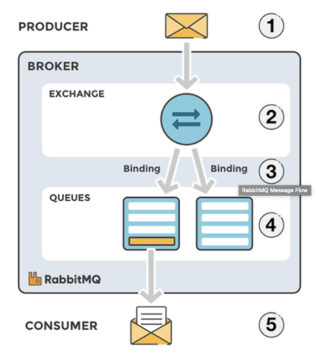
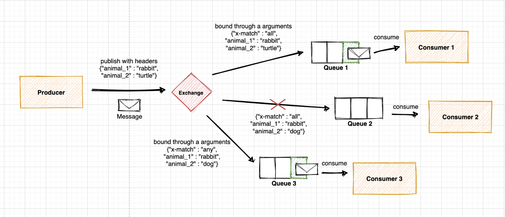

### RabbitMQ
- *참고: https://co-de.tistory.com/9*
- *참고: https://velog.io/@sdb016/RabbitMQ-%EA%B8%B0%EC%B4%88-%EA%B0%9C%EB%85%90*

- **개요**
  - 메시지 큐 시스템: SW간 비동기 메시지 통신을 위한 SW
  - Erlang으로 AMQP(Advanced Message Queuing Protocol) 구현한 메시지 브로커 시스템
    - AMQP: client application과 middleware broker와의 메시지를 주고 받기 위한 프로토콜
  - 서버간 메시지를 전달해주는 오픈소스 메시지 브로커
    - A->B, A->B,C,D,E,F... 등 메시지 보내려고 할 때 RabbitMQ가 메시지 받아서 전달

- **사용처**
  - 요청을 많은 사용자에게 전달할 때
  - 요청에 대한 처리시간이 길 때
  - 많은 작업이 요청되어 처리를 해야할 때

- **장점**
  - 해당 요청을 다른 API에게 위임하고 빠른 응답을 할 때 많이 사용됨
  - MQ를 통해 어플리케이션간에 결합도를 낮출 수 있음

- **아키텍처**
  - 
    - Producer가 메시지를 보내면, exchange에서 해당하는 키에 맞게 queue에 분배하고, 해당 queue에서 Consumer가 메시지 받음
    - producer: 메세지를 보내는 아이
    - exchange: 메시지를 목적지(큐)에 맞게 전달하는 아이
    - queue: 메시지를 쌓는 아이
    - consumer: 메시지를 받는 아이
  - 
  - 
    - producer/consumer는 역할의 구분임
  - 
    - producer: 요청 보내는 주체, 보내고자 하는 메시지를 excahnge에 publish
    - consumer: producer로 부터 메시지를 받아 처리하는 주체
    - **exchange**: producer로 부터 전달받은 메시지를 어떤 queue로 보낼지 결정 (4가지 타입)
      - Name: Exchange 이름
      - Type: 메시지 전달 방식 (Direct, Fanout, Topic, Headers)
      - Durability: 브로커 재시작될 때 남아있을지의 여부 (Durable, Transient)
      - Auto-delete: 마지막 queue 연결이 해제되면 삭제
    - **queue**: consumer가 메시지를 consume하기 전까지 보관하는 장소
      - Name: Queue 이름
      - Durability: 브로커가 재시작될 때 남아있는지 여부 (Durable, Transient)
      - Auto-delete: 마지막 consumer가 consume을 끝낼 경우 자동 삭제
      - Argument: 메시지 TTL, MaxLength 같은 추가 기능 명시
    - **binding**: exchange와 queue의 관계
      - Exchange와 Queue를 연결하는 관계
      - Exchange 타입과 binding 규칙에 따라 적절한 queue로 전달

- **exchange의 4가지 타입**
  1. Fanout
    - 
    - exchange와 binding된 모든 queue에게 동일한 메시지를 보냄. (전체메시지)
  2. Direct
     - 
     - routing key를 활용해 큐와 직접 바인딩할 수 있음
     - 각 큐의 이름이 routing key로 지정됨
     - 하나의 큐에 여러 routing key를 지정할 수 있고,
     - 여러 큐에 하나의 routing key를 지정할 수도 있음
  3. Topic
     - 
     - Routing key의 **패턴이 일치**하는 큐에 메시지 전달
       - `*`: 단어 1개를 대체
       - `#`: 0개 이상의 단어를 대체
  4. Headers
     - 
     - Key-Value로 정의된 헤더에 의해 메시지를 큐에 전달
     - 메시지 전달하는 Producer 측에서 정의하는 header의 k-v와 메시지를 받는 consumer쪽에서 정의된 k-v 일치하면 바인딩

- **메세징 플랫폼**
  - *참고: https://www.youtube.com/watch?v=H_DaPyUOeTo&t=20s*
  1. 메시지 브로커 (레디스큐, RabbitMQ)
     - 이벤트 브로커 역할 X
     - 미들웨어로 동작
       - 서비스하는 어플리케이션을 연결시켜주는 SW
     - 메시지 받아서 적절히 처리하고 나면, 즉시 삭제되는 구조
     - 데이터를 보내고, 처리하고, 삭제한다
  2. 이벤트 브로커 (Kafka)
     - 얘는 메시지 브로커 역할도 수행 가능
     - 이벤트(메시지)라 불리는 레코드를 딱 하나만 저장
       - 인덱스를 통해 접근
     - 업무상 필요한 시간동안 이벤트 보존
     - 얘는 데이터 삭제 안 해
       - 단일 진실 공급원
       - 장애에 대해 복구 포인트
       - 많은 양의 스트림 포인트로써 가동
